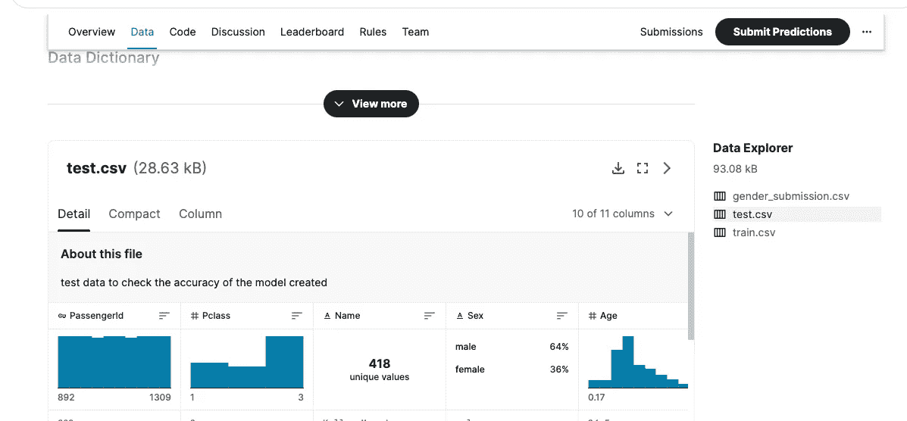
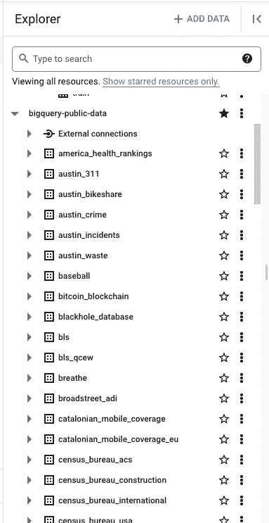
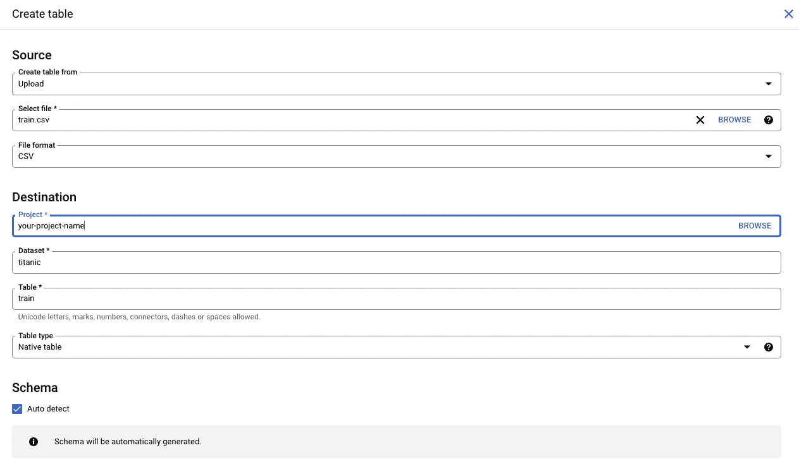
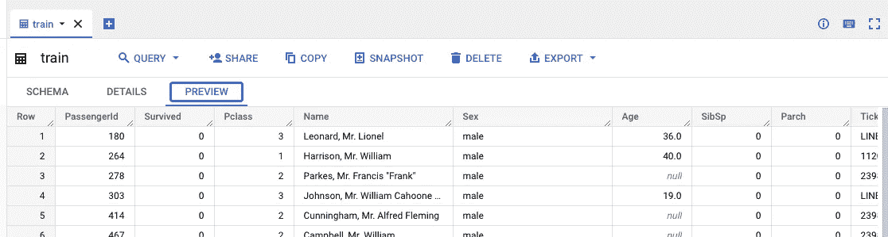
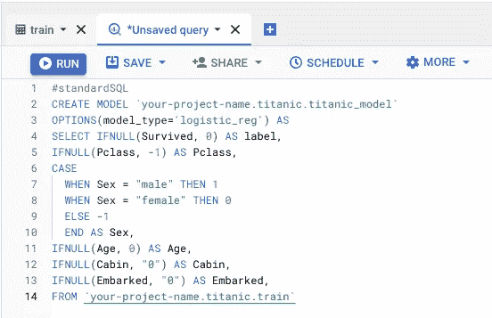
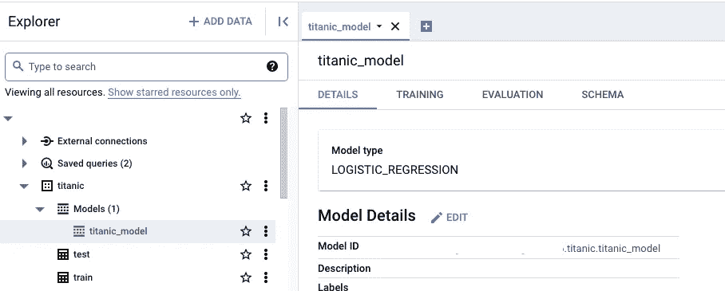
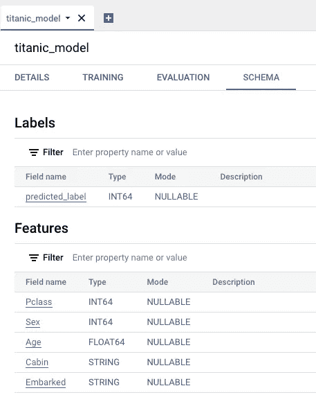
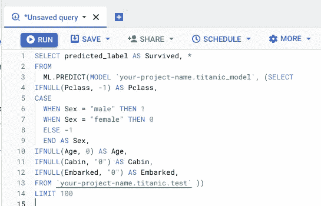
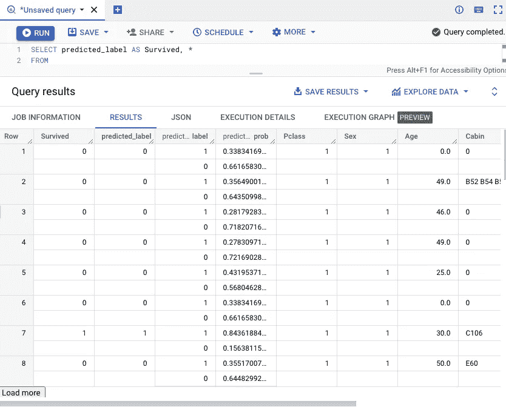

# 仅使用 SQL 查询的机器学习

> 原文：<https://blog.devgenius.io/machine-learning-using-sql-queries-only-47b5f118d2b6?source=collection_archive---------7----------------------->

我猜你对这篇文章标题的第一反应是“*不可能*！”—我听到你认为这是“*不可能的*！”—你在互联网上看到的所有例子表明，如果你想进行**机器学习**，你必须知道如何使用张量流和 Scikit-learn 等框架用 Python 等语言编程。

我给大家介绍一下 Google 用 BigQuery 实现的机器学习。这篇技术性的分步文章将向您展示如何仅使用 SQL 语句创建一个简单的回归模型**。请继续阅读，了解如何操作！**


机器学习的 BigQuery

## 步骤 1:样本数据集

我选择使用 Kaggle 著名的[泰坦尼克号数据集](https://www.kaggle.com/competitions/titanic/)进行我的第一次挑战。泰坦尼克号数据集允许机器学习者识别**特征**，这些特征可用于预测乘客是否会幸存。例如，如果乘客是女性(*特征 1* )，36 岁(*特征 2* )，并且坐在第二乘客舱(*特征 3* )，则模型将确定她是否能够幸存。

有 2 个 CSV 文件-培训和测试。显然，*列车*将用于“训练”模型，而*测试*将用于执行模型并预测乘客是否幸存。



Kaggle 的泰坦尼克号数据集

尽管 BigQuery 中有大量的公共数据集可用，但它们通常使用起来非常复杂，尤其是对于第一次学习机器的人来说。



BigQuery 公共数据集

从 [Kaggle](https://www.kaggle.com/competitions/titanic/data) 下载训练和测试 CSV 文件，解压它们，然后点击“ *ADD DATA* ”按钮将数据集添加到您的 BigQuery 项目中。注意，您必须为模式选择“*自动检测*”。



将 CSV 文件添加到项目中

## 步骤 2:调查“训练”数据集

既然 BigQuery 中既有训练数据集也有测试数据集，现在是时候查看它们了，目的是找到可以用来预测乘客是否能够幸存的**特性**。



预览数据集

## 步骤 3:创建您的查询

我选择使用 *Pclass、性别、年龄、客舱*和*上船*字段作为**特征**，并包含*幸存*字段标签作为第一个字段，它将决定乘客是否幸存。

```
SELECT IFNULL(Survived, 0) AS label,
IFNULL(Pclass, -1) AS Pclass,
CASE 
  WHEN Sex = "male" THEN 1
  WHEN Sex = "female" THEN 0
  ELSE -1
  END AS Sex,
IFNULL(Age, 0) AS Age,
IFNULL(Cabin, "0") AS Cabin,
IFNULL(Embarked, "0") AS Embarked,
FROM `your-project-name.titanic.train` 
```

可以看出，我对字段应用了一些基本的[](https://developers.google.com/machine-learning/data-prep/transform/transform-numeric)*，将“字符串”值转换为“数字”，例如“男性”转换为 1，“女性”转换为 0。*

## *步骤 4:创建你的模型*

*使用与上面相同的 SQL 查询，将下面几行添加到您的 SQL 代码中，目的是创建一个回归模型。*

```
*#standardSQL
CREATE MODEL `your-project-name.titanic.titanic_model`
OPTIONS(model_type='logistic_reg') AS*
```

**

*创建模型语句*

*几分钟后，您的模型应该已经创建好了，并且可以在 Explorer 中使用了。如果看不到，刷新页面。*

**

*回归模型*

*请注意，模型的“*预测 _ 标签*”将根据我们选择的特征来确定乘客是否幸存。*

**

*模型模式*

## *第五步:用你的模型预测结果*

*使用与前面相同的 SELECT 语句，但这次我们将从" *test* "数据集获取数据，将其注入到下面 SELECT FROM your model 语句的括号中。我们将选择模型的 *predicted_label* 字段来确定乘客是否存活(1)或不存活(0)。*

```
*SELECT predicted_label AS Survived, *
FROM
  ML.PREDICT(MODEL `your-project-name.titanic_model`, ( ...
      INJECT SQL statement here...
...)*
```

**

*使用测试数据集从您的模型中选择*

*您的结果现在应该已经预测到某些乘客幸存(predicted_label ),而其他乘客则没有:*

**

*模型的结果*

# *结论*

*虽然我以前使用过没有编码的[可视化界面](https://medium.com/@che-kulhan/deep-learning-done-visually-with-teachablemachine-from-google-a4b579efdf3f)进行机器学习，但我发现 Google 的 BigQuery 的这个简单实验很有启发性，开辟了执行机器学习的新方法，这次只使用 SQL 语句，如果你已经将数据存储在 BigQuery 中，这将非常有用。*