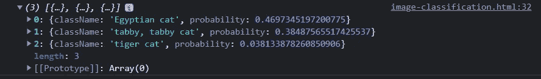
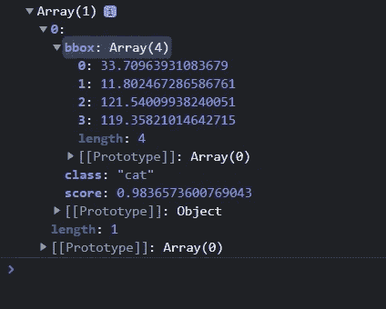
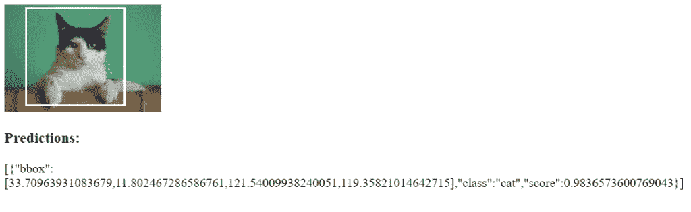

# 用 TensorFlow.js 进行机器学习(对，JavaScript) |图像分类和物体检测

> 原文：<https://blog.devgenius.io/machine-learning-with-tensorflow-js-yes-javascript-image-classification-and-object-detection-abfedb64bf98?source=collection_archive---------5----------------------->


我将向您展示如何通过 JavaScript 中的 TensorFlow 使用人工智能和机器学习来执行图像分类和对象检测。我被这种实现的容易程度惊呆了，老实说，我仍然有点挠头，感觉我错过了什么。但是，我向你保证这是非常简单的(至少开始使用)，你可以在几分钟内用 AI/ML 和 JavaScript 分析图像！

[我上两篇博文](https://northstarcode.com/blog/automate-your-website-deployment-an-absolute-beginners-guide/)基本都是小说。两篇文章都超过 4000 字，花了很长时间才写完。为了我自己，也为了那些关注我前两篇文章的人，我将保持这篇文章的简短。使用 TensorFlow.js 分析图像花了我几分钟的时间。我从他们网站的链接中抓取代码，粘贴到一个 VS 代码窗口中，并且已经被告知图片中有一只猫。

# 什么是图像分类和物体检测？

我将首先解释“图像分类”和“对象检测”之间的区别我对它的理解(开玩笑，我在 StackOverflow 上找到了[一篇总结了它的帖子](https://stackoverflow.com/questions/31750076/what-is-the-difference-between-object-detection-and-object-classification))是，当你想更具体地猜测图像中有什么时，应该使用图像分类。使用这个 TensorFlow 软件包，它将输出三个不同的“预测”,每个都有自己的概率值。

当你想知道图像中有什么，以及*在图像中的位置*时，应该使用对象检测。关于对象检测的高级将与面向对象编程相关，因为它被抽象了很多。想想:德国牧羊犬是一种狗，斯芬克是一种猫，等等。我还发现了 Pulkit Sharma 在 Medium 上发表的这篇关于[图像分类与对象检测和图像分割的文章，如果你想了解更多信息。](https://medium.com/analytics-vidhya/image-classification-vs-object-detection-vs-image-segmentation-f36db85fe81)

# 一点编码错误(我们有一些设置要做)

要启动并运行它，您实际上只需要做几件事情。首先，很明显，是一个代码编辑器。接下来，[点击此链接进入 TensorFlow.js 主页](https://www.tensorflow.org/js/)。我不打算详细说明什么是张量流，因为我自己也只是触及了它的表面。到目前为止，我喜欢它的一点是它是开源的，可以在许多编程语言中使用。从最受欢迎的 Python，一直到无处不在的 JavaScript！不管你喜欢它还是讨厌它，你都不能否认它确实是一个任何人都可以学习的强大的多功能工具。

所有这些的一个问题是，如果你想用图片解决 CORS 的问题，你需要有一个自托管的网站。如果您已经安装了 Wamp 或 Xamp 之类的东西，这没有问题。但是，你也可以像我这样做，因为我主要是在。NET 世界，那就是在 Windows 上用 IIS 建立一个超级简单的站点。我不会在这个博客中详细介绍如何设置主机，但也许将来我会。

给你的托管站点起个你喜欢的名字，然后我们就可以开始写代码让它运行了！

# 利用 TensorFlow.js 进行影像分类

我们将从使用 TensorFlow.js 的图像分类模型开始。访问 TensorFlow 网站的 [JS 模型页面以获取代码。我也将在这里提供它，但我需要声明我使用的是示例中的基本模板，并做了一些轻微的修改。我不认为这一切都是我的！好吧，适当推卸责任，我们继续。](https://www.tensorflow.org/js/models)

点击[图像分类模式](https://github.com/tensorflow/tfjs-models/tree/master/mobilenet)。这将把您带到 TensorFlow.js tfjs-models 项目的 GitHub repo。如果你想继续阅读你将要阅读的内容，请自便。否则，请继续阅读，我马上会发布代码。

现在，为了让我神魂颠倒的魔法。说真的，你需要做的就是下面的代码片段。将其复制并粘贴到您的自托管网站文件夹中的新文件中。我打算给我的名字起个类似`image-classification.html`的名字。另外，一定要使用你自己的图片，或者去谷歌上搜索一些猫的图片。下载图片，然后上传到根目录，紧挨着你的其他 html 文件。代码如下:

```
<!DOCTYPE html>
<html>
<head>
    <title>Image Classification</title>
    <meta charset="utf-8" />
    <meta http-equiv="Content-type" content="text/html; charset=utf-8" />
    <meta name="viewport" content="width=device-width, initial-scale=1" />
    <!-- Load TensorFlow.js. This is required to use MobileNet. -->
    <script src="https://cdn.jsdelivr.net/npm/@tensorflow/tfjs@1.0.1"> </script>
    <!-- Load the MobileNet model. -->
    <script src="https://cdn.jsdelivr.net/npm/@tensorflow-models/mobilenet@1.0.0"> </script>
</head><body>
    <!-- Replace this with your image. Make sure CORS settings allow reading the image! -->
    </img>
    <h3>Predictions:</h3>
    <p id="predictions"></p>
    <script>
        const img = document.getElementById('img');
        const predictionsElem = document.getElementById('predictions'); // Load the model.
        mobilenet.load().then(model =>
        {
            // Classify the image.
            model.classify(img).then(predictions =>
            {
                var serializedPredictions = JSON.stringify(predictions);
                // View in browser in string version
                predictionsElem.innerHTML = serializedPredictions;
                // View in console in object version
                console.log(predictions);
            });
        });
    </script>
</body></html>
```

从上面的代码片段中需要注意的重要一点是，我向图像元素添加了`crossorigin="anonymous"`属性。在 TensorFlow 的例子中，他们告诉你要确保 CORS 设置正确，但在撰写本文时，他们还没有这个属性。我查了一下，这似乎已经足够让我开始使用这张图片了。

现在剩下的就是打开你的网站，查看图片分类的结果。

# TensorFlow.js 影像分类结果

我使用下面的一只猫的图像来运行我的测试:


一旦我加载了新的 html 文件，浏览器和控制台都会向我显示结果。我不太关心浏览器中的文本版本，而是会查看控制台。以下是我的输出结果:



每次运行图像分类代码时，它都会返回三个不同概率和类别名称的结果。我得说这次运行相当准确。由于我对猫知之甚少，我愿意接受从某个告诉我同样故事的人那里得到的所有这三个答案。

第一个例子就是这样。拍拍自己的背，因为你刚刚在 JavaScript 中成功地使用了 AI 和机器学习！让我们转到对象检测模型。

# 使用 TensorFlow.js 进行对象检测

接下来我们将尝试 TensorFlow.js 中的对象检测模型。概括一下，对象检测模型与图像分类模型的不同之处在于，它会为您提供一个高级对象名称，但还会包括该对象所在图像内的位置数据。我总是用这个回忆脸书的早期。那个令人毛骨悚然的白色小盒子会自动包裹住你的朋友和家人的脸，建议你在图像中“标记”他们。我的人工智能已经成为我们日常生活的一部分了，嗯？

无论如何，我们将使用看起来很像上一个文件中的代码，但是做了一些修改以使用不同的模型“基础”。图像分类代码使用一种叫做“MobileNet”的模型来收集数据。(如果我在这一点上大错特错，请告诉我。我只看了一点)对象检测模型会使用 COCO 数据集中已经聚合的数据。如果你需要更多关于我刚刚抛出的任何一个东西的信息，只要看看这些 GitHub 包的文档就可以了。

要获得这个项目的代码[，请访问 GitHub repo 的对象检测页面，这里是](https://github.com/tensorflow/tfjs-models/tree/master/coco-ssd)。我们将再次使用项目的脚本标签版本。在与上一个文件相同的文件夹中，创建一个名为`object-detection.html`的新文件，并粘贴以下代码。确保`cat.jpg`文件仍然位于根级别，这样它就可以顺利地进入。

```
<!DOCTYPE html>
<html>
<head>
    <title>Object Detection</title>
    <meta charset="utf-8" />
    <meta http-equiv="Content-type" content="text/html; charset=utf-8" />
    <meta name="viewport" content="width=device-width, initial-scale=1" />
    <!-- Load TensorFlow.js. This is required to use coco-ssd model. -->
    <script src="https://cdn.jsdelivr.net/npm/@tensorflow/tfjs"> </script>
    <!-- Load the coco-ssd model. -->
    <script src="https://cdn.jsdelivr.net/npm/@tensorflow-models/coco-ssd"> </script>
</head>
<body>
    <!-- Replace this with your image. Make sure CORS settings allow reading the image! -->
    </img>
    <h3>Predictions:</h3>
    <p id="predictions"></p> <!-- Place your code in the script tag below. You can also use an external .js file -->
    <script>
        // Notice there is no 'import' statement. 'cocoSsd' and 'tf' is
        // available on the index-page because of the script tag above.
        const img = document.getElementById('img');
        const predictionsElem = document.getElementById('predictions'); // Load the model.
        cocoSsd.load().then(model =>
        {
            // detect objects in the image.
            model.detect(img).then(predictions =>
            {
                var serializedPredictions = JSON.stringify(predictions);
                // View in browser in string version
                predictionsElem.innerHTML = serializedPredictions;
                // View in console in object version
                console.log(predictions);
            });
        });
    </script>
</body></html>
```

对象检测文件的主要区别是脚本引用，使用 coco-ssd 而不是 mobilenet。在文件的后面，我们还调用了 cocoSsd 对象，而不是 mobilenet 对象实例。这些强大的物体背后到底发生了什么？我不知道。我仍然在阅读它，你也应该如此。但是，我们需要知道的是，这是非常惊人的东西。

# TensorFlow.js 的对象检测结果

加载你的新文件，无论你给它起了什么名字。我确实注意到 coco-ssd(对象检测)页面加载速度比 mobilenet(图像分类)慢得多。我不知道这到底是为什么，但如果我不得不猜测，我会说这与它必须分析图像和对象位置的地图坐标这一事实有关。

好的，一旦你加载了你的页面，你应该会看到你的猫的相同的图像，然后检查控制台有一个新的对象输出给我们看。加载几秒钟后，我的看起来如下:



这将输出关于对象是什么以及它在图像中的位置的信息。每次,`bbox`属性显示四个附加属性。它们依次代表 X 和 Y 轴以及贴图的宽度和高度。然后你可以获取这些信息，并像脸书那样使用他们的标签建议，如下图所示。我在文件中添加了一些额外的代码，在猫的脸周围放了一个盒子。

# 给你的图片添加一个脸书风格的“标签”

在`<head>`标签中添加以下内容。确保更改您的值以匹配您自己的输出，使长方体正确显示在对象面上。

```
<style>
    .tag-box
    {
        position: absolute;
        left: 34px; / *Comes from the bbox[0] (X) element, or 33.7096393..., in my case* /
        top: 12px; / *Comes from the bbox[1] (Y) element, or 11.80246728...* /
        width: 122px; / *Comes from the bbox[2] (Width) element, or 121.54009938...* /
        height: 120px; / *Comes from the bbox[3] (Height) element, or 119.358210146...* /
        border: 3px solid white;
    }
</style>
```

接下来，在您的`<body>`标签中添加以下元素:

```
<div class="tag-box"></div>
```

将代码添加到对象定义文件后，我得到了以下结果:



这就是事情的全部。给自己打个五分，因为现在您刚刚使用了 TensorFlow 和 JavaScript 的两个特性。你正在帮助机器人统治世界的路上！

# 摘要

我说过我会长话短说，所以我会的。我自己才刚刚开始学习如何使用 TensorFlow.js，对真正详细的话题不能讲太多。但是，在设置了它之后，我估计它会花费我很少的时间，我想我可能已经开启了另一个永无止境的编程虫洞。不过，我对此并不生气。

希望这篇教程对你有所帮助，并向你展示了编程世界中一些新的探索。我知道人工智能和机器学习是一个庞大的话题，也是目前科技界最热门的词汇。如果你喜欢这篇文章，一定要喜欢它，对它做出反应，评论它，或者嘲笑它，然后关闭页面。感谢你一如既往地花时间阅读，我希望你将来能回来看更多的帖子。

*编码快乐！*

有用的链接

*   [TensorFlow.js 模型页面](https://www.tensorflow.org/js/models)
*   [图片分类 GitHub Repo](https://github.com/tensorflow/tfjs-models/tree/master/mobilenet)
*   [物体检测 GitHub Repo](https://github.com/tensorflow/tfjs-models/tree/master/coco-ssd)

猫图片由 [Manja Vitolic](https://unsplash.com/@madhatterzone?utm_source=unsplash&utm_medium=referral&utm_content=creditCopyText) 在 [Unsplash](https://unsplash.com/photos/gKXKBY-C-Dk?utm_source=unsplash&utm_medium=referral&utm_content=creditShareLink) 上提供，狗图片由 [Victor Grabarczyk](https://unsplash.com/photos/N04FIfHhv_k?utm_source=unsplash&utm_medium=referral&utm_content=creditShareLink) 在 [Unsplash](https://unsplash.com/s/photos/dog?utm_source=unsplash&utm_medium=referral&utm_content=creditCopyText) 上提供