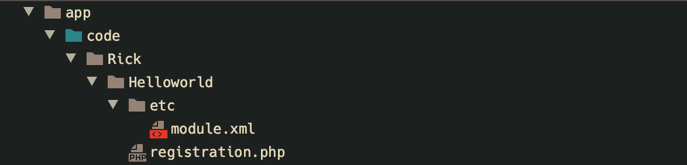
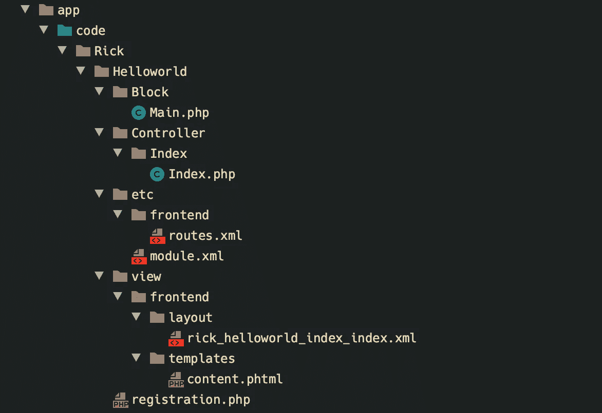
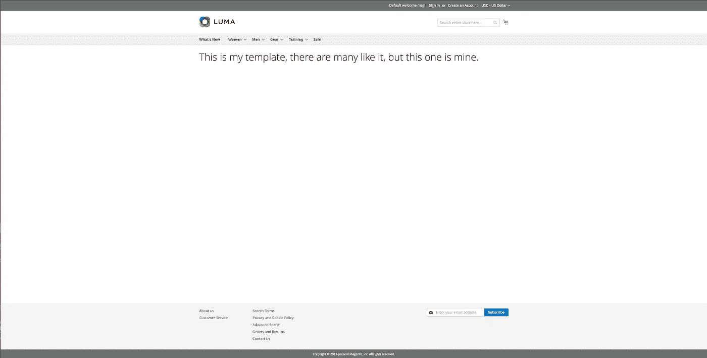

# Magento 2 模块开发与杵

> 原文：<https://blog.devgenius.io/magento-2-module-development-with-pestle-e122c77dc755?source=collection_archive---------13----------------------->


布莱克·康纳利在 [Unsplash](https://unsplash.com/) 上的照片

Magento 2 有很多工具可以帮助你开发模块。Magento 中一个著名的 CLI 工具是 Magerun。这是 Magento 自带的 CLI 工具的扩展，在你安装 Magento 2 的时候就已经开箱即用了。我经常使用的最喜欢的工具之一是艾伦·斯道姆的[杵](https://github.com/astorm/pestle)。

由于我们编写的大部分代码主要由模板(可重用的)代码组成，slaust 有助于生成大量这种代码。最终，这在开发 Magento 2 模块时节省了大量时间。

**杵是什么**

你可以把 slash 想象成一个 PHP 框架，帮助你在 Magento 2 中构建和组织 CLI 程序。例如，您可以使用自己的模板扩展现有的函数，如“生成”函数。

熟悉 Python 的人，杵类似于 Python 如何导入模块。

它也是一个 CLI 程序的集合，重点是 Magento 2 代码生成。

**安装杵**

杵以. phar 文件(PHP 归档文件)的形式出现，很容易下载，如下所示。Phar 文件是自包含的跨平台的，所以它在 MacOS，Windows 和 Linux 上都可以工作。

```
#with curl:
curl -LO [http://pestle.pulsestorm.net/pestle.phar](http://pestle.pulsestorm.net/pestle.phar)#with wget:
wget [http://pestle.pulsestorm.net/pestle.phar](http://pestle.pulsestorm.net/pestle.phar)
```

或者你可以在他们的 [Github](https://github.com/astorm/pestle/releases) 页面下载其他版本。

运行下面的“PHP slaust . phar version”看看安装的是哪个版本。

我们要建造什么？

我们将建立一个简单的模块，我们可以导航到前端页面。安装完 list 之后，运行“PHP slaust . phar”来查看选项列表。

我们对 Magento 2 的生成选项特别感兴趣。要仅查看“生成”选项的运行情况:

```
php pestle.phar | grep generate --color=never
```

**注册一个模块**

我们从注册一个模块开始。现在有两个选项，“全模块”和“模块”选项。

完整模块的工作方式与模块选项略有不同。这个选项不是直接创建 PHP 和 XML 模块文件，而是生成一个 Unix shell 脚本，该脚本执行其他 slash 命令来生成模块。

现在，我们坚持“模块”选项。运行:

```
php pestle.phar magento2:generate:module
```

杵现在会提出几个问题。

*   供应商名称空间应该是什么
*   模块的名字应该是什么。
*   哪个版本。参见如下内容:

```
www-data@example-php-fpm:04:51 PM:/var/www/html$ php pestle.phar magento2:generate:module
Vendor Namespace? (Pulsestorm)] Rick
Module Name? (Testbed)] Helloworld
Version? (0.0.1)] 
Creating [/var/www/html/app/code/Rick/Helloworld/etc] 
Created: /var/www/html/app/code/Rick/Helloworld/etc/module.xml
Created: /var/www/html/app/code/Rick/Helloworld/registration.php
```

完成后，你会看到在 app/code/Rick 下，一个 Helloworld 模块已经被创建了。运行“bin/magento s:up”进行注册。



**创建前端路由**

现在我们已经创建并安装了一个模块，我们可以创建一个路由。

```
php pestle.phar magento2:generate:route
```

然后，像处理 generate: module 一样填写问题。

*   选择您想要在哪个模块中创建路由，在我们的例子中是 Rick_Helloworld
*   选择它是前端还是管理路由，默认为前端，因此只需按 enter 键。
*   昵称和路线 id: rick_helloworld
*   使用默认(索引)作为“控制器名称”
*   使用默认(索引)作为“操作名称”

```
www-data@example-php-fpm:04:51 PM:/var/www/html$ php pestle.phar magento2:generate:route 
Which Module? (Pulsestorm_HelloWorld)] Rick_Helloworld
Which Area (frontend, adminhtml)? (frontend)] 
Frontname/Route ID? (pulsestorm_helloworld)] rick_helloworld
Controller name? (Index)] 
Action name? (Index)] 
Backing existing file: /var/www/html/app/code/Rick/Helloworld/etc/frontend/routes.xml.5f1db51e071db.bak.php
/var/www/html/app/code/Rick/Helloworld/etc/frontend/routes.xml
/var/www/html/app/code/Rick/Helloworld/Controller/Index/Index.php
```

之后你会在 app/code/Rick/Helloworld /etc /中看到一个 routes.xml

```
<?xml version="1.0"?>
<config xmlns:xsi="http://www.w3.org/2001/XMLSchema-instance" xsi:noNamespaceSchemaLocation="urn:magento:framework:App/etc/routes.xsd">
    <router id="standard">
        <route id="rick_helloworld" frontName="rick_helloworld">
            <module name="Rick_Helloworld"/>
        </route>
    </router>
</config>
```

如果 routes.xml 已经存在，它将添加一个. bak 扩展名，以便您保留现有文件的备份。如果不再需要，您可以选择删除它。

最后，我们通过运行以下命令创建一个前端视图:

```
php pestle.phar magento2:generate:view
```

选择“Rick_Helloworld”作为模块，并接受区域、句柄、块名、模板文件和布局的默认值。最终，您会看到 slakut 创建了以下文件。



最后用“bin/magento c:c”删除你的缓存，转到[*https://app . example . test/Rick _ hello world/index/index*](http://Finally delete your cache with bin / magento c: c and go to https: //app.example.test/webfant_helloworld/index/index)



如你所见，在很短的时间内，我创建、注册并安装了一个 Magento 2 模块，构建了一个控制器，构建了一个包含块、布局和模板的 route.xml，而没有编写任何代码。杵提供了广泛的选项来帮助您开发 Magento 2 模块，所以我强烈建议您看看杵提供的其他选项。

**杵中有用的命令**
除了生成代码，还可以执行扫描和检查。

更正 PHP 对象管理器的直接使用

```
php pestle.phar magento2:fix-direct-om
```

恢复权利

```
php pestle.phar magento2:fix-permissions-mod
```

扫描模块中的 ACL 规则 id，并确保它们都被使用/定义

```
php pestle.phar magento2:scan:acl-used
```

在 MySQL 数据库中搜索无效的键

```
php pestle.phar mysql:key-check
```

从 Magento 1 代码迁移到 Magento 2

```
php pestle.phar magento2:convert-class
php pestle.phar magento2:convert-observers-xml
php pestle.phar magento2:convert-system-xml
```

# 觉得这个帖子有用吗？请点击👏下面的按钮！:)