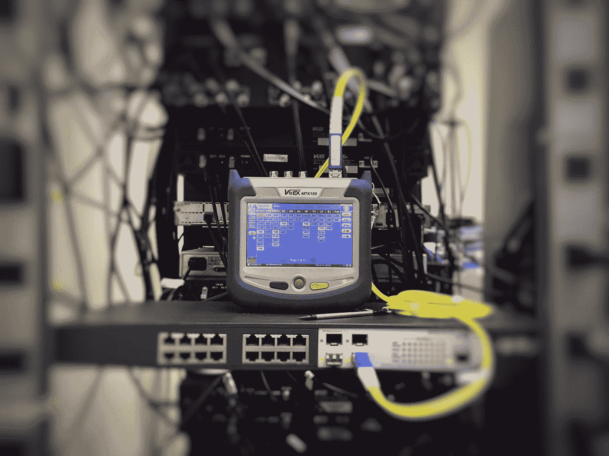

# 可维护的 JavaScript —开关

> 原文：<https://blog.devgenius.io/maintainable-javascript-switch-922178e5ce9?source=collection_archive---------8----------------------->


[Hanson Lu](https://unsplash.com/@hansonluu?utm_source=medium&utm_medium=referral) 在 [Unsplash](https://unsplash.com?utm_source=medium&utm_medium=referral) 上的照片

如果想继续使用代码，创建可维护的 JavaScript 代码很重要。

在本文中，我们将通过编写`switch`语句来了解创建可维护的 JavaScript 代码的基础。

# switch 语句

`switch`语句对于在检查某个值后做某事很有用。

有更好的方式来格式化`swicth`报表。

JavaScript `switch`语句的行为与其他语言不同。

它可以使用任何类型的值。

任何表达式都可以和有效的`case`一起使用。

其他语言分别需要使用原始值和常量。

# 开关缩进

Switch 语句的内容应该缩进。

例如，我们写道:

```
switch (condition) {
  case 1:
    // ...
    break; case 2:
    // ...
    break; case 3:
    // ...
    break; default:
    // ...
}
```

我们缩进了`case`语句及其内容。

缩进是用两个空格完成的。

这使得内容更容易阅读。

从第二个开始，我们在每个`case`语句的前后都有一个额外的 ab 行。

道格·克罗克福德的风格指南还有另一个建议。

`case`语句之间的行被删除。

例如，我们可以写:

```
switch (condition) {
  case 1:
    // ...
    break;
  case 2:
    // ...
    break;
  case 3:
    // ...
    break;
  default:
    // ...
}
```

我们删除了`switch`语句各部分之间的空行。

然而，所有样式指南对缩进都有相同的建议。

# 失败了

在结尾不小心省略了`break`关键字是我们在编写`switch`语句时经常犯的错误。

这将导致它们下面的`case`语句也运行。

有人建议每个`case`都要无一例外的以`break`、`return`或者`throw`结尾。

这样，`case`将在我们期望的地方结束。

如果我们在代码中表明失败不是一个错误，那么我们可以让`case`语句失败。

例如，我们可以写:

```
switch (condition) { // falls through
  case 1:
  case 2:
    // ...
    break; case 3:
    //...
    // falls through
  default:
    // ...
}
```

这样每个人都知道失败是故意的。

第一种情况属于第二种。

第三种情况属于默认情况。

它们都标有注释，以传达程序员的意图。

一些风格指南，像道格拉斯·克洛克福特的风格指南，从来没有全部在`switch`中失败过。

但这取决于我们团队的偏好。

# 系统默认值

也有人争论`default`案是否需要。

有些人认为他们应该永远被包括在内。

更像是人们遵循这种模式。

然而，如果我们想不出要添加的默认情况，我们可以省略它。

如果我们省略了`default`的情况，我们可以用注释来传达，这样每个人都知道这是有意的。

例如，我们可以写:

```
switch (condition) {
  case 1:
    // ...
    break;
  case 2:
    // ...
    break;
  // no default
}
```

这样，我们都知道这不是一个错误。



[Ildefonso Polo](https://unsplash.com/@i_m_polo?utm_source=medium&utm_medium=referral) 在 [Unsplash](https://unsplash.com?utm_source=medium&utm_medium=referral) 上拍照

# 结论

当我们写`switch`陈述时，有几件事需要考虑。

`break` s 和`default`案例可以添加也可以不添加，但我们必须清楚地传达我们的意图。

这样就不会有什么误会了。