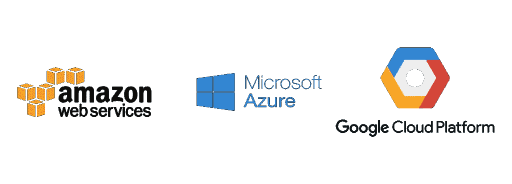

# 主要云提供商

> 原文：<https://blog.devgenius.io/major-cloud-providers-512d4c5a3d0f?source=collection_archive---------19----------------------->

## 1-亚马逊网络服务

一个 WS(亚马逊网络服务)是一个全面的、不断发展的[云计算](https://searchcloudcomputing.techtarget.com/definition/cloud-computing)平台，由亚马逊提供，其中包括基础设施即服务( [IaaS](https://searchcloudcomputing.techtarget.com/definition/Infrastructure-as-a-Service-IaaS) )、平台即服务( [PaaS](https://searchcloudcomputing.techtarget.com/definition/Platform-as-a-Service-PaaS) )和打包软件即服务( [SaaS](https://searchcloudcomputing.techtarget.com/definition/Software-as-a-Service) )产品。AWS 服务[可以为组织提供工具](https://searchcloudcomputing.techtarget.com/feature/A-closer-look-at-the-Amazon-Web-Services-cloud-platform)，例如计算能力、数据库存储和内容交付服务。

AWS 于 2006 年推出，基于 Amazon.com 为处理其在线零售业务而建立的内部基础设施。AWS 是首批引入[按需付费](https://searchstorage.techtarget.com/definition/pay-as-you-go-cloud-computing-PAYG-cloud-computing)云计算模式的公司之一，这种模式能够[扩展](https://searchdatacenter.techtarget.com/definition/scalability)为用户提供所需的计算、存储或吞吐量。

AWS 为企业和软件开发人员提供了许多不同的工具和解决方案，可用于多达 190 个国家的数据中心。政府机构、教育机构、非营利组织和私人组织等团体可以使用 AWS 服务。

## 2-谷歌云平台(GCP)

G **oogle 云平台** ( **GCP** )，由[谷歌](https://en.wikipedia.org/wiki/Google)提供，是一套[云计算](https://en.wikipedia.org/wiki/Cloud_computing)服务，运行在谷歌内部为其终端用户产品使用的同一基础设施上，如[谷歌搜索](https://en.wikipedia.org/wiki/Google_Search)、 [Gmail](https://en.wikipedia.org/wiki/Gmail) 和 [YouTube](https://en.wikipedia.org/wiki/YouTube) 。除了一套管理工具，它还提供一系列模块化云服务，包括计算、[数据存储](https://en.wikipedia.org/wiki/Computer_data_storage)、[数据分析](https://en.wikipedia.org/wiki/Data_analysis)和[机器学习](https://en.wikipedia.org/wiki/Machine_learning)。注册需要信用卡或银行账户的详细信息。

谷歌云平台提供[基础设施即服务](https://en.wikipedia.org/wiki/Infrastructure_as_a_service)、[平台即服务](https://en.wikipedia.org/wiki/Platform_as_a_service)和[无服务器计算](https://en.wikipedia.org/wiki/Serverless_computing)环境。

2008 年 4 月，谷歌发布了[应用引擎](https://en.wikipedia.org/wiki/Google_App_Engine)，这是一个在谷歌管理的[数据中心](https://en.wikipedia.org/wiki/Data_center)开发和托管网络应用的平台，是该公司的第一个云计算服务。这项服务于 2011 年 11 月全面推出。自从宣布应用引擎以来，谷歌在平台上增加了多种云服务。

谷歌云平台是**谷歌云**的一部分，包括谷歌云平台公有云基础设施，以及 **G 套件**，企业版 [Android](https://en.wikipedia.org/wiki/Android_(operating_system)) 和 [Chrome OS](https://en.wikipedia.org/wiki/Chrome_OS) ，以及[机器学习](https://en.wikipedia.org/wiki/Machine_learning)和企业地图服务的[应用编程接口(API)](https://en.wikipedia.org/wiki/Application_programming_interface)。

## 3-微软 Azure

A zure 是一个公共云计算平台，其解决方案包括基础设施即服务(IaaS)、平台即服务(PaaS)和软件即服务(SaaS)，可用于分析、虚拟计算、存储、网络等服务。它可用于替换或补充您的本地服务器。以下是一些关于 Azure 的事实:

*   **微软 Azure:** IaaS、PaaS 和 SaaS
*   **灵活**:根据需要上下移动计算资源
*   **开放**:支持几乎任何操作系统、语言、工具或框架
*   **可靠** : 99.95%可用性 SLA 和 24×7 技术支持
*   **全球**:存放在地理同步数据中心的数据
*   经济实惠:只为你使用的东西付费

Azure 是一个快速、灵活、经济的平台，其价格和功能使其成为市场上最好的公共云产品。现在让我们来看看如何让它为你工作。

*   增强和实施备份和灾难恢复
*   托管和开发 Web 和移动应用
*   分发和补充活动目录
*   利用物联网行业解决方案进行创新

## 地理可用性

云计算地点遍布全球，被称为“区域”或“可用区”。

*   AWS 有 18 个区域，每个区域有 2 到 6 个可用区域。
*   GCP 有 23 个地区，每个地区至少有 3 个可用区域。
*   Azure 在全球有 58 个地区，在全球 140 个国家/地区提供。

## 市场份额和增长率

*   AWS 成立于 2006 年，目前是领先的云提供商，拥有 33%的市场份额。
*   微软 Azure 拥有大约 17%的全球市场份额。
*   谷歌在全球占有大约 6%的市场份额。

## 参考资料:

*   [TechTarget.com](https://searchaws.techtarget.com/)
*   [维基百科](https://en.wikipedia.org/wiki/Main_Page)
*   [bigzerobd.com](http://bigzerobd.com/)