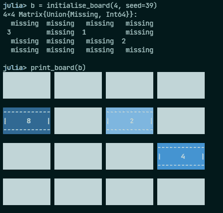
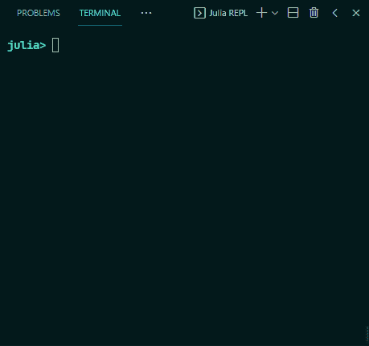

# 和朱莉娅一起做一个命令行游戏🎮

> 原文：<https://blog.devgenius.io/make-a-command-line-game-with-julia-a408057adcfe?source=collection_archive---------5----------------------->

## 没有图形用户界面的 2048 游戏


[萨姆·帕克](https://unsplash.com/@melocokr?utm_source=unsplash&utm_medium=referral&utm_content=creditCopyText)在[号航天飞机](https://unsplash.com/s/photos/gaming?utm_source=unsplash&utm_medium=referral&utm_content=creditCopyText)上拍摄的照片

# 学习编程语言时为什么要做游戏？

我上过的最好的编程课程之一是莱斯大学在 Coursera 上开设的“T4 Python 交互式编程导论”(这是很久以前的事了，所以内容可能从那时起就已经改变了)。对我来说真正突出的是，接受一个游戏概念是多么容易，并且**对将它变成代码行感到兴奋**。

> 通过制作游戏来学习编码是你提高技能的最好方法之一。

但是用 Python(或者任何一种语言)制作电脑游戏的一个主要缺点是**你需要学习一个新的库**来做到这一点，这可能会随着你学习的越来越多而影响你的学习体验，并且**会更多的使用这个软件包而不是核心语言**。

本着努力解决这个问题的精神，我给自己设定了一个目标，在 Julia 中制作一个完全命令行界面的游戏。这花了我大约 4 个小时集中精力来编写代码——我这周很早就起床了——所以如果你有时间并且准备好迎接挑战，我建议你也尝试自己制作游戏！这确实是一种学习朱莉娅的好方法，同时也很有趣。

> 创造自己的游戏真的很有回报。当它最终发挥作用时，我脸上露出了灿烂的笑容，我可以和自己的创作互动。

> 要完全访问所有 Medium 文章——包括我的文章——请考虑在此处订阅。

# 为什么是 2048 年？

2048 曾经是(现在仍然是)一个非常受欢迎的游戏，在棋盘上给定一组牌，你向左、向右、向上和向下滑动，试图将 2 的幂合并在一起，创造新的数字，最终达到 2048 年及以后。如果您没有听说过 2048，请观看此视频获取灵感:

视频由[史蒂夫模具](https://www.youtube.com/channel/UCEIwxahdLz7bap-VDs9h35A)

既然你已经复习了游戏是如何运作的，那就忘掉一切吧，我会制定自己的规则——毕竟这是我的游戏。😜

特别是，我做了以下改变:

*   您的分数等于棋盘上所有牌的总和。
*   您可以在每一轮中随机获得 2、4 或 8 分，其中 2 分最有可能。
*   一旦你到了 2048 年，游戏就结束了——我放弃了为我的瓷砖寻找新颜色😅。
*   你可以随心所欲地使用一块或大或小的板子。

# 建立它

游戏的逻辑由 3 个主要部分组成:

*   滑动棋盘，以相同的方向移动所有的方块。
*   滑动时合并彼此相邻的磁贴。
*   每回合添加一个新的随机牌。

为了代表董事会，我不会创建一个`Board`类或结构或任何类似的东西——python stasts 现在畏缩了😉…相反，我将只使用一个整数值矩阵，其中一个空图块将由内置的`missing`值表示。因为所有的数字都是 2 的幂，所以我用 1，2，3，4…来表示瓷砖，当我们需要显示它们时，用 2 的幂来表示瓷砖。

## 创建一个董事会

让我们初始化一块可以玩的板:

我想在这里提出两点:

*   如果你在玩随机数，总是给机会**为你的生成器**设置种子。它将使测试和再现成为可能。
*   `zeros(Union{Missing, Int64}, n, n)`创建一个 n 乘 n 的矩阵，它的值可以是`missing`——类型为`Missing`——或者整数。

如你所见，我们随机选择了`n-1`块来填充。填充瓷砖的逻辑由`StatsBase`完成。这个包允许我们**从数字列表中随机抽取样本**并做其他有趣的“统计”工作。

[0.6，0.3，0.1]是我们挑选新瓷砖的概率。

## 推送瓷砖

在我们的待办事项列表中，将价值观推向棋盘的一边。我们通过**过滤掉丢失的值**并把它们放在每一行或每一列的最后来做到这一点。实际上，我非常惊喜地发现这可以如此优雅地完成，因为我们使用了`missing`值。

首先，这段代码在我们的板的向量切片上工作。我们需要根据滑动的方向对矩阵的每一行或每一列都这样做，但是逻辑是一样的，所以我把它分开了。

下面是每个函数的作用:

*   `similar`创建一个与原始线相似的向量——读作:相同大小，相同类型。由于我们的行将是类型`Vector{Union{Missing, Int64}}`，Julia 将创建一个填充了`missing`值的向量，这正是我们所需要的。
*   `skipmissing()`过滤掉向量的所有缺失值。
*   最后，我们根据 reverse 关键字将这些非缺失值赋给向量的末尾或开头。

将此应用于每一行或每一列很容易:

这是我们的实际功能:

```
julia> board = initialise_board(4, seed=42)
4×4 Matrix{Union{Missing, Int64}}:
  missing  2          missing  missing
  missing   missing   missing  missing
 3          missing  1         missing
  missing   missing   missing  missingjulia> push_board(board, :up)
4×4 Matrix{Union{Missing, Int64}}:
 3         2         1         missing
  missing   missing   missing  missing
  missing   missing   missing  missing
  missing   missing   missing  missing
```

## 合并图块

合并瓷砖可能是游戏的要点，但它实际上很容易编码。这里唯一需要技巧的是确保我们以正确的顺序合并。从左向右滑动应该先合并右边的图块，然后将高值图块推到右边，反之亦然。

> 我们假设所有的方块都已经被向正确的方向推动，作为该功能的起点。

这里有几件事需要提醒:

*   我们使用了`reverser`位来反转我们迭代的数字范围。如果我们不需要反转范围，我们可以使用`identity`不去管它。我真的很喜欢这个技巧，把一个`if-else`语句变成一个从两个函数中选择的问题。
*   第 10 行的检查实际上根本不需要，因为`1 + missing`仍然会给我们遗漏，但是我把它留在那里是为了更好的测量。
*   通过将`l[i]`或`l[i + 1]`设置为`missing`，我们可以避免链接合并在一起。我们不希望发生的是一组增量瓦片全部合并:`merge_line([1, 1, 2, 3] != [missing, missing, missing, 4]`。

要将此应用于整个电路板，我们基本上需要与`push_board`相同的功能，但应用于每一行或每一列。我把这个新函数叫做`merge_board`。如果我们想让它变得非常漂亮，我们可以创建一个正确应用`merge_lines`和`push_lines`的函数。但是我想保持混乱——这毕竟是真实的世界，并且**看到这些是如何产生的比拥有一个完美的解决方案更重要**。

> 没有完美的代码。这个绝对不是。如果您对这段代码有任何问题或建议，请留下您的评论。

## 推动和合并

现在我们有了两个主要函数，我们可以推送和合并，我们只需要把它们放在一起，让游戏运行起来。当玩家想要刷卡时，我们基本上要做三件事:

*   将所有瓷砖推到一起
*   将瓷砖合并在一起
*   再推一次，万一我们合并了一些

这里有一个函数:

刷走！— Gif 由 [GIPHY](https://giphy.com/gifs/SNL-snl-saturday-night-live-xThta6s7QzUg8aI7ni) 主持

[](https://towardsdatascience.com/jupyter-notebooks-can-be-a-pain-but-i-%EF%B8%8F-pluto-f47913c5c16d) [## 朱庇特笔记本可能是一种痛苦，但我❤️布鲁托

### 朱莉娅的 Pluto.jl 将使教育变得更好

towardsdatascience.com](https://towardsdatascience.com/jupyter-notebooks-can-be-a-pain-but-i-%EF%B8%8F-pluto-f47913c5c16d) [](https://towardsdatascience.com/julia-dataframes-jl-basics-95dba5146ef4) [## Julia DataFrames.jl 基础

### 用 DataFrames.jl 戳戳你的数据

towardsdatascience.com](https://towardsdatascience.com/julia-dataframes-jl-basics-95dba5146ef4) 

# 把它变漂亮——给我拿些蜡笔来！

至此，游戏**基本完成**。你可以继续在同一块板上反复调用`swipe`，在终端中找点乐子。但是，我认为这将是一个增加趣味和尝试`Crayons.jl`的好地方。这个[包让](https://github.com/KristofferC/Crayons.jl)你能够轻松地对打印到命令行的文本进行颜色和样式设置，而且它非常容易使用。

我的想法是将每个图块打印为 3 行文本，如下所示:

```
------------
|     2    |
------------
```

但是因为我们在同一行上有多个图块，所以我们必须首先打印第一个图块的盒子的顶部，然后是第二个图块的顶部，直到我们打印了所有的顶部，移动到中间的位，然后是底部。

所以我写了这个人:

该函数获取单元格的值以及需要打印的部分，然后打印该部分。我有一组**颜色用于顶部列出的瓷砖**的背景，以便不同价值的瓷砖获得不同的美感。

> 我不得不编写自己的`centered_format`函数，因为我看到的包中没有一个能实现这个功能。[代码在 GitHub 上，如果你感兴趣](https://github.com/niczky12/medium/blob/b239a849c286b8067e39db57c69e62c34f47aac1/julia/2048.jl#L156)。

一旦我们知道如何打印瓷砖的各个部分，我们只需要将它们连接在一起并打印整个板:

看它多漂亮:



印刷的示例板—作者截图

# 终于可以玩了！

在我们开始玩这个游戏之前，我们必须弄清楚我们是否输了。如果轮到我们，而棋盘已经满了，我们就输了:

朱莉娅:俏皮话是一种美丽的东西。

然后我们需要实际的逻辑:

*   安装电路板
*   当我们可以玩的时候，我们需要:
*   添加单幅图块
*   打印分数和黑板
*   以用户输入为例——我用`wasd`寻找方向。
*   滑板
*   冲洗并重复

# 结果呢



是的，我不擅长这个游戏:D——视频由作者录制

我希望你在阅读这篇文章和学习在 Julia 中制作愚蠢的基于终端的游戏时感到有趣。

> 我真诚地相信制作游戏是学习和掌握新语言的好方法，因为你试图解决问题，并且可以与你的工作成果互动。

与你的游戏互动真的很酷，也很有收获。我强烈建议你不要看 GitHub 上的[代码，自己尝试构建同样的游戏。](https://github.com/niczky12/medium/blob/master/julia/2048.jl)

> 我写关于朱莉娅和其他很酷的东西，所以如果你喜欢这样的文章，请考虑关注我。

[](https://towardsdatascience.com/vectorize-everything-with-julia-ad04a1696944) [## 向量化朱莉娅的一切

### 告别 for loops，广播所有的东西

towardsdatascience.com](https://towardsdatascience.com/vectorize-everything-with-julia-ad04a1696944) [](https://towardsdatascience.com/index-sort-and-aggregate-your-dataframes-in-julia-38646daf6214) [## 在 Julia 中索引、排序和聚集你的数据帧

### 使用 DataFrames.jl 进行常见数据分析的教程

towardsdatascience.com](https://towardsdatascience.com/index-sort-and-aggregate-your-dataframes-in-julia-38646daf6214)