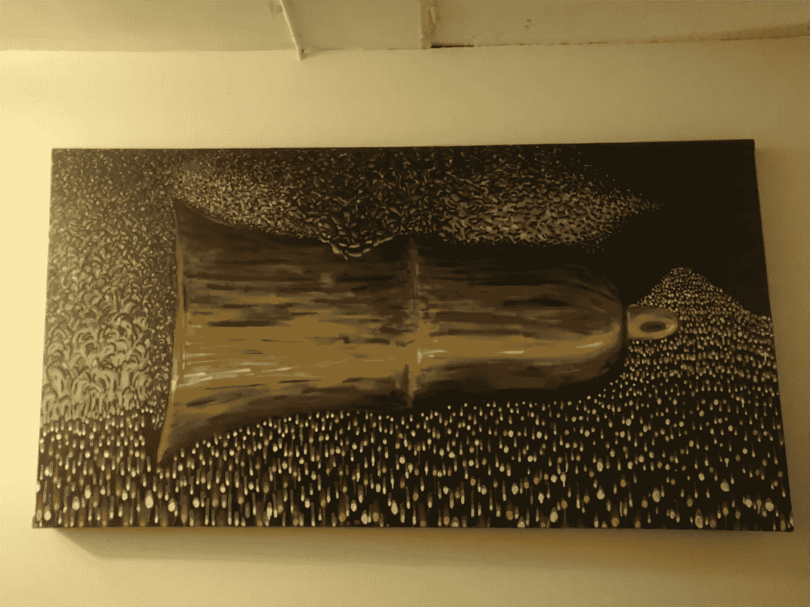
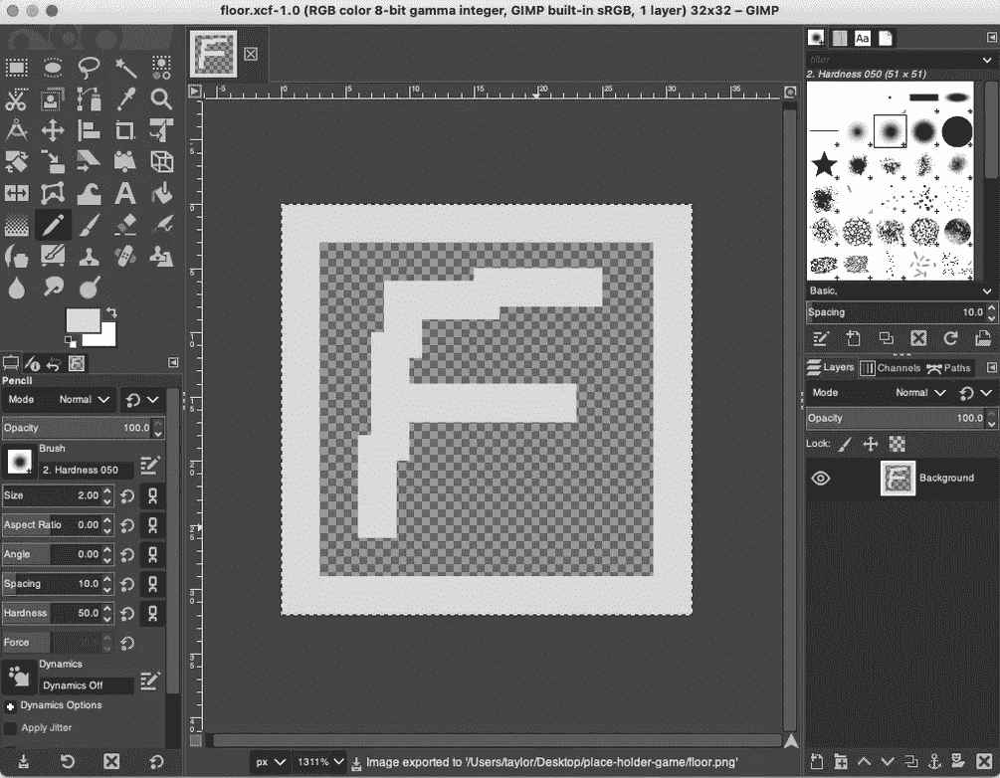
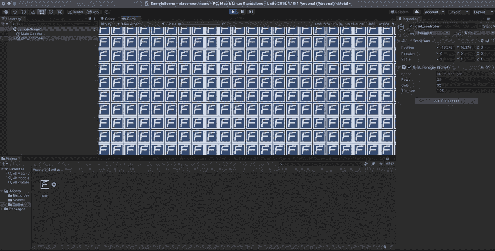

# 用 Unity 制作一个基于网格的游戏:开发日志第一天

> 原文：<https://blog.devgenius.io/make-a-grid-based-game-with-unity-dev-log-day-1-7feebfd400cd?source=collection_archive---------1----------------------->

出现

在过去的几个月里，我一直在做一个长期项目(那幅画。)我刚刚完成它，所以现在我要开始一个新的项目。这就是这个基于网格的游戏的目的。

# 介绍

## 我对 unity 没什么经验。

除了一些算法[可视化项目](https://youtu.be/pMhOjZEb3y4)之外，我对 unity 没有什么经验。

不然我做程序员两年左右。我已经相对快速地发展了这项技能，所以我已经很好地掌握了结构、算法和一般设计原则。

我已经开发了几个基于[网格的](https://youtu.be/irihIZgJZ3M)游戏，所以我对使用这些类型的结构很有信心。

我使用过一些流行的框架，我使用 unity 的次数刚好足以知道它的惯例与流行的 web 框架没有太大的不同。

## 为什么是统一？

我已经经历了足够长的时间，知道创建正常人可以在代码之外使用的真实事物是一项令人敬畏的工作，并且这种事情需要大量的时间。

我选择 unity 是因为我已经花了几十个小时学习一些基础知识。它已经在我的可视化中为我节省了相当多的时间，我相信它也会在这个项目上为我节省一些时间。

此外，我相信 unity 足够强大，可以封装我想制作的游戏类型，我希望在这个过程中发现一些惊喜，让我的生活变得更容易。

是的，我完全期待与框架斗争几次，但这是我愿意冒的风险。

## 我要做什么样的游戏？

与[地牢爬行石头汤](https://crawl.develz.org/)风格相似的一款。

我喜欢这个游戏。我已经玩了好几年了。我希望世界上有更多像这样的内容，所以我把这件事掌握在自己手中。

最重要的是，我想要一个由一个人在不到两年的时间里现实地实现的项目。我以前尝试过游戏开发，我知道艺术作品和动画需要多长时间。通过像这样选择一个现实范围的跳跃点，我将为自己节省很多压力和心碎。

这个游戏不会有任何很酷的动画或过场动画。它将有一个网格和一群做事情的暴民。这些攻击和行动将被记录到日志中(就像 DCSS 一样)

暴民和角色将同时解决他们所有的行动(像 DCSS)

这将是一个类似罗格里的 RPG 游戏(就像 DCSS)

我真的很喜欢时尚灵魂，所以它将有可穿戴物品的精灵。

我会在尽可能多的机会中注入任何形式的创造力。

## 哲学和策略。

这是我在现实世界中没有看到足够多的讨论。

我真的不知道我在做什么。我的编程技能中等。我不知道我将如何解决这个项目中可能出现的许多问题(如分配问题)。

我所知道的是，我已经在我的生活中完成了一些令人印象深刻的事情，我将像处理我生活中其他令人印象深刻的项目一样处理这个项目。

每天留出 1-2 个小时来做这件事，问很多问题(谷歌搜索)

即使感觉没有取得进展，也要相信它确实取得了进展。

对于我面临的每一个问题，我会用我能找到的最简单和最明显的方法，我会一直使用这种方法，直到我需要做得更好来实现最终目标。

## 目标。

做一个成熟的、面向人类的产品，拥有做好工作所必需的所有功能。

通过潜移默化(编程)了解更多我的职业

# 基于网格的游戏:第一天

我要做的第一件事是在 unity 中生成一个 2D 网格。

我几乎不知道如何在 unity 中做任何事情，所以在安装 unity 并用“placement-name”开始一个新的 2D 项目后，我谷歌了如何做我想做的事情“如何在 unity 中生成 2D 网格”

我发现了这个很棒的教程。

当我找到能解决我的问题的信息丰富的视频时，我做的第一件事就是将它们保存到一个列表中。我为我做的每个主要项目都有单独的清单，这样我可以随时参考它们。

在这个时代，保存有价值的教程是至关重要的，因为当你试图学习像这样的技术难度的东西时，网络上有大量的噪音会误导你。

这里有几个我最喜欢的来源:

[塞巴斯蒂安·拉格](https://www.youtube.com/channel/UCmtyQOKKmrMVaKuRXz02jbQ)

[失落的遗迹游戏](https://www.youtube.com/channel/UCg-RkUY5LWy9qL1RBt2y0oA)

在这个教程中，我需要一张图片作为我的地板，所以我用 gimp 做了一些简单的东西作为我的地板。不知道的，Gimp 除了免费开源，基本就是 photoshop 了。我过去经常使用它，所以我更喜欢它。

这是我做的:

为了保持开发的进展，我将尽可能从最愚蠢、最简单的解决方案开始每一个解决方案，并在以后对它们进行微调。这个楼层也不例外。

这也是我决定把这个做成 32px 游戏的地方。每一个格子，以及游戏中的其他东西都将被装进一个 32 像素的盒子里。这是一种审美选择。我想让它有点复古的感觉。

在完成教程后，我得到了这段代码:

这里没有什么新奇的东西，但是在这个视频中教授了一些重要的基本概念。它教导如何制作一个基本的预置，以及如何实例化和引用游戏对象。

对于那些完全陌生的人来说，游戏对象就是这个游戏中的一个对象，它有很多属性或其他行为。

一个预置就像一个可以重复使用的资源，它附加了一些额外的东西，比一个简单的 png 文件多了一点功能..我们现在不需要比这更亲密的视角。

这是我最后得到的结果。我的地板砖的 30x30 格子。

在下一篇日志中。我要设置一个角色，让摄像机跟着他。

[https://www.patreon.com/taylorcoon](https://www.patreon.com/taylorcoon)