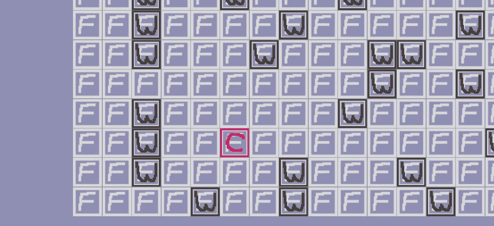
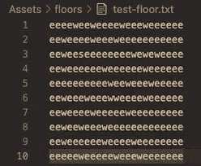
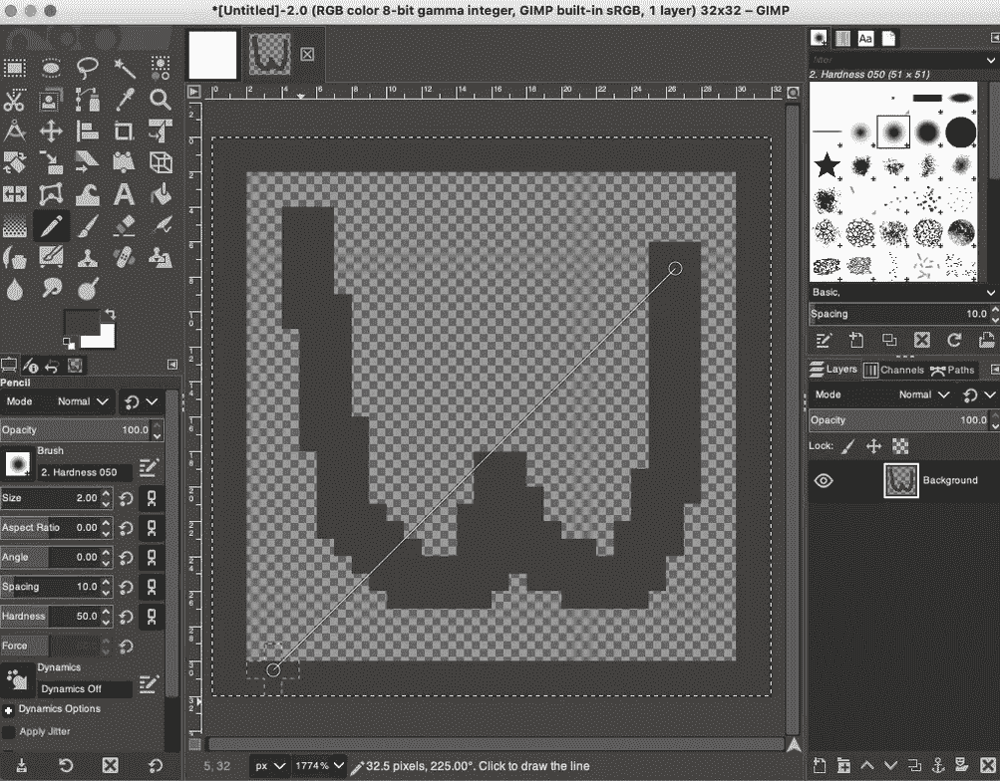

# 用 Unity 制作一个基于网格的游戏:开发日志第 3 天

> 原文：<https://blog.devgenius.io/make-a-grid-based-game-with-unity-dev-log-day-3-8ac29d61da7d?source=collection_archive---------5----------------------->

创建一个系统，从文本文件中生成墙和地板的网格。

生成带墙和楼板的楼板。

# 目标

今天我想制作它，这样我的游戏就可以以文本文件的方式接收平面图，它看起来像一个带有如下标签的矩阵:

字母矩阵。

然后，我的 grid_manager 将读取这个文件并从中生成一个网格。我希望我的 grid_manager 足够智能，可以接受任何大小的矩形矩阵，只要它包含有效的标签。

从那里，我的 grid_manager 将能够用适当的游戏对象生成一个地板。

## 鬼怪；雪碧

首先，让我们做一个墙壁精灵，然后把它变成一个预置，就像我的其他精灵一样。

出于测试的目的，我将遵循一个惯例，将重要的东西用明亮的颜色，将朴实的颜色用于游戏中不重要的元素。

对于我的墙壁，灰褐色就可以了。

土色

顺便说一下，我通过在这个网站上发送“随机”按钮来获得我所有的颜色，直到我找到我想要的东西。

我们到了:

墙壁精灵

## 预制的

就像上次一样，我的游戏中会有很多墙，所以我想要一个可重用的资产，可以很容易地实例化，它可能比精灵有更多的功能，所以我把它制作成一个预置，放在我的资源目录中。

## 把墙放进我的格子里

我决定这样做的方法是通过 txt 文件创建一个矩阵，然后读取 txt 文件并为矩阵中的每个单元生成一个网格。对于矩阵中的每个单元，我想在有墙的地方生成一面墙，即使有墙，也为每个瓷砖生成一个地板。这样，墙的下面仍然有地板。

这将为我以后当或者如果我想添加游戏机制，让玩家通过墙壁打洞。

## 为什么要使用这个实现？

我选择这样做是因为我可以确定这个实现是可能的。Unity 可能有一个更优雅的选择，但我不知道那是什么。

此外，这使得我可以很容易地通过各种方法生成一个级别库。

我未来的目标之一是做一个门户网站，让朋友、家人和粉丝可以用一个简单的网格编辑器为我的游戏关卡。我的实现是这样设置的，这个目标不会太难。我可以简单地创建一个 API，它能够基于网格编辑器中的输入生成文本文件。

后来，可以使用各种矩阵算法自动生成各种迷宫。

## 它是如何工作的

我的代码开始变得有点混乱，但我保持了所有组件的一致性，并扩展了我的 grid_manager 游戏对象。

我去掉了行和列的序列化，而是创建了一个方法，它将在我传递给方法调用的某个路径读取本地 txt 文件。

这个方法将自动检测我的矩阵的大小，并将其内容传递给我的 grid_generator。

将我的路径传递给我的文件阅读器是很重要的，因为当我从 master_manager 调用 grid_generator 时，它允许我控制在屏幕上绘制哪个级别。

这将有助于我以后让玩家从一个级别跳到下一个级别。

我的 grid_manager 将检测我的矩阵中每个位置上的标签，并实例化与该标签相关联的预设，而不是实例化地砖。

## 我遇到了什么麻烦？

嗯，我在日常工作中使用 ruby，我几乎没有使用过 C#，所以我花了大约一个小时才弄明白如何在 unity 中读取本地 txt 文件。幸运的是，C#的矩阵语法非常方便，所以这部分很容易。

大约一个小时后，我向我的朋友抱怨，然后休息一会儿去看电影，但是在那之后，我就没有什么问题了。

经过一点点的错误修复，它的工作！

结果是:

## 今天使用的资源

我用以下代码生成了今天的所有工作:

1.  [官方 c#文档](https://docs.microsoft.com/en-us/dotnet/)
2.  [官方统一文档](https://docs.unity3d.com/Manual/ScriptingSection.html)

3.各种堆栈溢出线程

今天就到这里吧！

下一次，我会让我的角色不能穿墙而过。