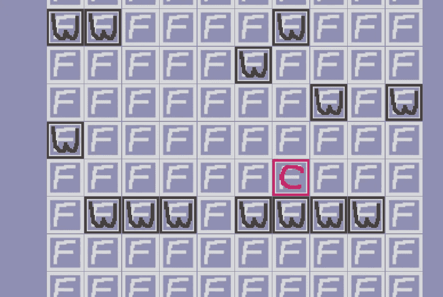
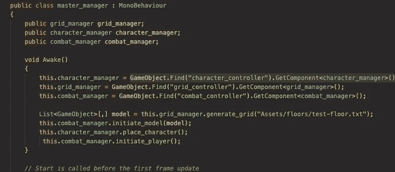

# 用 Unity 制作一个基于网格的游戏:开发日志第 4 天

> 原文：<https://blog.devgenius.io/make-a-grid-based-game-with-unity-dev-log-day-4-2d0a8625ab8b?source=collection_archive---------8----------------------->

阻止我的角色穿墙。

我的基于网格的游戏的屏幕截图。

# 目标

防止我的角色穿墙，同时保持对角线运动。

# 我该怎么做？

我不确定。我脑子里有一个方法，我知道它会起作用，但我怀疑它是否是最有效的方法。我也相信 unity 有不错的网格游戏支持，并且可能有更好的方法来处理这个问题。

然而，由于我不知道这些是什么，我只是要做我知道会工作。

我希望我的 grid_manager 处理我的网格生成。

我希望我的主经理处理“游戏流程”所以，我的总教练将负责关卡之间的转换，以及从主菜单到游戏开始的转换，等等。

我希望有另一个经理来处理所有的逐回合机制，并通过继承来处理敌人和这些事情。

这位经理将是游戏机制的支柱，我不知道在这个人不了解整个董事会的情况下，我如何能让它工作。

它可能不需要知道板的整个状态，只是为了防止墙路径，但当我想到未来要实现的所有事情时，我知道我需要在内存中保留整个级别。

例如，我不想只检查相邻的墙，我想在未来检查相邻的敌人和墙的类型以及其他各种各样的废话。

因此，我将让我的 grid_generator 创建一个矩阵，引用我已经实例化的游戏对象。我的矩阵中的每个单元都是一个游戏对象的列表，包括墙壁和地板。然后，我将能够检查我的角色的相邻单元的各种事情，这些事情将具有特定的行为，包括不可逾越的墙。

我想看看 unity 完成后能否处理好游戏中的每一个细胞(~3600000)。简单的 2D 纹理游戏对象并不昂贵，也没有明确的上限，它可以处理多少。我知道 unity 有一些有趣的规则，关于它是否重画一个对象，这些规则可以改变，这将大大提高我的游戏性能。

然而，这些问题我会尽量不去担心，直到我需要的时候。如果以后性能成为一个问题，我总是可以缩小它，这样只有当前楼层被保存在内存中。

因此，让我们按照这个路线图前进。

## 需要考虑一些组织方面的事情

在做了一些研究后，我想到可能有更好的方法来组织我的经理。如果我们认为我的经理在屏幕上是不可见的，并且有任何奇怪的依赖关系，那么把我的经理放在一个层次结构中可能会更好。

例如，我可以让我的 charcater_manager 和 grid_manager 成为我的 master_manager 的直接子对象。这将使引用他们的脚本变得更容易，所以如果我看到他们，我今天会留意做这些改进。

## …4 小时后。

结果花了比预期更长的时间，因为我清理了一些东西，制造了更多的混乱，学习了很多关于 c#的知识，并且遇到了一些非常烦人的约定，我不知道如何避开。

好消息是它起作用了！

我为此编写的代码非常多余和混乱，但如果我能找到更好的方法，我会在以后的日子里清理它。

我做了一个战斗管理器来控制回合数。它还在作用域中保存了一个单元格矩阵，每个单元格中有一个游戏对象列表。当角色移动时，我们检查相邻的单元格，看它是否包含一堵墙。如果它包含一面墙，角色不会移动，它会将“这是一面墙”打印到日志中。

我在每次检查中遍历每个单元格，但是即使从长远来看，任何给定的单元格中也不会有超过 40 个对象，所以这个操作应该不会出现性能问题。

我还为每个预设附加了一个道具列表，这样每个游戏对象都可以跟踪自己在模型上的位置。当板上的任何东西改变时，它首先更新模型，然后在屏幕上适当地绘制。

这种解决方案并不优雅，目前，角色可以直接离开地板，但现在，这是朝着正确方向迈出的一步。

就我的门卫工作而言，我在我的 master_manager 和我的 character_manager 中大大减少了源代码。

我决定将我的管理脚本保存在类变量中，这样主管理器就可以更容易地引用它们。

我的主经理的看门工作

## 下一步是什么

我认为下一步是防止角色离开地板。我认为最显而易见的解决办法是确保外面有一圈墙。

然而，我最终希望我的角色能够钻透墙壁，所以我决定做一堵超级墙作为地板的边缘，而我的普通墙将是那些可以被钻透的墙。

下次见。