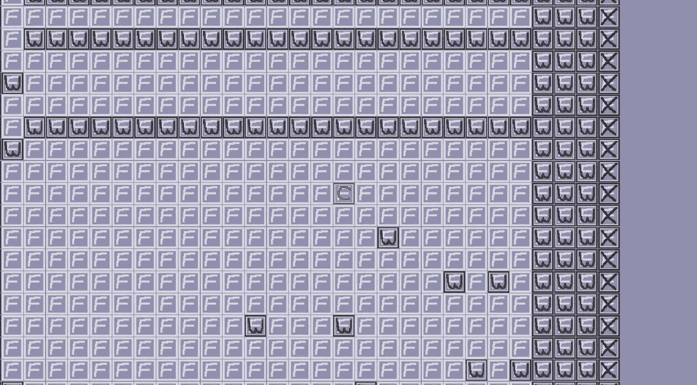
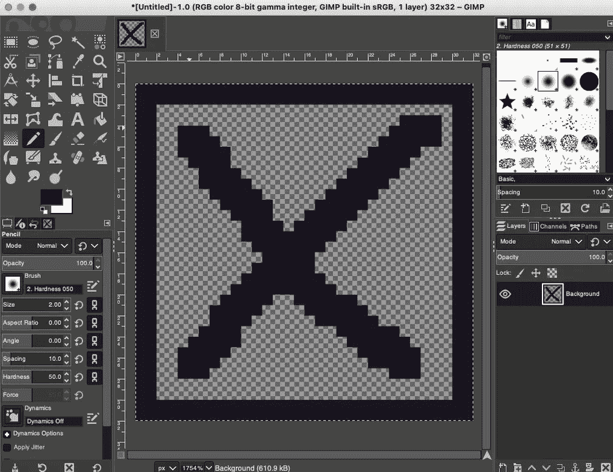
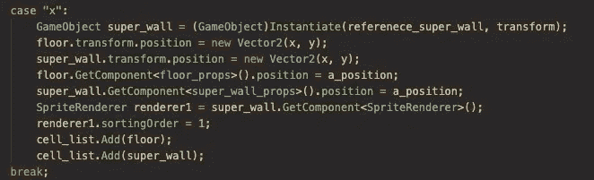
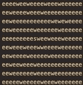
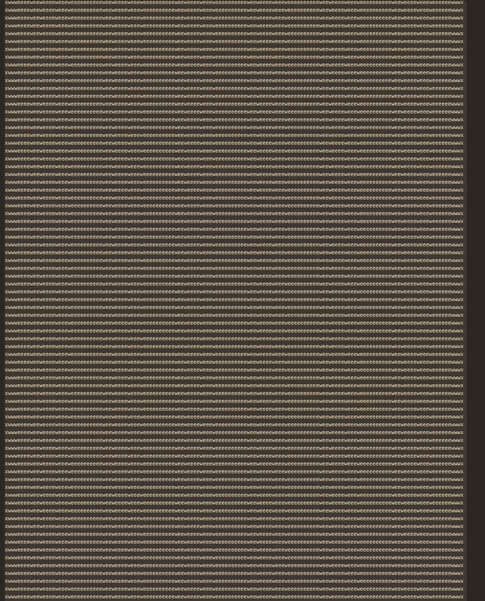
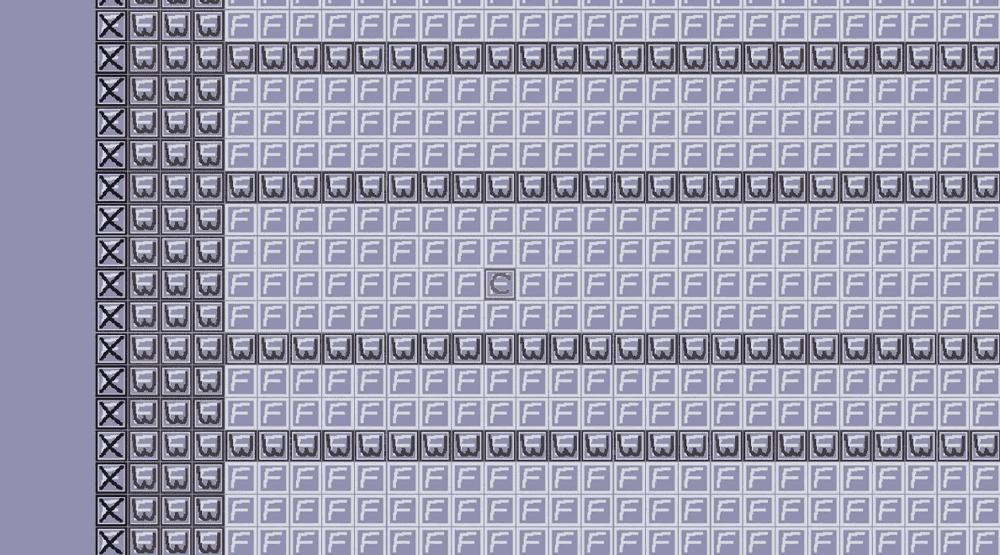

# 用 Unity 制作一个基于网格的游戏:开发日志第 5 天

> 原文：<https://blog.devgenius.io/make-a-grid-based-game-with-unity-dev-log-day-5-4e02f9eae5b5?source=collection_archive---------2----------------------->

造几个关卡，在 em 上打一面外墙。

带墙和超级墙的格式化级别。

# 目标

让我们用我到目前为止所做的来生成一些基本的关卡，用于进一步的制作。

# 我该怎么做？

我现在有了一个方法来稳定关卡，不会导致任何破坏游戏的崩溃。我的 grid_manager 可以接收任何文本文件并生成级别。

现在，我希望在我制作的任何地图的外面都有一圈墙，并且我希望在它的外面有一堵超级墙。向前看，超级墙在任何情况下都是完全不可逾越的。

我要做的第一件事是制作一个超级墙壁精灵和预制体。

然后，我将快速编写一个 ruby 脚本，将墙环和超级墙标签添加到我的楼层文件中。之后，我会制作一些地板并保存在我的 Unity 环境中。

## 超级墙壁精灵

超级墙的占位符精灵

我们找到了。一个简单的占位超级墙精灵。

顺便说一下，我一直在考虑这个游戏的美术设计。对于最终产品，我想我会尽量避免复古的像素艺术风格。我可能会使用像素，但如果我这样做，它们会像这样小:

精细像素艺术鹦鹉

我们很快就要到达我可能需要做更严肃的艺术作品的点，但现在，这只是一些头脑风暴。

好吧，我把我的超级墙壁精灵做成一个预制体，就像我把其他东西做成一个预制体一样。

## 更新 grid_generator 以查看超级墙标签

我更新了我的 grid_generator，接受了一个新的标签“x ”,并在那里放置了一面超级墙。

这段代码乱七八糟，但我可能稍后会清理它。基本上，它只是从预置目录中创建一个新的超级墙，并把它放在屏幕和模型中。它还在那里放了一层地板，因为我希望墙的下面总是有一层地板。

它还更新了游戏对象的属性，这样每个游戏对象都可以跟踪它在模型中的位置。这可能是不必要的，但我实现了这个约定，因为我认为它可以在以后帮助我。

我在墙下放置地板的原因是，在最终版本中，我希望墙比地板略小，这样当艺术品以这种方式覆盖时，我们可以看到墙下地板艺术的边缘。

超级墙标签的 case 语句

## 到我的地板上

我希望我在 ruby 中的 floor 格式化程序接收一个文本文件(就像我的 unity c#生成器一样)，然后它将清理标签，以便生成另一个文本文件，这将是一个更加机械完整的级别。

以我的测试水平为例:

我最初的测试水平

我想让我的 ruby 生成器在外面加上一圈墙。然后在它的外面有一圈超级墙。

这是一个简单的算法:

因为我的等级都不会超过 300x300，而且这个格式化程序可能不会在游戏过程中运行，所以我完全不顾性能地把它拼凑了起来。

下面是 ruby 格式化程序的一个简短视频:

格式化关卡的视频

我继续并缩小了所有的瓷砖。这是我新设置的游戏关卡:

我在游戏中格式化级别的视频

有了我构建的这个系统，我可以很容易地一个接一个地添加新的精灵，给它们分配各种标签，然后让我的 grid_generator 从那里获取。一旦它们进入模型，我就可以构建一些功能，让它们做一些事情，比如移动和攻击玩家。

最终，我将能够从手动角度在一天内生成 10 个级别，这些级别可以包括各种各样的精灵，如果我想，我甚至可以自动生成级别。

## 一些好消息和坏消息

好消息是，我的新游戏对象测试网格在加载后似乎不会出现任何性能问题。我希望 unity 足够聪明，能够知道绝大多数对象没有改变，因此不需要重新绘制。似乎是这样的。

坏消息是我的测试网格是 32x 50，第一次加载到屏幕上需要 1.5 秒。

如果我把它放大，最初的游戏加载可能会变成一个加载条，或者从一个级别到下一个级别会有一个很短的 5 秒的加载周期。我们会看到的。

## 让我们进行压力测试

我继续前进，产生了一个异常大的水平。

这个级别大约是 160 x 160

它在大约 3 秒钟内加载完毕，同样，加载后不会出现性能问题。这是个好消息。

我继续生成了另外两个测试等级，我将在接下来的特性中使用它们。今天是轻松的一天，我很高兴。

## 明天

对于明天，我想我会试着让角色从一层走到下一层。下次见。