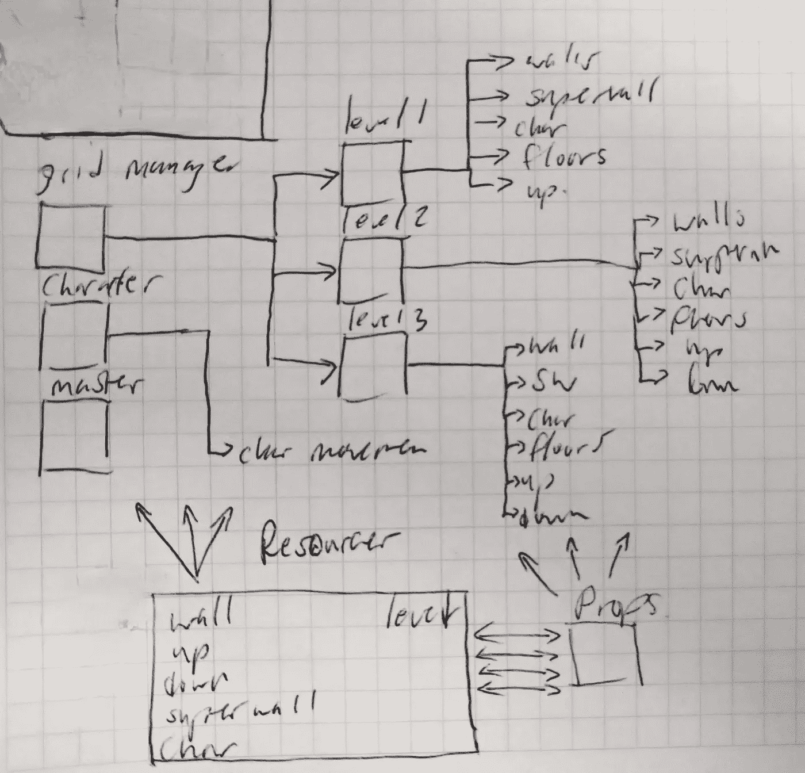

# 用 Unity 制作一个基于网格的游戏:开发日志第 6 天

> 原文：<https://blog.devgenius.io/make-a-grid-based-game-with-unity-dev-log-day-6-77a0a455c076?source=collection_archive---------7----------------------->

从一个级别到下一个级别

# 目标

今天我想让我的角色可以进入一个入口，或者用 DCSS 的方式，“下楼”到下一个级别。同样，我希望我的角色能够回到楼梯上，这样他们就可以回到原来的高度，如果他们愿意的话。

# 我该怎么做？

关于 DCSS，有一些关键的东西我想远离。例如，在 DCSS，每层楼都有多个楼梯和“活板门”DCSS 将此作为玩家的一种瓶颈机制。当附近有敌人时，玩家可以“爬楼梯”。游戏中的敌人只有在紧邻玩家的情况下才能跟随玩家上楼。

我认为这种楼梯滥发的事情是一种蹩脚的技工，所以我要减少流行，使每个级别只有一套楼梯。玩家仍然会因为战利品而有动力去探索整个楼层，但那都是以后的事了。

从技术上来说，我认为最好的方法是制作另一个精灵和预设，把它插入到我的模型中，就像其他的一样，然后在玩家按下按钮时运行某种检查。一旦按钮被按下，他们将被传送到一个新的水平。

在未来的某个时候，我想我会制作一个“互动”窗口，它会弹出一个列表，列出游戏中可以互动的所有选项，但我认为将它包括在今天的目标中会是一天中太多的工作。

为了简单起见，我想我会尝试在游戏开始时生成所有的关卡，并将所有的关卡保存在内存中的某个地方。即使在最后的游戏中，我也不认为玩家每次运行会处理超过 40 级的关卡，所以现在，我只是在某个对象中保留引用的关卡，当玩家进入一个新的关卡时，我会将新关卡的模型放入所有其他机制使用的模型引用中。

## 首先，让我们做一些占位符精灵。

我将为楼梯选择比墙壁和地板更亮的颜色，因为它们可以相互影响。

我们开始吧。楼上是一样的东西，除了水平翻转。

## 意识到目前为止我构建这个的方式违背了 Unity 惯例，我需要重构一些东西来使我的生活更容易。

> 如果你和框架对抗，框架通常会赢

来说说我的系统设计吧。我画了一个图表，大致显示了我的游戏到目前为止是如何工作的。

我有 4 个管理器，它们在内存中保存某些东西，引用预置，实例化对象，调用其他模块中的方法，做各种各样的事情。

照这样下去，我的游戏会很快变成一个混乱的参考网。

此外，在第一帧之前，我的网格管理器创建了所有的级别，并且将所有级别的所有图块都放入一个包中。这使得找到特定的瓦片来实现各种逻辑(比如上楼或下楼)变得更加困难

所以，我重构了整个系统。现在比以后好，我觉得这些改变是必要的，以使等级转换更容易。

如今，大多数渲染框架都陷入了一个惯例，对于任何给定的过程，通常更容易判断各个对象是否负责自己的属性和细节，并且它们将系统的事情报告给父控制器。

我已经改变了我的整个系统，使之更符合这些原则。

我就不告诉你大部分细节了，给你看看我新系统的示意图。

总结一下；我的网格管理器现在正在实例化一个级别对象。对于它生成的每个图块，它都将其分配到自己的级别。每个级别对象都是其中所有对象的直接父对象。

每个对象都有一个 props 脚本，它只是记录一些我希望它记录的变量。我的大部分预设道具仅仅是跟踪它在模型中的位置，但是角色和关卡道具要厚一点。每一层都有自己的 level_model 和上下瓷砖(因为它们是特殊的)

每个上下瓷砖都在记录它吐出的高度。

此外，我没有一个奇怪的角色管理器，而是把它拆开，给我的角色预设添加了脚本，来处理移动和相机移动之类的无聊的事情。

我删除了我的战斗管理器和我的角色管理器，因为它们是不必要的复杂性。

这样，我的对象处于一个有组织的层次结构中，它们可以根据需要引用资源(预设)和它们的属性来执行我的逻辑。

这是一个巨大的进步，也是需要做的事情。

## 现在重构已经完成，回到转换的层面

这是我刚刚做的重构的真正内容。等级转换现在变得轻而易举。

每一关都记录着它自己重要的瓷砖，角色也记录着它在哪一关，所以当我与一些向下的楼梯互动时，我所要做的就是通过询问下一关向上的楼梯在哪里找到出口，然后把我的角色移到那里。

我在里面写了代码，现在它开始运行了:

我对设计和重构非常满意，因为这将允许我一次载入多个关卡，即使玩家不在这个关卡上(例如当怪物四处移动时)，它们的状态也会改变

下次见。