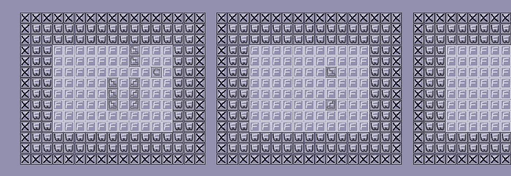

# 用 Unity 制作一个基于网格的游戏:开发日志第 7 天

> 原文：<https://blog.devgenius.io/make-a-grid-based-game-with-unity-dev-log-day-7-cc1067976e5c?source=collection_archive---------7----------------------->

升级我们的电网发电系统，使其更加稳定，并接受更多选择。

多层，有任意数量的楼梯

# 目标

今天我要解决几个问题。

我的网格生成器接收一个包含单个字符串矩阵的文本文件。

我的每个关卡都是迭代生成的。

这两种行为对我的创作过程造成了一些限制，因为我只能使用大约 50 个单个角色，所以这将我的整个游戏限制在大约 50 张牌。我相信最终游戏会有超过 50 张牌。

第二，单个字符约束与迭代网格生成相结合，使我无法使用最简单的解决方案为图块添加某些功能，如缠结。

例如，说我想在一个单一的水平多个楼下。在我看来，解决这个问题最简单的方法是在 tile 上应用一些类名和标识符。

我们知道每个楼下都有通往楼上的出口，但最简单的方法是对有问题的楼梯应用匹配的代码。这样，相互关联的上下瓦片将隐式地“纠缠”在一起，而不需要我在网格生成期间做任何额外的逻辑。

例如，当我创建一个关卡时，我说这个关卡有一个“向下”的瓷砖，并附加了代码“6”我可以用一个附加了代码“6”的“向上”瓷砖创建另一个级别

我可以按照我希望的任何方式生成这些级别，但是这种纠缠是隐式的，因为当我与“向下”的瓷砖进行交互时，我可以简单地解析瓷砖的名称，检索代码，并查询 GameObject 哈希以获得具有相同代码的“向上”瓷砖。

这将允许我对我的世界设计进行荒谬的创新。它将允许我在任何给定的水平上有许多起伏，它们可以去我想去的任何地方，包括相同的水平。我甚至可以创建忽略欧几里德定律的转换。

## 把我的关卡文件做成 JSON

为了实现我上面所描述的，最直接的方法是将我的 floor 文件转换成 JSON 文件，而不是文本。然后，每个级别将显示为如下所示的显式矩阵:

我将把每块瓷砖都表示为长度为 4 的字母数字字符串。这将给我大约 1874161 种不同的可能组合，对于这个游戏的范围来说已经足够了。

这也将为我节省几行代码，因为现在我有一个函数可以解析不再需要的文本文件。

结果是:我可以有任意数量的楼上和楼下，他们可以去我选择的任何地方。

[https://www.patreon.com/taylorcoon](https://www.patreon.com/taylorcoon)