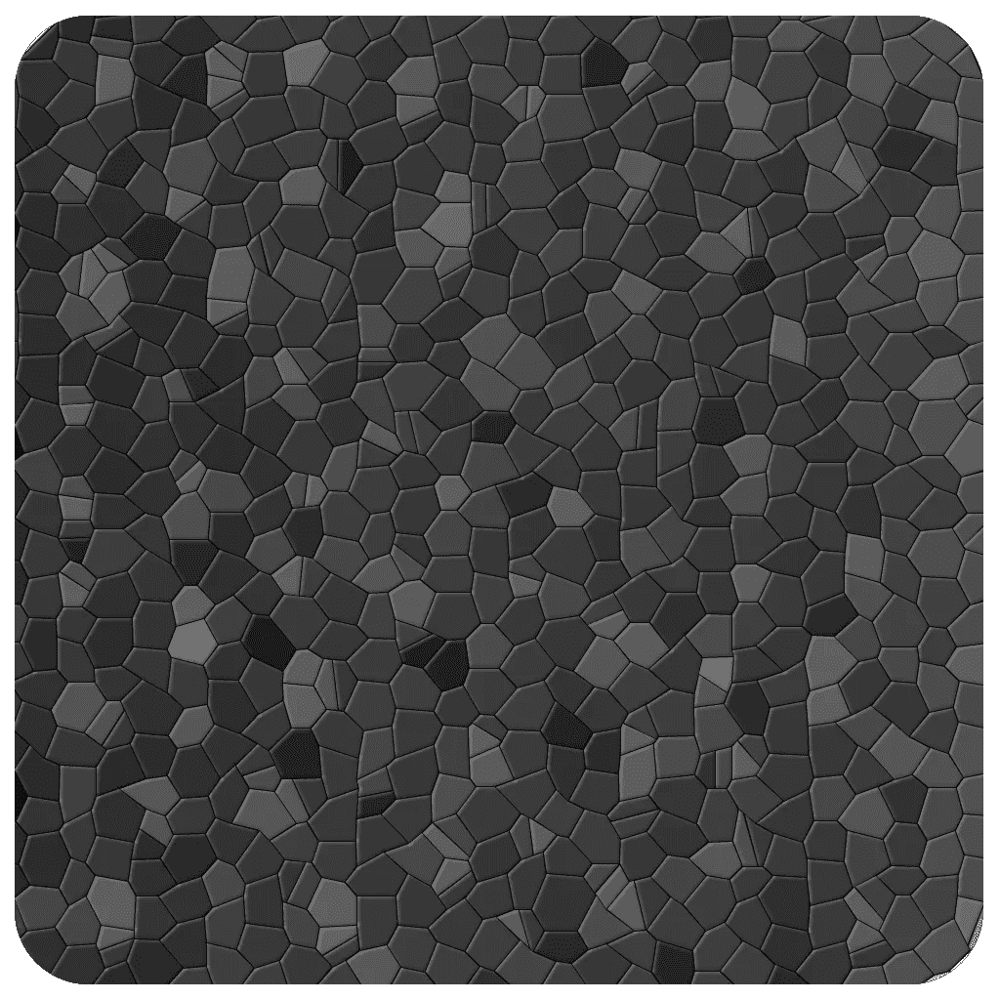

# 用 Unity 制作一个基于网格的游戏:开发日志第 8 天

> 原文：<https://blog.devgenius.io/make-a-grid-based-game-with-unity-dev-log-day-8-99599491bbf5?source=collection_archive---------1----------------------->

现在我们已经有了游戏的基本基础。让我们稍微提升一下审美。

# 目标

我现在已经有了开始一点点建设世界所需要的基本基础。今天，我要在前进之前做一堆瓷砖，这样我的游戏看起来会更好一点。

## 第一次尝试

我花了 2 个小时做了一些瓷砖，这是它的样子。

我认为它看起来很糟糕，所以我放弃了它，再试一次。

## 我花了很多时间摆弄过滤器，但从来没有真正喜欢的结果。

在这一点上，我真的开始考虑聘请艺术家或什么的。原来美术是很难的，制作一个有很棒美术的游戏需要相当多的时间。

在花了大约 5 个多小时制作时间和做研究后，我最终决定，如果我要有任何希望独自完成这个游戏，我需要降低艺术。

我做了一些像样的瓷砖，总的来说，我不是一个糟糕的艺术家。事实上，在过去，我甚至为油画做过委托。

但这是一只完全不同的野兽。

## 简化一切，这样就可以制造一些进步的假象。

在花了几天时间练习我的作品并失败后，我发现最好的前进方式就是在我现有的基础上做一些微小的改进。所以，我用简单的形状和颜色做了一个 tileset，并把它们放到我的游戏中。

这里是我的旧测试水平与新瓷砖集。它永远保持这种状态的可能性很小，但这是对我以前的一个很大的改进。

我怀疑美术作品将是这个游戏最具挑战性的方面之一。

下次见。