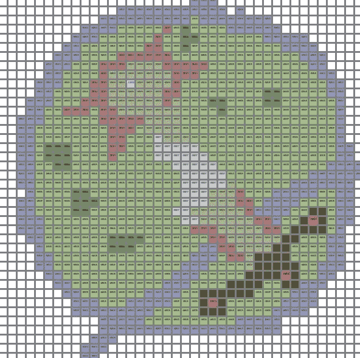

# 用 Unity 制作一个基于网格的游戏:开发日志第 9 天

> 原文：<https://blog.devgenius.io/make-a-grid-based-game-with-unity-dev-log-day-9-2dcc286087ae?source=collection_archive---------2----------------------->

制作关卡编辑器

# 目标

我为我的游戏做了一个过得去的磁贴和关卡生成器。现在，我要做一个关卡编辑器。

在未来，我可能会使用一点程序生成，但我希望能够定制某些级别和级别内的一些东西。这就是关卡编辑器的用武之地。

## 我该怎么做？

我打算用 js/html/css 制作一个门户网站，允许任何人制作一个网格并用预设的瓷砖填充它。它将有一个按钮，当他们完成时，将下载一个 JSON 的水平。

最后，我想把这个门户网站放在网上，这样朋友、家人和支持者可以提交可能会出现在最终游戏中的关卡。

至于技术方法，这是一个用 HTML 制作网页的问题，其中每个预设图块都有一个告诉它代码和颜色的数据属性。

然后，我根据用户的输入生成网格，并向单元格添加几个事件侦听器。

当单击或单击并拖动时，每个单元格将应用当前选择的颜色和代码。

对我来说，这比使用 unity 的内部预制方法要快得多。

这是我的 JS 文件。

最后，我想为这个游戏做一个有很多很酷的信息和功能的网站(包括这个关卡编辑器，以防粉丝想提交潜在的关卡)，但现在我只想把它放到 codepen.io 上的一个浏览器模拟器中

这里有一个笔的链接，如果你愿意的话，你可以使用这个编辑器。

## 如何使用它:

第一个输入是完成后它会给你的文件名。

选择行和列计数(小于 100x100 时为最佳结果)，然后单击生成。

现在基础网格已经在屏幕上了，只需单击您想要的图块预设，然后单击并拖动它到您想要放置预设的图块上。

到目前为止，唯一的规则是网格内的任何空瓷砖必须用墙隔开，上下代码必须在“U”或“D”后加上 3 位数的后缀，即“U005”“D005”。

请允许我演示一下关卡编辑器，然后我会把关卡放到我的游戏中，这只需要大约 5 分钟，因为我制作的所有这些东西都是专门为加快这个过程而设计的。

所以我所要做的就是跟踪一些全局修饰符，比如 up 和 down 关键字，这样我就可以非常快速地创建关卡。

直到下次

[https://www.patreon.com/taylorcoon](https://www.patreon.com/taylorcoon)