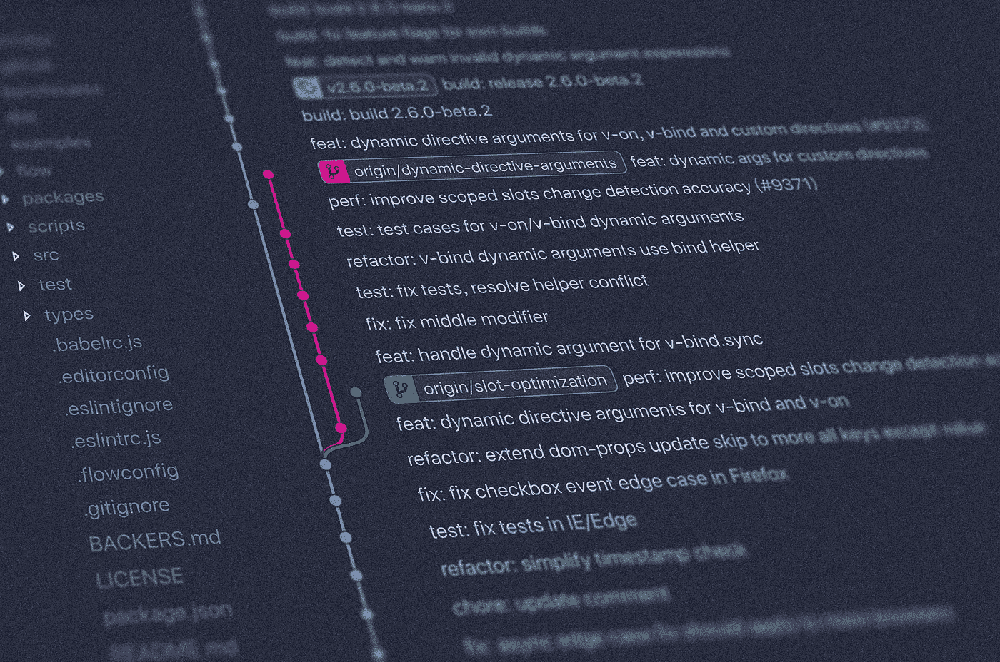

# 使用语义提交消息生成有意义的 git 提交消息

> 原文：<https://blog.devgenius.io/make-a-meaningful-git-commit-message-with-semantic-commit-message-b39a79b13aa3?source=collection_archive---------1----------------------->



> 这篇文章首先发表在 [martinlabs.me](https://martinlabs.me/programming/conventional-git-commit-message/)

我第一次接触版本控制(尤其是 git)时，我只把版本控制看作是一个帮助我存储代码历史的应用程序。因此，当不好的事情发生时，我可以看到历史，并恢复到我的存储库中“好代码”的最后状态。

直到我更频繁地使用它，我才知道它不仅仅是一个版本控制，它还是一个协作工具，您可以在其中编写您的回购之旅的历史，并与其他开发人员共享。那时我才知道，拥有一条好的承诺信息的好处是可以让你更好地与他人合作。

在这篇文章中，我将分享如何编写一个好的提交消息可以帮助你成为一个更好的开发人员，以及常规提交(我最近学习和使用的一个约定)如何使编写一个更好的提交消息变得更加容易。

# 早期

在我使用 git 的早期，我从来没有在编写提交消息的方式上花太多精力。我的大部分提交信息会是这样的。

```
commit e71fcf2022b6135e18777bdc58c2ac3180202ec7
Author: mvalentino
Date: Tue Apr 24 01:25:48 2015 +1000
Extract out information for payment page

commit d1952883b05b685f2d22e4c41b4fbc4362fd6bd0
Author: mvalentino
Date: Mon Apr 23 22:16:50 2015 +1000
[WIP] stripe integration

commit 74b8920d96e3e09d5cd958ffa369a0e3c86a6851
Author: mvalentino
Date: Mon Apr 23 21:09:11 2015 +1000
Generate link for payment

commit b02255b25eed57c7595504c66233d5ee3024190c
Author: mvalentino
Date: Mon Apr 23 18:32:40 2015 +1000
[WIP] Search widget auto places
```

我甚至都懒得去使用提交体。我的定位命令将始终是`*git commit -m <commit message>*`。当你在创建 PR 的公司工作时，做代码审查并不是一件常见的事情，甚至没有人费心要求我写一个好的提交消息。直到我去了一家有良好工程文化的公司，在那里我学会了写一条提交信息，解释它作为我工作的一部分意味着什么。

在我学习寻找编写提交消息的更好方法的过程中，我阅读了来自一位名叫 Chris Beams 的开发人员的文章。在那篇文章中，我首先阅读了术语*“原子提交”*。从那篇文章中，我学到了制作更好的 git 提交消息的 7 条规则(您可以阅读这篇文章以了解每条规则的更多细节):

1.  用一个空行将主题和正文分开
2.  将主题行限制在 50 个字符以内
3.  将主题行大写
4.  不要以句号结束主题行
5.  在主题行中使用祈使语气
6.  在 72 个字符处换行
7.  用身体来解释什么和为什么以及如何

快进到两个月前，我一直在尝试应用上面的那些规则，也通过阅读其他开发人员的提交消息并将其作为参考来构建我的提交消息。有一件事让我很难写出一个好的提交消息，那就是确定哪些更改属于哪个消息。每当我想提交我的更改时，总会有这样一个心理过程来尝试划分更改，这样就可以尽可能地按“原子”分组。

# 传统的救援承诺

然后，直到我的同事引入这个称为[约定提交]的约定(https://www . conventionalcommits . org/en/v 1 . 0 . 0/)，编写一个清晰的提交消息才开始变得容易。因为它指定了一组结构，所以你知道什么类型的变化属于什么类型的消息。

在常规提交中，有 16 个规范规定了提交消息的要求。我可能没有遵循所有的规定，但是总的来说，我总是试图遵循定义提交消息标题结构的主要约定。

简而言之，对于每个提交消息，它总是具有这样的结构

```
<type>[optional scope]: <description>[optional body][optional footer(s)]
```

提交消息的第一行将类似于:

```
feat: add hat wobble
^ — ^ ^ — — — — — — ^
| |
| +-> Summary in present tense.
|
+ — — — -> Type: chore, docs, feat, fix, refactor, style, or test.
```

其中`<type>`可以是以下之一:

*   `feat`:(用户的新特性，不是构建脚本的新特性)
*   `fix`:(针对用户的 bug 修复，不是针对构建脚本的修复)
*   `docs`:(文档变更)
*   `style`:(格式，缺分号等；没有生产代码变化)
*   `refactor`:(重构生产代码，例如重命名变量)
*   `test`:(添加缺失测试，重构测试；没有生产代码变化)
*   `chore`:(更新打杂任务等；没有生产代码变化)

通过合并上述约定，现在我可以快速确定我做了什么更改，以及更改的提交消息是什么样子的。使用这种格式，作为开发人员，您可以立即知道(或者至少猜测)特定提交中发生了什么变化。如果主分支的新合并有问题，您还可以快速扫描 git 历史来找出哪些更改可能会导致问题，而不需要查看差异。

正如传统的 commit 网站所说，有几个很好的理由来使用这个约定。

*   自动生成变更日志。
*   自动确定语义版本碰撞(基于着陆的提交类型)。
*   向队友、公众和其他利益相关者传达变更的本质。
*   触发构建和发布过程。
*   通过允许人们探索更结构化的提交历史，使他们更容易为您的项目做出贡献。

# 我如何在现实世界中使用它

我在工作中使用吉拉进行项目管理，它也支持与 Github 的集成。最近，我了解到，如果你把吉拉的机票号码放在提交信息中，吉拉可以自动检测到它，并可以直接嵌入到你目前在吉拉工作的卡中。这与约定很好地配合，因为我可以将吉拉的票号作为消息的一个`<optional scope>`部分。所以现在每当我在吉拉完成一项任务时，我的提交信息将会是

```
<type>(<jira ticket number>): commit title
```

我最近提交的一条消息中的一个例子

```
refactor(FOW-1327): refactor authentication classadd new class name `userRepo` and extract out api call to `/api/v1/users/me` from authentication to separate class and use the new class to contain all of external api call related to the user data
```

在吉拉，这也将得到体现。


吉拉中反映的 Git 提交

我的工作场所中使用这种约定的另一个例子是名为 [Kaizen](https://github.com/cultureamp/kaizen-design-system/blob/master/CONTRIBUTING.md#conventional-commit) 的开源设计系统库，其中传统的提交格式(尤其是`fix`和`feat`)也被用于在包发布变更日志中生成描述。

# 结论

经过这么长时间，我一直想改进我写 git 提交消息的方式，我想说学习常规提交帮助我成为一个更好的开发人员。现在，当我查看我的回购的 git 历史记录时，我可以很快找出回购中最近发生了什么，并通过查看提交消息来猜测变化。

## 资源:

*   [约定俗成](https://www.conventionalcommits.org/en/v1.0.0/)
*   如何编写 Git 提交消息
*   大卫·德马利的《承诺的艺术》