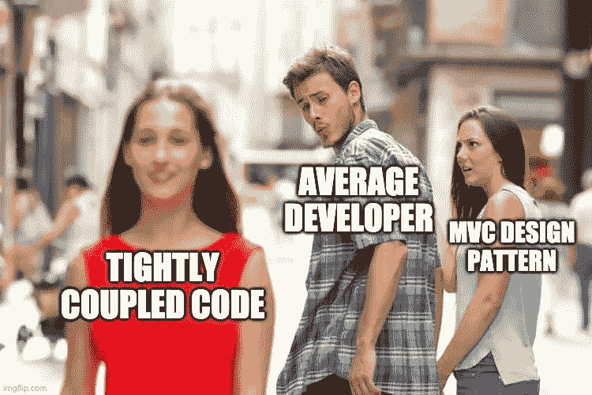
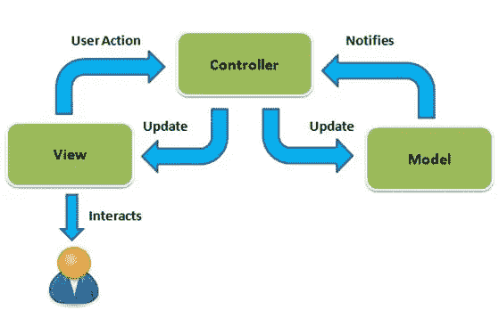

# 使用 MVC 设计模式创建一个令人敬畏的应用程序

> 原文：<https://blog.devgenius.io/make-an-awesome-application-using-the-mvc-design-pattern-9f064b78df48?source=collection_archive---------2----------------------->

## 通过一个很酷的例子了解模型视图控制器设计模式🐕



通过使用 MVC 将您的开发技能提升到一个新的水平

# MVC 设计模式的背景📚

紧密耦合的代码可能很容易编写，但在尝试扩展时却是一个巨大的痛苦…

*   在紧密耦合的代码中，很难与其他开发人员并行工作，因为存在大量的相互依赖。
*   测试可能很困难，因为不同代码段的职责没有很好地分离或定义。
*   这使得在不改变代码其余部分的情况下改变代码的一部分变得更加困难。

MVC(模型视图控制器)是在有 UI 的应用程序中常用的设计模式。MVC 的主要目标是将前端从业务逻辑和数据存储中分离出来。



由 [DotNetGuide](https://thedotnetguide.com/mvc-design-pattern/) 拍摄的照片

上图是 MVC 工作流的一个很好的例子。

1.  用户在视图(UI)上做了一些事情
2.  视图告诉控制器所采取的行动
3.  控制器更新模型
4.  该模型提供了作为操作结果的新数据
5.  控制器更新视图

⚠️ **注意** ⚠️ **:** 有时在 MVC 架构中，在模型和控制器之间还有另一层服务。这个服务层将处理数据库中模型的调用和修改。在我们的示例中，数据将存储在本地，因此我们不会使用服务层。

# MVC 的具体例子💻

编码时间！

在我们的例子中，我们将有一个简单的 MVC，使用一只狗作为我们的数据模型。

这里是模型 POJO(普通旧 Java 对象)。我们简单地使用两个字段，每个字段都有一个 getter 和 setter，以及一个接受这两个字段的构造函数。

## 型号:

这里是视图(我们将只打印出狗的名字和品种，而不是一个完整的 html 页面)

## 查看:

这将简单地打印出狗的名字和品种。

```
{name} is a {breed}
```

最后，这里是控制器，它充当模型和视图之间的翻译器。

## 控制器:

正如你所看到的，我们的控制器依赖于视图和模型，我们通过构造函数注入它们。控制器中的方法委托给模型或视图。(对于更复杂的项目，也可能存在一些业务逻辑)

现在我们将运行一个程序来模拟网页加载，用户修改数据，然后网页更新。

我们将获得以下输出

```
Ralph is a Corgi
Spot is a Yorkie
```

哒哒！你制作了一个 MVC 来与 Ralph 和他的其他朋友互动😀。


由[布兰登·科尔米耶](https://unsplash.com/@ghosttrooper)上[的 unsplash](https://unsplash.com/)

通过使用这种设计模式，我们可以使视图非常简单，并将许多业务逻辑和数据查询从前端分离出来。

# 为什么要用 MVC？🤔

您知道如何实现 MVC 设计模式，但是为什么要使用它呢？从视图中调用模型更容易，为什么要使用控制器。我不是说你应该总是使用 MVC，因为它不一定适合每个项目。

我**会**给你列举使用 MVC 的利与弊…

## 优点:👍

*   *同时开发*——通过将代码分成这三个部分，我们可以让开发人员在模型、视图和控制器上独立工作，而相互之间的影响最小。
*   容易修改 —通过分离每个部分的职责，我们使修改变得更容易，因为我们只需要担心那个部分。
*   *更好的测试*——有了更好定义的边界，我们可以很容易地单独测试每个部分。

## CONS:👎

*   *写起来很复杂* — MVC 架构有一个学习曲线，比仅仅拼凑一个应用程序需要更长的时间。
*   *样板代码* —对于一个小项目，MVC 需要大量的样板代码，例如在狗的例子中，我们可以只用一个模型和一个视图实现相同的最终结果，并保持代码相对干净。

简而言之，如果你是唯一一个从事小型 web 项目的人，MVC 可能不适合你。如果你和一组开发人员一起编写一个更大的应用程序，MVC 可以减少开发时间，提高代码的可测试性和可读性。