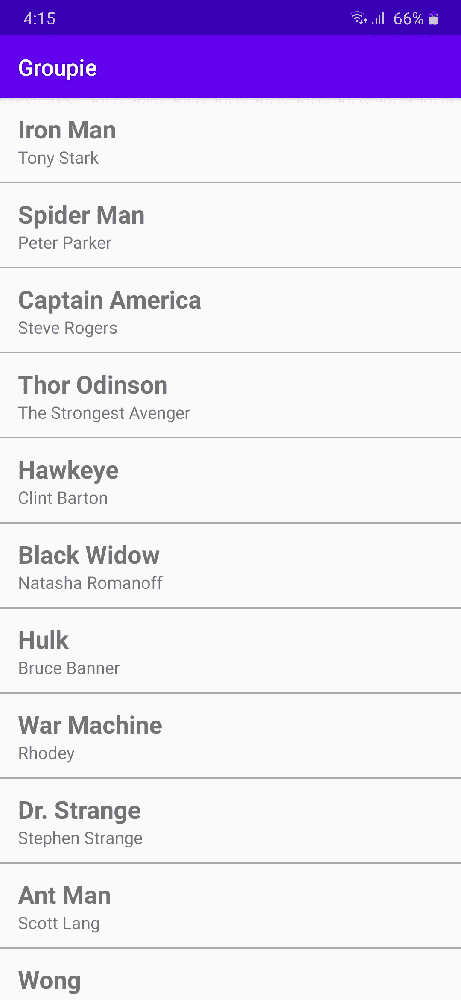

# 使用 Android 中的 Groupie 轻松制作复杂的 RecyclerViews

> 原文：<https://blog.devgenius.io/make-complex-recyclerviews-easily-with-groupie-in-android-659227b207f3?source=collection_archive---------4----------------------->

## Groupie 是一个 android 库，它可以让你的 android 应用程序中复杂的 RecyclerViews 变得超级简单。


杰西卡·刘易斯在 [Unsplash](https://unsplash.com?utm_source=medium&utm_medium=referral) 上拍摄的照片

RecyclerView 是一个超级有用的小部件，用于在 android 应用程序中显示大型列表。但是实现 RecyclerView 需要大量的样板代码，比如创建适配器、视图容器等。这包括创建一个条目列表的大量工作。

这就是追星族的由来。Groupie 是一个开源的 android 库，让你的应用程序中的 RecyclerViews 变得非常简单。Groupie 将您的列表项视为逻辑组，并为您处理更改通知。您还可以为列表项制作页眉和页脚。Groupie 还支持 android 数据绑定来创建适配器。它删除了创建视图容器、适配器、视图类型等的样板代码。

在这篇文章中，我们将看到如何用 Groupie 创建一个简单的回收视图。

## 将 Groupie 添加到您的项目中

通过在您的应用级别`build.gradle`文件中添加最新版本，在您的项目中添加 Groupie。

```
implementation "com.xwray:groupie:2.8.0"
implementation "com.xwray:groupie-kotlin-android-extensions:2.8.0"
```

我们将创建一个应用程序，在一个 RecyclerView 中显示超级英雄的名字和真实姓名列表。假设我们从一个 Api 中获取一个超级英雄列表，并在我们的活动中获取它。

主活动. kt

超级英雄对象的模型类如下:

```
data class Superhero(
    val name: String,
    val realName: String
)
```

## 创建布局文件

在创建 recycle view 时，我们会为单个项目创建一个单独的布局文件，还会将 recycle view 添加到您的活动或片段中，因此这里也是一样的。

在布局文件中添加`RecyclerView`。

main.xml

现在为单个项目创建一个单独的布局文件。

item_superhero.xml

这是一个非常简单的布局，只有两个`TextViews`和一个垂直的`LinearLayout`分隔符。这两个文本视图只是用来显示超级英雄的名字和他们的真实姓名。

## 使用 Groupie 创建 RecyclerView

Groupie 抽象出了制作适配器的复杂性，取而代之的是，我们将创建一个`SuperHeroItem`类并扩展 Groupie 的`Item`类。`Item`类为您提供了简单的回调，将您的模型对象绑定到生成的字段。

超级英雄

在扩展了`Item`类之后，我们必须覆盖两个函数`getLayout()` 和`bind()`。在`getLayout()`函数中，我们将返回我们希望在 recycle view 中使用的单个项目布局，在`bind()`函数中，我们将像在普通 recycle view 适配器的`onBindViewHolder()`中一样，将视图与超级英雄数据绑定。注意，我们在`SuperHeroItem`类的构造函数中获得了`SuperHero`对象。

现在，Groupie 使用一个`GroupAdapter`而不是普通的适配器来创建列表。因此，在我们的 MainActivity 中，我们将创建一个 GroupAdapter，并将从 api 获得的超级英雄列表添加到 GroupAdapter 中，并将 is 设置为 RecyclerView 的适配器。

现在这里的问题是 GroupAdapter 接受项目作为`List<SuperHeroItem>`，但是我们获取超级英雄作为`List<Superhero>`。所以我们将创建一个扩展函数，将`SuperHero`类的列表更改为`SuperHeroItem`类的列表。

```
fun List<Superhero>.toSuperHeroITem() : List<SuperHeroItem>{
    return this.*map* **{** SuperHeroItem(**it**)
    **}** }
```

现在，我们将在 MainActivity 中创建 GroupAdapter，并使用`addAll()`方法添加其中的所有项目，然后将其设置为回收器适配器。

主活动. kt

结束了。您的回收器视图已创建，如下所示。



用 groupie 创建的 RecyclerView

## 结论

现在，您已经用几行代码创建了一个回收器视图，更不用说没有制作适配器、视图容器等。这只是创建回收器视图的一个简单示例，但是使用 groupie，您可以创建更复杂的回收器视图，例如向回收器视图添加页眉和页脚，甚至向回收器视图添加节。我们将在本系列的其他部分看到更复杂的制作回收器视图的例子。

与此同时，你可以阅读我的另一篇文章，用 android 中的 Stetho 库轻松调试你的网络请求和数据库。

[](https://medium.com/dev-genius/stetho-the-ultimate-debugging-tool-for-android-1e7573554d04) [## ste tho:Android 的终极调试工具。

### Stetho 是一个易于使用的库，由脸书调试网络请求和 android 应用程序中的数据库。

medium.com](https://medium.com/dev-genius/stetho-the-ultimate-debugging-tool-for-android-1e7573554d04) 

## 参考

[追星族官方文件](https://github.com/lisawray/groupie)

感谢阅读。请在评论中给我你的建议。