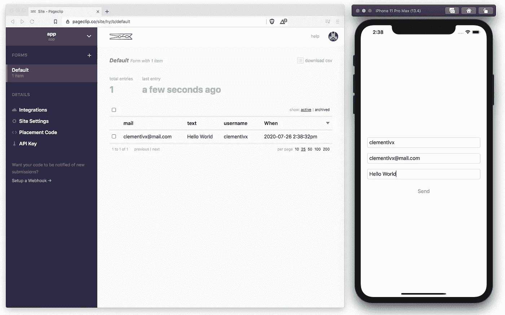
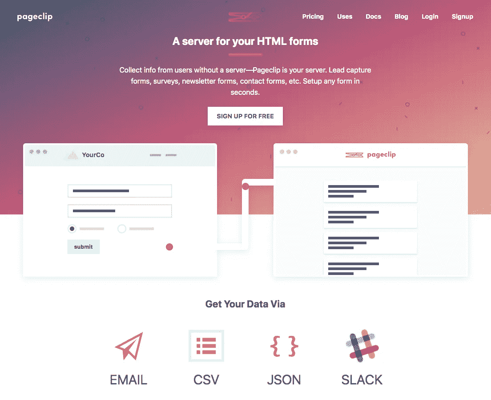
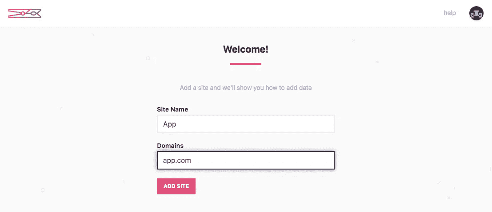
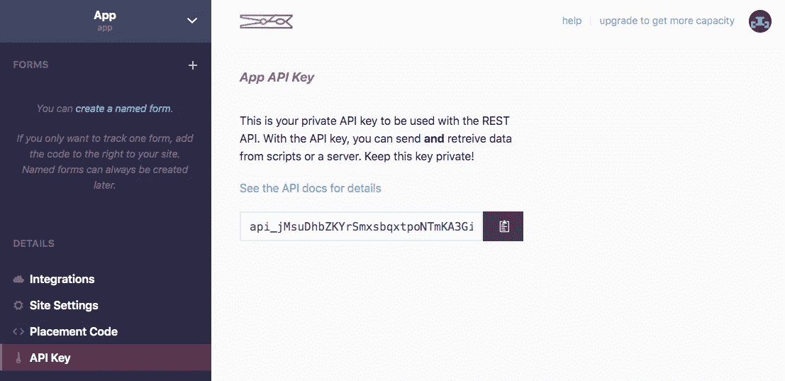
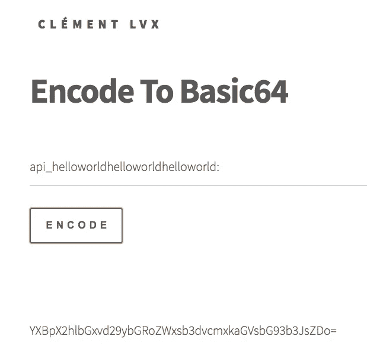
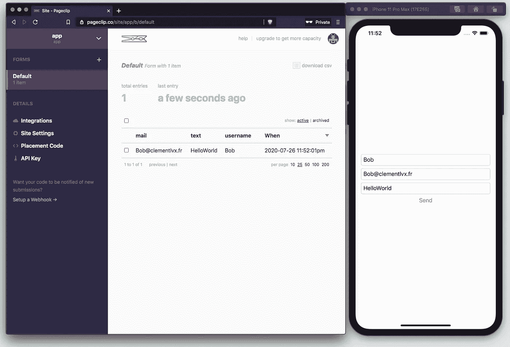
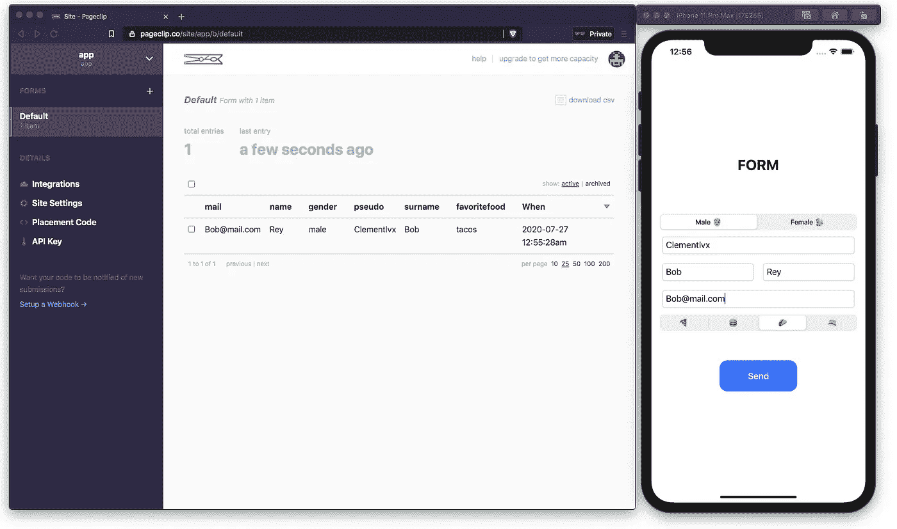

# 使用 Swift 5 和 PageClip 制作表格

> 原文：<https://blog.devgenius.io/make-forms-with-swift-5-and-pageclip-d81a9a0383fc?source=collection_archive---------4----------------------->

你想在你的 iOS 应用程序中创建一个联系人表单？你在好地方！

为了管理表单数据，我们将使用 [Pageclip](https://pageclip.co) 和他的 API。

首先，在 Pageclip.co 的[上创建一个账户，你有几种类型的订阅，对于这个故事，你可以选择免费的。](http://Pageclip.co)

*提示:如果你是学生，你可以免费使用* [*Github 学生*](https://education.github.com/pack) 的基础计划

创建您的帐户后，您必须将您的站点添加到 Pageclip，这里我们将放置一个无效的域，因为我们将使用 API:

然后，转到“API 密钥”选项卡，复制密钥并将其放在一边:

我们现在可以创建一个简单的 Xcode 项目，我们将在其中插入一个视图、一个或多个文本字段和一个按钮:

然后，我们将创建一个函数，在这个函数中，我们将使用每个文本字段的数据发出一个 HTTP 请求。

**别忘了粘贴 API 密匙，但这里必须是 Base64 编码，末尾带“:”。**

你可以用 linux 命令或在线工具编码，这里我们将使用我的工具[clementlvx.fr/basic](https://clementlvx.fr/basic)

如果你愿意，可以让你的程序直接编码你的 API 键，但是我们今天不会看到

完成后，您可以启动模拟器并进行测试。

当您输入数据并点击“发送”时，您应该会看到 PageClip 仪表盘上显示的数据:

然后你可以随时添加数据发送，由你决定:)

