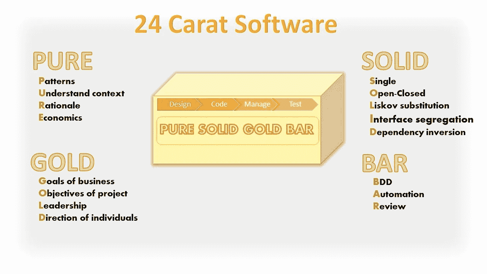

# 不用抢劫银行，用一根纯金棒就能做出伟大的软件。

> 原文：<https://blog.devgenius.io/make-great-software-with-a-pure-s-o-l-i-d-gold-bar-without-raiding-a-bank-7090528c154f?source=collection_archive---------5----------------------->

[Infrarate.com](https://unsplash.com/@infrarate?utm_source=medium&utm_medium=referral)在 [Unsplash](https://unsplash.com?utm_source=medium&utm_medium=referral) 上拍照

## 24k 软件需要的不仅仅是坚实的基础

## GOLD 能像 SOLID 做编码那样做开发吗？

编程世界中每个人都提到的最成功的缩写是 **SOLID** 。这个容易记住的朗朗上口的词传达了一种质量和力量的感觉，并允许人们记住五个原则，这五个原则是开发健壮、优秀软件的基础。

然而，SOLID 并不是全部，而是一个很好的开始。我认为尝试并扩展这一点来创造一个包含更多软件开发领域而不仅仅是编码的短语会很有趣。此外，它应该非常简单，并充分利用固体，因为这是一个伟大的胜利，为营销团队想出了它(或饮料垫上画了草图)。

# **该消息的要求**

不同寻常的是，我在戴工程帽子之前戴上了我的营销帽子(那顶帽子积满灰尘，几乎从未用过),来定义这个小冒险的要求:

*   容易记住
*   构建并包含实体(毕竟让我们“站在巨人的肩膀上构建”)
*   还包括设计、测试和管理
*   传达积极、高质量的目标
*   易于用简单的图片或图像传达概念

# 沉思的时刻

固体通过重量暗示质量，所以真正重的东西——铅——不感觉不对，另一方面，金，贵，重，是人们努力争取的东西。所以是金子，所以这给了我们纯金。纯金带来的第一个图像是一个亮黄色的重锭。有抱负、有价值、有梦想意味着它必须是纯金的，因此它是 24 克拉的。添加管理、设计、测试和现有单词 SOLID 三个主题表明最终短语总共需要四个单词。

最终的结论和结果是:

*   图像—金元条
*   文本—纯金条

# 现在创建一个有用的缩写

所以现在把这三个新单词与三个特定领域的技巧和技术联系起来，并用它们所属的单词把它们联系在一起。

设计和建筑的纯粹缩写

*   **模式** —理解模式对于重用现有知识、使用通用词汇、避免重复发明轮子(和以前的错误)至关重要。Principle 是这个“P”字母的有力竞争者，但是当我想到团队所做的事情时，那么 Patterns 是一个更实用的词。
*   **了解背景** —在设计解决方案之前，你必须清楚并充分了解问题所在。最基本的第一步是背景
*   **理由** —理解为什么做出决策是关键。使用 ADR 来获取这类信息就是一个具体的例子。
*   **经济** —交付和过度设计(镀金)之间的平衡是一个关键决策，同时还有立即行动或积累技术债务(及其资本利息的积累)。

管理的黄金缩写可以解释为:

*   **业务目标**。团队必须考虑企业的长期目标、愿景和使命。
*   项目目标。目标必须始终保持清晰，并成为决策的主要驱动力。
*   **领导力**在需要时应该是支持性的(仆人型领导模式)、果断的和清晰的，关注团队目标的一致性。它不应该过于强势(独裁)或隐藏(缺席)。
*   **驱动**的个体。了解个人的职业抱负和技术兴趣至关重要，这样他们才能以有意义和令人满意的方式做出贡献。即不要把方钉放在圆孔里。

质量和测试的酒吧缩写是:

*   **行为**驱动的开发——使用给定的时间及其与用户故事的联系，对用户的特性和需求进行建模测试。
*   **测试的自动化**允许可重复的测试，具有可追踪的需求和结果。
*   **审查**源代码、测试计划和结果是团队拥有和提高整个产品或服务质量的关键。我确实讨论过 RCA 根本原因分析作为一个可能的选择，但是回顾需求范围的 3-Amigo 会议的成功经验意味着我最终决定进行回顾。

# 最后的结果

# 你怎么想呢?

请评论您认为更有价值的任何其他原则，以及如何将它们压缩到首字母缩写词中。

# 进一步阅读

 [## 照片中的神盾局原则

### 如果你熟悉面向对象编程，那么你可能听说过坚实的原则。

medium.com](https://medium.com/backticks-tildes/the-s-o-l-i-d-principles-in-pictures-b34ce2f1e898)  [## 坚实是旅程的一部分，而不是目标

### 什么是好的软件？

medium.com](https://medium.com/dev-genius/solid-is-part-of-the-journey-not-the-goal-658c17787335)