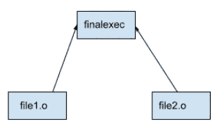
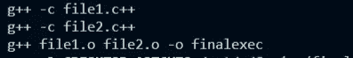

# 制作和制作文件

> 原文：<https://blog.devgenius.io/make-makefiles-e17015cf5b56?source=collection_archive---------6----------------------->

正如维基百科所说， **Make** 是一个[构建自动化](https://en.wikipedia.org/wiki/Build_automation)工具，它通过读取指定如何派生目标程序的[文件](https://en.wikipedia.org/wiki/File_(computing))称为 *Makefiles* ，自动[从](https://en.wikipedia.org/wiki/Software_build)[源代码](https://en.wikipedia.org/wiki/Source_code)构建和[库](https://en.wikipedia.org/wiki/Library_(software))。

**为什么需要构建系统？**

*   简化管理大量程序文件的过程
*   仅编译已更改的文件(节省时间和资源)
*   自动链接和编译文件

> 我将考虑一个基于 C/C++的项目，同样的想法适用于所有语言

在上下文中，考虑一个非常大的项目，包含许多文件，每个文件又依赖于许多其他文件。一个显而易见的方法是开发代码的模块化结构，这样，单独的组件被放置在单独的文件中，然而，这些文件需要协调工作。在非 makefile 方法中，每次构建可执行文件都需要编译。c/。c++文件给对象文件并链接所有这些。这是一个非常痛苦的过程，并且可以自动化和简化。这是构建可执行文件的明智之举。

> 用 c++创建可执行文件的步骤

1.  预处理:#include 和#define 被解析。这意味着头文件的内容放在文件中，而#define 引用的值按原样放在代码中。
2.  编译器:将 cpp 文件转换成汇编代码。
3.  汇编程序:下一步是从汇编代码中创建目标代码
4.  链接:链接目标文件以创建可执行文件

在 C++中，目标文件是通过以下方式创建的:

```
gcc -c name-of-file.cpp
```

各种目标文件可以如下链接以创建可执行文件，这里 final-exec 是最终的可执行文件

```
gcc obj-file1.o obj-file2.o -o finalexecutable
```

> 生成文件

Makefile 以下列格式编写:

```
target: dependencies
     action #needs to be preceeded by a tab NOT spaces
```

目标表示正在构建什么，依赖项表示目标依赖于依赖项，而操作指的是为了从依赖项中获得目标必须做什么

> Makefile 示例

```
# -*- MakeFile -*- (for comments)# target: dependecies#   action (after a tab only)# final executable created (only has a target and dependencies)all: finalexec# final exec depends on the object files file1.o an file2.ofinalexec: file1.o file2.o# action needed to create finalexecg++ file1.o file2.o -o finalexec # object file of file1 depends on file1.c++file1.o: file1.c++g++ -c file1.c++# object file of file2 depends on file2.c++file2.o: file2.c++g++ -c file2.c++ # removes the object files, can be run as make cleanclean:rm -rf *.o
```

这里创建了一个依赖图，要执行的第一条指令不依赖于任何其他文件，例如:这里指令 file1.o 和 file2.o 是目标，可以首先执行，因为它们没有任何依赖关系。



不同目标的依赖关系图

在某种意义上，指令在 Makefile 中的执行顺序可以由依赖关系和目标的**拓扑排序**(如维基百科所定义的，在计算机科学中，有向图的拓扑排序或拓扑排序是其顶点的**线性排序，使得对于从顶点 u 到顶点 v 的每个有向边 uv，在排序中 u 在 v 之前)来确定，额外考虑的是，只有对于文件中有变化的指令，才会重新编译其直接和间接连接。在依赖树中，考虑到可执行文件处于最高级别，时间戳的概念用于决定哪个分支应该重新编译，哪个不应该。**

记住:依赖图中较低层次的文件在较高层次之前编译(可执行文件是最后创建的)。如果一个文件的编译或最后一次创建时间晚于它上面的一个文件，那么这意味着该文件已经被改变，因此该分支将需要重新编译。

时间戳被称为**系统时间。**
维基百科说:例如， [Unix](https://en.wikipedia.org/wiki/Unix) 和 [POSIX](https://en.wikipedia.org/wiki/POSIX) 兼容的系统将系统时间([Unix time](https://en.wikipedia.org/wiki/Unix_time))**编码为自**[**Unix epoch**](https://en.wikipedia.org/wiki/Unix_epoch)**1970 年 1 月 1 日 00:00:00**[**UT**](https://en.wikipedia.org/wiki/Universal_Time)**开始所经过的秒数**



运行“make”命令时执行指令的顺序

但是可能存在循环依赖性，其中目标文件 f1 具有对文件 f2 的依赖性，而目标文件 f2 具有对文件 f1 的依赖性(不确定这是如何解决的，可能引发了警报)

**参考资料**
-[https://www.youtube.com/watch?v=DtGrdB8wQ_8](https://www.youtube.com/watch?v=DtGrdB8wQ_8)-[https://www.youtube.com/watch?v=GExnnTaBELk&t = 1s](https://www.youtube.com/watch?v=GExnnTaBELk&t=1s)
-[https://www.youtube.com/watch?v=upX8WjCITXg&list = plalvdrk 2 RC 6 rektqao 7 a 6 _ mMQJAZPbERk](https://www.youtube.com/watch?v=upX8WjCITXg&list=PLalVdRk2RC6rektqao7a6_mMQJAZPbERk)

以上都是超级有用的参考！
-