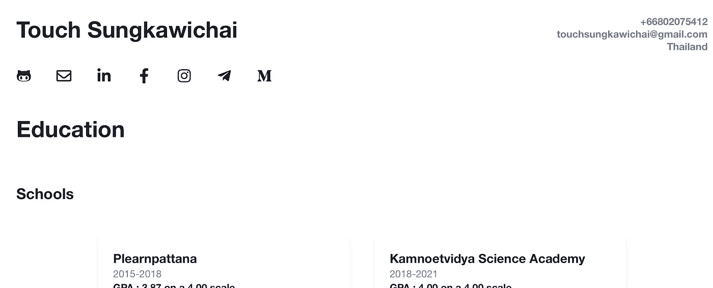

# 在几分钟内制作最少的在线简历

> 原文：<https://blog.devgenius.io/make-minimal-online-cv-in-minutes-cd64503e21ad?source=collection_archive---------5----------------------->

# 为什么要有简历？

拥有一份简历在很多方面都是必不可少的，尤其是申请工作和大学的时候。简历显示了申请人的必要信息，包括他们接受的教育，经验，技能和奖项。

# 为什么在线？

网上简历肯定比纸质简历好，因为申请人和招聘人员都更容易提交和接收已经在网上的简历。与可互动的网络简历相比，发送 pdf 格式或普通简历的照片并不有趣。在线简历也更容易更新，因为它没有限制；内容不需要放在一张纸的小页边上。

# 怎么做一个？

如果你正在寻找一份类似于[这份](http://my99n-cv.now.sh)的简历。(点击查看完整网站)

在线简历的模板

它已经为你建造好了。如果你知道如何使用 github，设置会非常简单。

*   派生并克隆存储库，并导航到/src/constants。您将看到包含所有个人信息的文件。
*   编辑文件。包括您的个人信息。
*   发布。使用 [Vercel](https://vercel.com/) 来部署站点既简单又免费。

请随意重新设计或改变你喜欢的模板。CV 是使用 NextTS (ReactTS)构建的。

也不要犹豫向我的存储库提出请求！