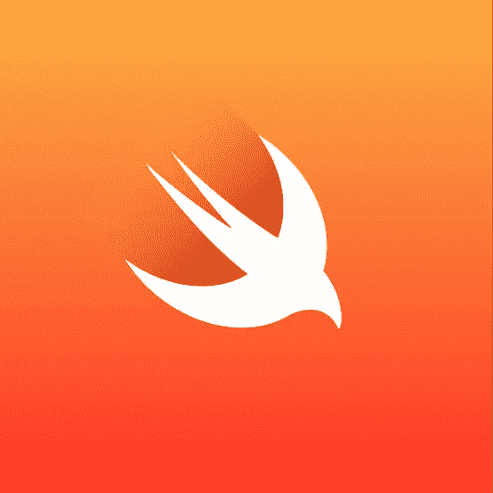
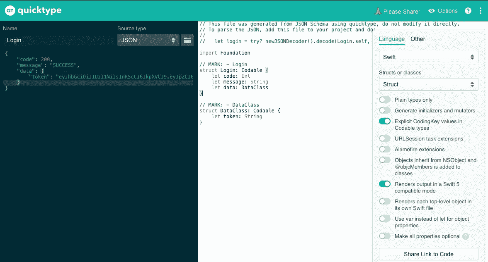

# 使可重用和更干净的 HTTP 请求更快捷 5

> 原文：<https://blog.devgenius.io/make-reusable-and-more-clean-http-request-swift5-2cd6077073ce?source=collection_archive---------8----------------------->

大家好，我想分享我用 Swift 5 MVVM 学习开发 IOS 应用程序的故事。因为基本 me 来自 android 开发者，Ios 开发和 android 开发有一些不同的模式。但我认为 ios 开发的学习曲线并不太难，因为 swift 更容易学习，尤其是 Swift5 和 SwiftUi it。

我决定学习 Swift 是因为我在使用 react native 等多平台应用程序做项目时，遇到了很多本机模块的问题。react native 中有这么多库，但有时我发现只适用于 android 应用程序或只适用于 ios。或者我没有发现任何人有我需要的本机模块。

当我用 kotlin 或 java 开发 android 应用程序时，有类似库的改进非常有用、简单和干净。有了这个库，我使用 MVP 模式代码看起来整洁简单。但是当我开始学习 swift 时，很多教程看起来只是工作代码，而不是整洁和可维护的。现在我发现了一个很好的模式，用 MVVM 可观察模式使 http 请求看起来简单且可重用。

第一步是创建 RequestService 来处理对 API 的请求，如下例所示。

然后制作可编码模型来映射 web 服务 json 响应，有一个简单的方法可以做到这一点。打开网站 [https://swift4json](https://www.json4swift.com/) 或【https://app.quicktype.io/】T2 然后从 postman 那里复制你 json 响应并像这样粘贴到网页上。

然后从生成的代码复制到你的项目，我通常把它保存到文件夹模型，但你可以把它保存到另一个。

通过创建一个父类名为 ObservableObject 的类来创建您的视图模型，然后您可以像这样调用 API。我没有使用 NSUserDefaults 保存令牌不安全或未加密，无论是在设备上还是同步到 Mac 时，都可以轻松打开和读取。

NSUserDefaults 是存放首选项和配置信息等内容的好地方，但不是存放密码或令牌等敏感内容的好地方。我使用名为 KeychainSwift 的库来保存令牌。

最后，在视图上，您只需调用 ViewModel 并观察它对视图解析的响应。

现在，您可以添加更多请求 api，只需在登录函数下面添加即可。希望这篇教程能对你有用，感谢你的阅读。鼓掌支持我们；-).再见。