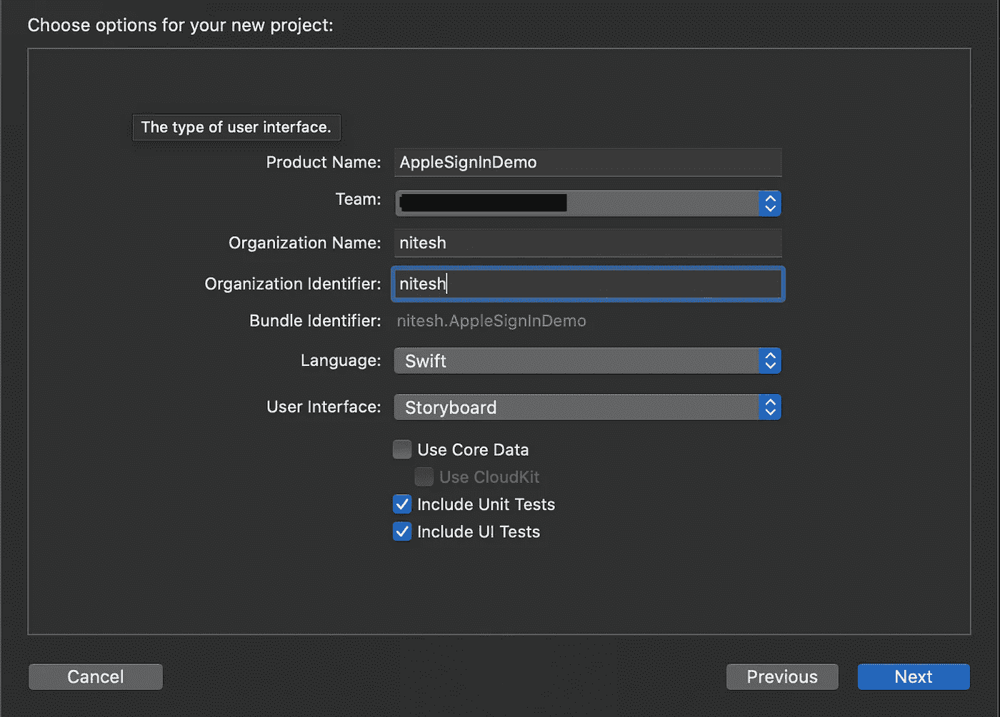
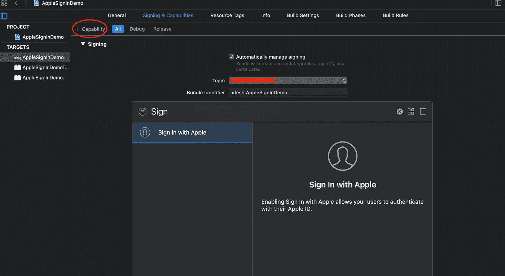
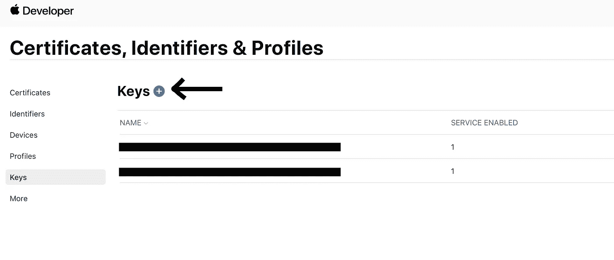
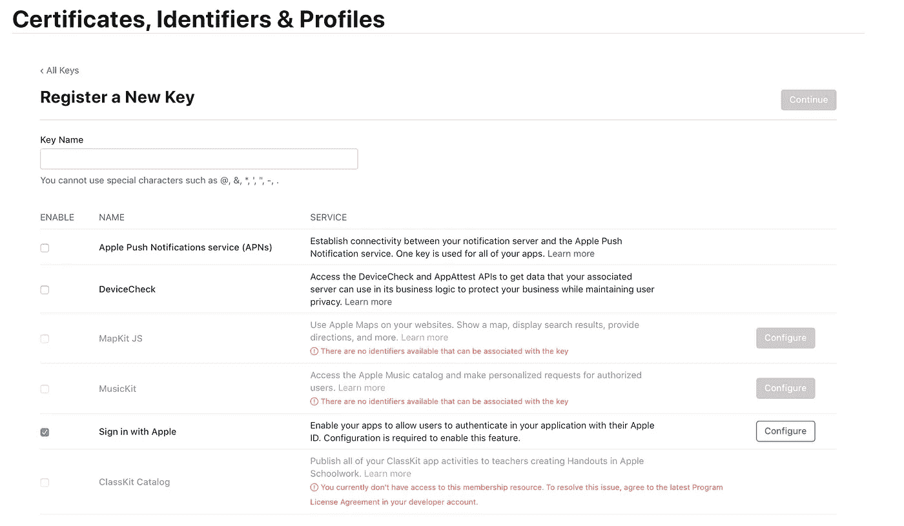
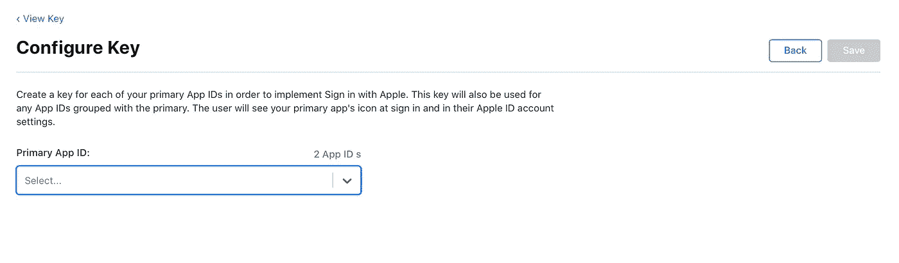
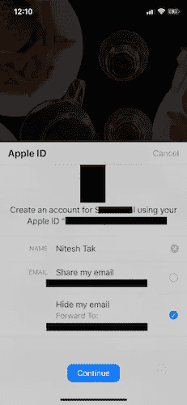

# 让登录变得简单，只需使用 Apple 登录🍎

> 原文：<https://blog.devgenius.io/make-signing-in-easy-simply-sign-in-with-apple-9f348a7c69e9?source=collection_archive---------8----------------------->

撰写另一篇文章，将苹果的登录功能整合到一个 iOS 应用中。在这个给初学者的循序渐进指南中，我试着用一个示例应用程序来涵盖整个过程。

没有更多的讨论，让我们直接进入它😄(假设你们对 swift 和 Xcode 了解不多)。

1.  使用 Xcode 创建一个新项目(如果您已经有一个项目，请跳过这一步):

**2** 。在项目中添加具有苹果功能的**登录:**

**3** 。在项目中创建一个新的 UIViewController***welcomeviewcontroller . swift***文件。这是我们要添加用苹果按钮登录的页面。(此时您会遇到一些编译错误，但不要担心，我们会在下面添加***appleauthmanager . swift***)。

**4** 。为您的主要应用程序 id 创建一个密钥，以便使用 Apple 实现登录。前往 apple 开发人员帐户，为您的项目添加一个新密钥。

命名您的密钥(您可以命名任何名称),并选中“使用苹果选项登录”,然后轻按“配置”。

从菜单中选择您的应用 Id 并保存。

**5。**现在回到项目，在你的项目中新建一个文件名***apple auth manager . swift***的文件。

这就是你们需要做的。你们必须添加一些额外的东西，比如在***welcomeviewcontroller . swift***中添加一个堆栈视图，并设置它为 *IBOutlet。*

同时创建一个新的***homeviewcontroller . swift***供用户在登录成功后导航。😊

我为***welcomeviewcontroller . swift***做了类似这样的 UI，你们可以按照自己的设计主题，在自己喜欢的任何页面上添加 Apple sign in 按钮。功能应该是相同的。

点击继续，你应该可以用 apple id 登录。

# **注销苹果认证**

Apple 没有可用于“登录 Apple”的注销功能。目前，用户必须进入设置应用程序并撤销许可。如果应用程序检测到撤销状态；清除任何本地 OAuth 或本地存储的其他身份验证数据，并要求重新进行身份验证。您也可以将本地存储的令牌清除到您的服务器，然后不管“使用 Apple 登录”状态如何，都需要重新鉴定。

 [## 管理您通过登录 Apple 使用的应用程序

### 了解如何查看和管理您在登录 Apple 时使用的应用程序。当您使用 Apple 登录时，您可以登录…

support.apple.com](https://support.apple.com/en-us/HT210426) 

希望你们喜欢这篇文章，如果有任何疑问，请随时提出。我会尽快在 github 上发布示例项目。感谢阅读这篇文章。快乐编码😄