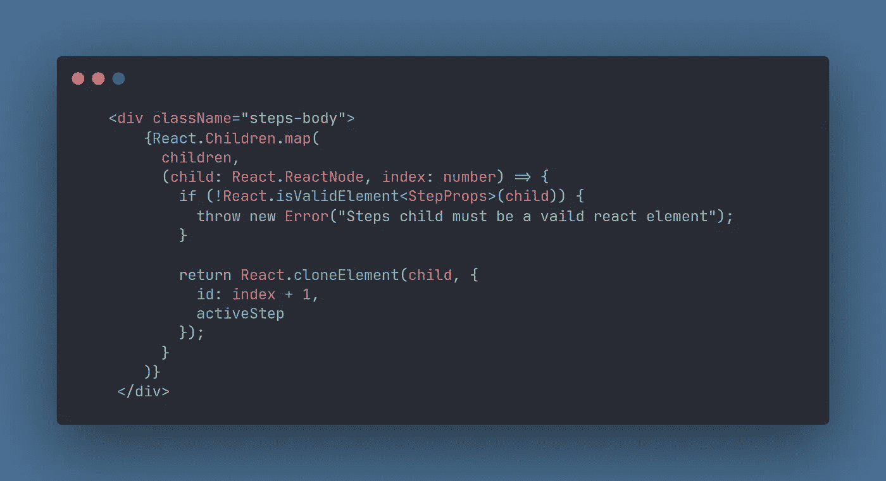

# 用 React 转换元素 API 制作“步骤”组件。

> 原文：<https://blog.devgenius.io/make-steps-component-with-reacts-transforming-element-apis-acceb7fce100?source=collection_archive---------11----------------------->

转换元素 API 是 React 顶级 API 的一部分。这些 API 用于操作 react 元素，利用组合模式，对于创建可重用组件非常有用。

下面是三个转换元素 API

React.cloneElement()

React.isValidElement()

做出反应。儿童

让我们一个一个地快速浏览一下。

**React.cloneElement():**

我们可以用它克隆任何 react 元素，并向它们添加新的属性。基本上就是给组件注入道具。

查看这篇[文章](https://blog.logrocket.com/using-react-cloneelement-function/)了解更多详情。

**React.isValidElement():**

它验证对象是否是 React 元素。返回真或假。

**做出反应。儿童:**

它提供了处理`props.children`的实用方法。我们可以用它对`props.children`进行迭代、映射、计数和其他操作。

**组件实现:**

现在我们已经有了这些 API 的基本知识，让我们一起使用它们来创建**步骤**组件。

在开始实现之前，看看我们组件的最终 API。

看啊！！多么简单美好。不是吗？😁

我们需要制作两个组件。一个包装器**步骤**组件，它将负责管理状态并呈现页眉和页脚；一个容器**步骤**组件，它的唯一职责是基于状态显示和隐藏其子组件。

现在看一下步骤组件的代码。

这个组件中有很多东西。让我一步一步地解释，让事情变得简单。

我们首先创建用于识别活动步骤的状态。然后我们使用`React.Children` API 提供的计数方法来计算这个**步骤**组件将拥有的子组件的数量。之后，我们定义下一个和上一个处理程序来改变活动步骤的状态。

我想更多地关注组件的这一部分，因为主要的魔法发生在这里。

步骤组件的一部分

这里，我们使用的是另一种方法`React.Children` API。就像`Array.prototype.map`一样，通过`React.Children.map`，我们可以映射子节点并返回它们的修改版本。它需要两个参数，`props.children`对象和一个回调函数。在 map 方法的回调函数中，首先我们用`React.isValidElement`验证每个子元素是否是有效的 react 元素，然后我们克隆每个子元素并在其中注入两个道具`id`和`activeStep`，用于隐藏或显示子元素。

在**步骤**组件的子组件中没有发生太多的事情，那就是**步骤**组件。看看它的代码。

由于这个组件是**步骤**组件的子组件，我们可以访问通过`React.cloneElement`注入的道具。首先，我们检查这些道具是否存在，如果它们不存在，这意味着这个组件没有被用作**步骤**组件的子组件，所以我们抛出错误。然后，我们使用这些道具来处理隐藏和显示逻辑。

这里的一个逃生出口是我们必须忽略道具类型的*类型脚本*。原因是 *TypeScript* 不知道这些道具是从它的父元素注入的，它会对我们大喊来定义这些道具的类型。但是我们不能定义这些道具的类型，因为我们不希望这个组件的消费者传递这些道具，因为它们是由其父组件自动传递的。

就是这样！！

你可以在 [codesandbox](https://codesandbox.io/s/stepper-component-made-with-react-children-and-react-cloneelement-57wcyp?file=/src/Steps/index.tsx:657-1092) 上查看完整的例子。

**最终想法:**

为了使本教程简单，我特意用最少的功能制作了这个组件。我们可以通过使用上下文 API 或渲染道具来扩展其功能，以暴露下一个和上一个处理程序，供组件的消费者使用。或者，我们可以通过接受`activeStep` prop，将处理状态的全部责任交给消费者，而不是在本地管理它。

希望您已经通过这篇文章学到了一些新东西，并且对这些 API 有了很好的理解。

**参考文献:**

**React 官方文档:**[https://React js . org/docs/React-API . html # transforming-elements](https://reactjs.org/docs/react-api.html%23transforming-elements)

**React.cloneElement 博客:**[https://blog . log rocket . com/using-react-cloneelement-function](https://blog.logrocket.com/using-react-cloneelement-function)