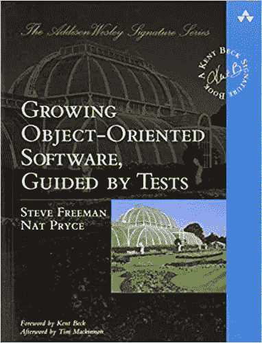
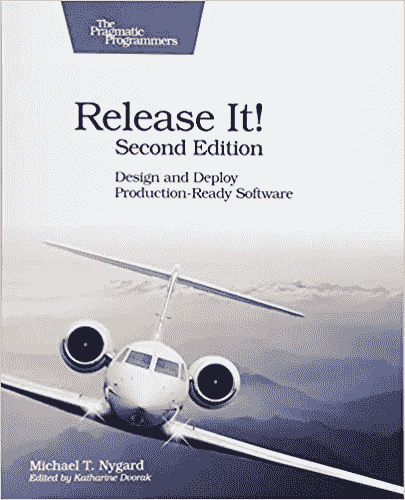

# 让代码比你发现的更好

> 原文：<https://blog.devgenius.io/make-the-code-better-than-you-found-it-129a7c63fddb?source=collection_archive---------5----------------------->

史蒂夫·哈拉马在 [Unsplash](https://unsplash.com?utm_source=medium&utm_medium=referral) 上拍摄的照片

作为一名开发人员，你将有很多时间来维护工作代码。

肯定会有这样的时候，你编写的新代码比维护、升级、修复和改进旧代码还要多，但是一般来说，代码是昂贵的，人们希望长时间运行它。

通常你会跳到代码中去修复一个 bug，调查一个问题或者回答一个问题。

当你这样做的时候，改进它。

这并不意味着您重写它，或者升级它所依赖的所有库，或者重命名所有变量。

不需要改造。

但是你应该做得更好。稍微清理一下。

因此，在这篇文章中，我将与你分享一些书籍，它们将帮助你成为一个干净的程序员。

# [1-干净的代码:敏捷软件工艺手册，作者罗伯特·c·马丁](https://amzn.to/2KVKRRq)

干净的代码

即使是糟糕的代码也能运行。但是如果代码不干净，它会使开发组织陷入困境。

每年，都有无数的时间和大量的资源因为糟糕的代码而被浪费。但不一定非要这样。

这本书最大的优势在于它包含了大量的代码示例，包括一些冗长而深入的示例。

许多章节不是仅仅列出干净代码的规则或原则，而是仔细阅读这些代码示例并反复改进它们。

这本书是每个专业软件开发人员的必读书。

**强烈推荐！**

# 罗伯特·c·马丁的《干净的编码者》

干净的编码器

这本书包含了从评估和编码到重构和测试的所有实用建议。

你将学会如何沟通，评估和处理工作中的困难情况。

***干净的程序员*** 会帮助你成为最好的专业人士之一。

# [Eric Freeman 和 Kathy Sierra 的三头首个设计图案](https://amzn.to/39CEnBi)

头部优先设计模式

这本书是通向**设计模式的捷径，是软件设计中常见问题的**久经考验的解决方案。

这本书以有趣、易读和实用的方式呈现了一个复杂的主题。

Head First 设计模式使用了一种视觉上丰富的格式，这种格式是为你的大脑工作方式而设计的，而不是一种让你昏昏欲睡的大量文本的方法。

**每个做 OO 设计的开发者必读。**

## 由 Steve Freeman 和 Nat Pryce 测试指导的面向对象软件开发

测试指导下的面向对象软件的发展

测试驱动开发(TDD)现在是一种更快交付更好软件的成熟技术。

TDD 基于一个简单的想法:在编写代码之前，先为代码编写测试。

然而，这个“简单”的想法需要技巧和判断才能做好。

这本书展示了如何使用 TDD 创建一个现实的项目，并且有很多代码示例。

**强烈推荐给 TDD 开发者！**

## [5-释放它！:迈克尔·尼加德](https://amzn.to/39LN8sU)设计和部署生产就绪软件

实现它！

如果你是一名软件开发人员，并且你不想在以后的日子里每天晚上都收到提醒，那么帮助就在这里。

结合了关于巨大损失、收入损失、声誉损失、时间损失、机会损失的案例研究，以及通过痛苦经历获得的实用、务实的建议。

这本书帮助你避免让公司损失数百万美元的停机时间和声誉的陷阱。

**获得这本书跳过痛苦获得经验**

# 结论:

代码不是一切，但它是一个重要的工作成果。

无论何时你触摸它，你都应该努力把它放在一个比以前更好的地方。

所以，这些书将帮助你成为一名优秀的手工艺程序员。

**奖励:**

一个普通程序员的工作环境需要长时间坐在办公桌前，周围都是小工具。

这里的现实是，程序员很有可能患上某些健康疾病和与计算机相关的伤害。

从我的个人经历来看，我有时会因为长时间坐在电脑前，有时是错误的姿势，而患上背痛。

我推荐一款 [**姿势矫正器**](https://amzn.to/3lPCzYl) **来**恢复正确的姿势，有助于预防背部、颈部和肩部疼痛的发作。**姿势矫正器**有助于在坐着、站着、躺着或进行其他日常活动时调整姿势。

我每周写一篇关于编程的文章，感谢作为我的撰稿人在 [**patreon**](https://www.patreon.com/zelakioui) 上支持我:-)

一些您可能感兴趣的相关文章:

1-把你的黄金时间投资在可转移技能上

[2–4 本软件架构实用书籍](https://selcote.com/2020/08/12/4-practical-books-for-software-architecture/)

[3-设计无法被教授](https://selcote.com/2020/06/17/the-design-cannot-be-taught/)

[有史以来最好的 4-6 名程序员](https://selcote.com/2020/10/27/6-best-programmers-of-all-time/)

这个故事起源于:[selcote.com](https://selcote.com/2020/12/07/make-the-code-better-than-you-found-it/)