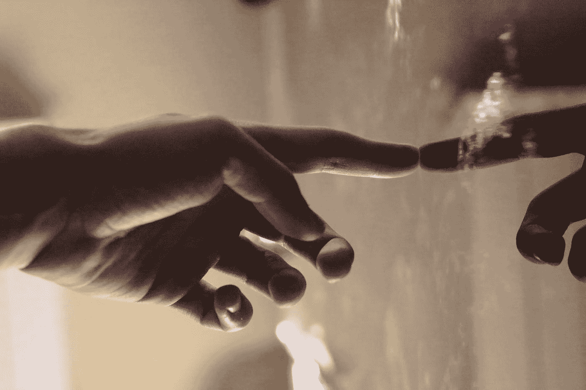
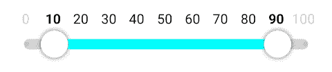
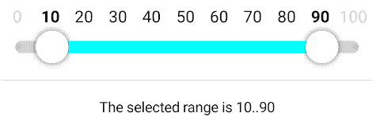

# 使带标签的范围滑块具有交互性

> 原文：<https://blog.devgenius.io/make-the-labeled-range-slider-interactive-516bdf6e5c25?source=collection_archive---------10----------------------->



Elia Pellegrini 在 [Unsplash](https://unsplash.com?utm_source=medium&utm_medium=referral) 上拍摄的照片

我们[创造了一个好看的 UI](https://medium.com/@alex.frank84/draw-the-labeled-range-slider-3eb96e748e88) ，但是目前它还没什么用。我们仍然没有办法与它互动。让我们解决这个问题。

我们的触摸手柄应该可以在工具栏上拖动，当点击它时可以立即定位，当交互完成时可以捕捉到最近的值。

# 移动它

在本系列的第 2 部分[中，我们看到了如何使用手势检测器。我们可以使用**检测手势**和**检测手势**来实现这一点。但是，由于我们想在点击或拖动时做或多或少相同的事情，将手柄定位到触摸点，我们可以使用简单提到的 **awaitPointerEventScope** 来实现一个更灵活、更合适的触摸处理程序。](https://betterprogramming.pub/touch-interactions-in-jetpack-compose-caf88adcae61)

我们可以将感兴趣的触摸状态定义为一个密封类。

```
sealed class TouchInteraction {
    object NoInteraction : TouchInteraction()
    object Up : TouchInteraction()
    data class Move(val position: Offset) : TouchInteraction()
}
```

对于我们来说，知道当前是否没有交互，应该将句柄移动到某个位置，并且用户举起了他们的手指就足够了。

然后使用**指针输入**修改器实现我们的触摸处理程序。

```
fun Modifier.touchInteraction(key: Any, block: (TouchInteraction) -> Unit): Modifier =
    pointerInput(key) {
        forEachGesture {
            awaitPointerEventScope {
                do {
                    val event: PointerEvent = awaitPointerEvent() event.changes
                        .forEach { pointerInputChange: PointerInputChange ->
                            if (pointerInputChange.positionChange() != Offset.Zero) pointerInputChange.consume()
                        } block(TouchInteraction.Move(event.changes.first().position))
                } while (event.changes.any { it.pressed }) block(TouchInteraction.Up)
            }
        }
    }
```

我们等待用户使用 **awaitPointerEventScope** 的触摸输入，当我们得到一个时，我们知道用户现在正在与我们标记的范围滑块交互。我们迭代事件，只要用户的手指停留在我们的可组合组件上，我们就获得事件的绝对位置，并将其作为 **TouchInteraction 传递。动**事件自己动手。用户一抬起手指，我们就用 **TouchInteraction 来响应。向上**让我们的用户界面有机会通过将手柄弹到最近的一步来做出反应。

在我们的 Composable 中，我们将**修饰符**添加到画布中，添加三个状态变量来跟踪当前的交互状态，并添加逻辑来更新句柄的位置。

```
var touchInteractionState by remember { mutableStateOf<TouchInteraction>(TouchInteraction.NoInteraction) }
var moveLeft by remember { mutableStateOf(false) }
var moveRight by remember { mutableStateOf(false) }
...Canvas(
    modifier = modifier
        .touchInteraction(remember { MutableInteractionSource() }) {
            touchInteractionState = it
        }
) {
    ...
}when (val touchInteraction = touchInteractionState) {
    is TouchInteraction.Move -> {
        val touchPositionX = touchInteraction.position.x
        if (abs(touchPositionX - leftCirclePosition.x) < abs(touchPositionX - rightCirclePosition.x)) {
            leftCirclePosition = calculateNewLeftCirclePosition(touchPositionX, leftCirclePosition, rightCirclePosition, stepSpacing, stepXCoordinates.first())
            moveLeft = true
        } else {
            rightCirclePosition = calculateNewRightCirclePosition(touchPositionX, leftCirclePosition, rightCirclePosition, stepSpacing, stepXCoordinates.last())
            moveRight = true
        }
    }
    is TouchInteraction.Up   -> {
        moveLeft = false
        moveRight = false
        touchInteractionState = TouchInteraction.NoInteraction
    }
    else                     -> {
        // nothing to do
    }
}
```

我们需要知道移动哪个把手。为此，我们查看触摸交互的 x 位置，计算左右手柄之间的距离，并移动交互最接近的手柄。当计算把手的新位置时，我们需要考虑把手不应该离开杆，并且两个把手在移动时不应该重叠。为了使它更清楚，让我们快速地看一下左手柄的更新位置的计算。

```
private fun calculateNewLeftCirclePosition(
    touchPositionX: Float,
    leftCirclePosition: Offset,
    rightCirclePosition: Offset,
    stepSpacing: Float,
    firstStepXPosition: Float
): Offset = when {
    touchPositionX < firstStepXPosition                    -> leftCirclePosition.copy(x = firstStepXPosition)
    touchPositionX > (rightCirclePosition.x - stepSpacing) -> leftCirclePosition
    else                                                   -> leftCirclePosition.copy(x = touchPositionX)
}
```

我们可以看到，根据触摸位置、另一个手柄的位置和步长的间距，以及本例中第一步的位置，我们可以计算出左手柄可以拥有的新位置。


带标签的范围滑块仍然缺少“吸附到值”功能

触摸滑块时手柄会移动，我们可以点击手柄立即跳转到的位置，我们甚至可以在两个手柄之间移动，而无需抬起手指。

# 赶快

手柄还没有达到我们想要的效果。在用户抬起手指后，以及当受控手柄改变时，它们应该捕捉到最近的步骤。为了实现这一点，我们更新了我们的触摸交互逻辑，找到最近的步长及其 x 坐标，并相应地更新手柄位置。

```
is TouchInteraction.Move -> {
    val touchPositionX = touchInteraction.position.x
    if (abs(touchPositionX - leftCirclePosition.x) < abs(touchPositionX - rightCirclePosition.x)) {
        leftCirclePosition = calculateNewLeftCirclePosition(touchPositionX, leftCirclePosition, rightCirclePosition, stepSpacing, stepXCoordinates.first())
        moveLeft = true if (moveRight) {
            val (closestRightValue, _) = stepXCoordinates.getClosestNumber(rightCirclePosition.x)
            rightCirclePosition = rightCirclePosition.copy(x = closestRightValue)
            moveRight = false
        }
    } else {
        rightCirclePosition = calculateNewRightCirclePosition(touchPositionX, leftCirclePosition, rightCirclePosition, stepSpacing, stepXCoordinates.last())
        moveRight = true if (moveLeft) {
            val (closestRightValue, _) = stepXCoordinates.getClosestNumber(leftCirclePosition.x)
            leftCirclePosition = leftCirclePosition.copy(x = closestRightValue)
            moveLeft = false
        }
    }
}
is TouchInteraction.Up   -> {
    val (closestLeftValue, closestLeftIndex) = stepXCoordinates.getClosestNumber(leftCirclePosition.x)
    val (closestRightValue, closestRightIndex) = stepXCoordinates.getClosestNumber(rightCirclePosition.x)
    if (moveLeft) {
        leftCirclePosition = leftCirclePosition.copy(x = closestLeftValue)
        moveLeft = false
    } else if (moveRight) {
        rightCirclePosition = rightCirclePosition.copy(x = closestRightValue)
        moveRight = false
    }
    touchInteractionState = TouchInteraction.NoInteraction
}
```



带标签的范围滑块

现在，这看起来已经是我们想要达到的最终结果了:-)。但是还缺少一个小细节:我们仍然需要将更新后的范围反馈给调用者，这样他们就可以对此做出反应；-).

这最后一步现在相当容易。我们将回调 **onRangeChanged** 作为参数添加到我们的 Composable 中。

```
@Composable
fun <T : Number> LabeledRangeSlider(
    selectedLowerBound: T,
    selectedUpperBound: T,
    steps: List<T>,
    onRangeChanged: (lower: T, upper: T) -> Unit,
    modifier: Modifier = Modifier,
    sliderConfig: SliderConfig = SliderConfig()
)
```

并且每当用户用所选步骤的值抬起手指时简单地调用它。

```
is TouchInteraction.Up   -> {
    val (closestLeftValue, closestLeftIndex) = stepXCoordinates.getClosestNumber(leftCirclePosition.x)
    val (closestRightValue, closestRightIndex) = stepXCoordinates.getClosestNumber(rightCirclePosition.x)
    if (moveLeft) {
        leftCirclePosition = leftCirclePosition.copy(x = closestLeftValue)
        onRangeChanged(steps[closestLeftIndex], steps[closestRightIndex])
        moveLeft = false
    } else if (moveRight) {
        rightCirclePosition = rightCirclePosition.copy(x = closestRightValue)
        onRangeChanged(steps[closestLeftIndex], steps[closestRightIndex])
        moveRight = false
    }
    touchInteractionState = TouchInteraction.NoInteraction
}
```

# 结论



带有所选值表示的最终带标签的范围滑块

我们做到了🎉。我们从头开始创建了我们自己的带标签的范围滑块，画出了我们自己需要的所有东西，并使它与各自的**修改器** 🥳.交互

标签范围滑块的完整源代码可以在 [GitHub](https://github.com/a-frank/labeled-range-slider) 上找到。

我希望您喜欢阅读这个系列，并获得一些有益的启发:-)。