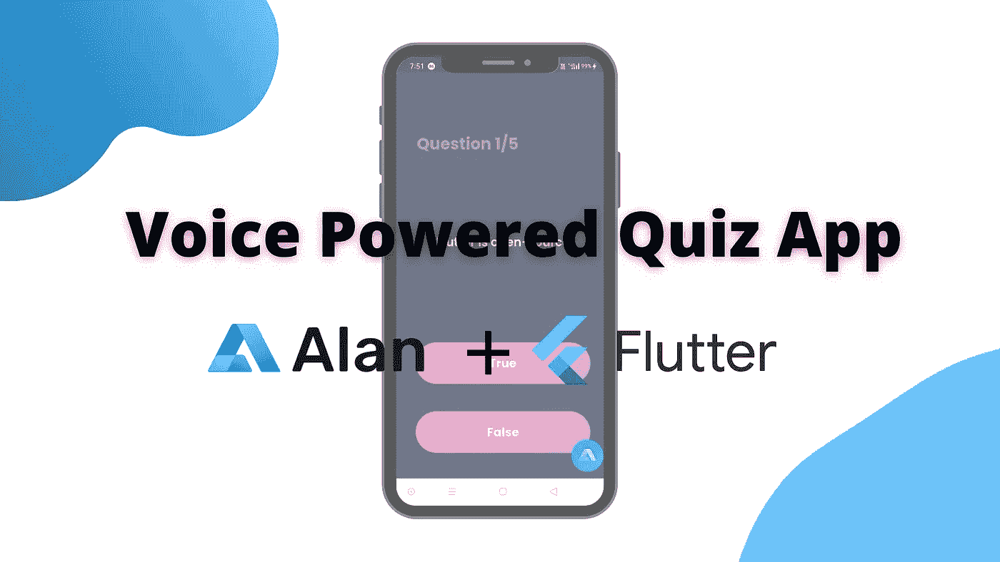
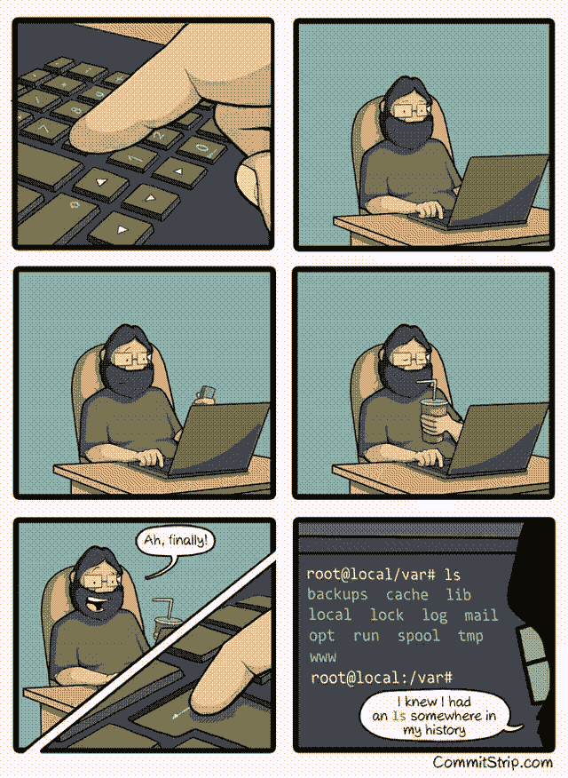
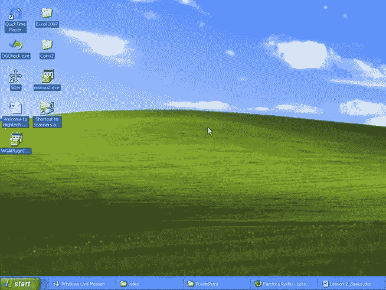
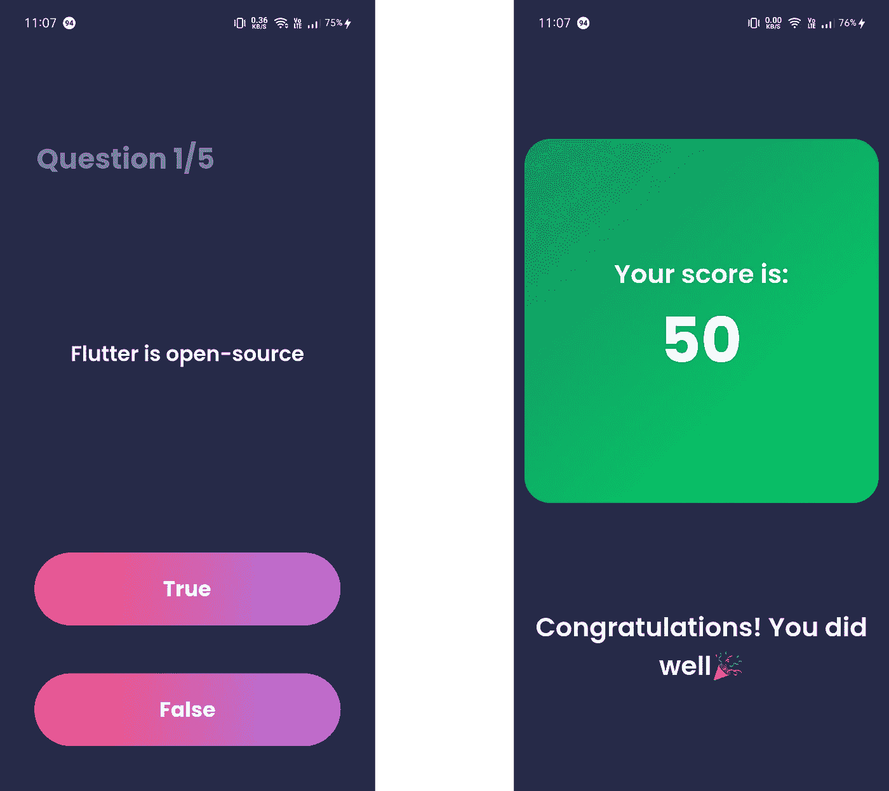
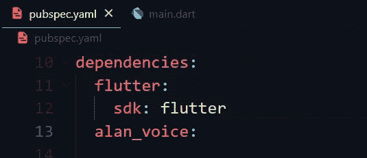
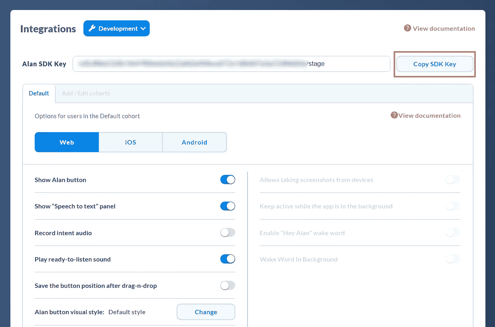
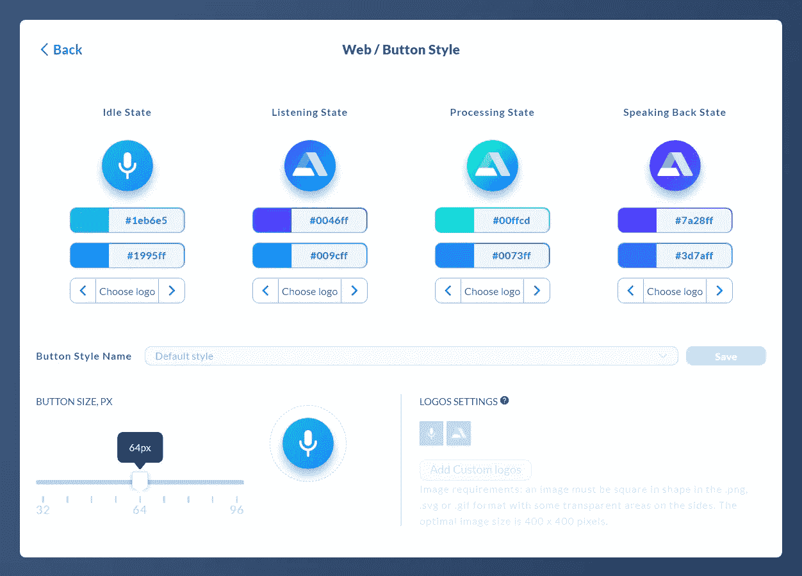
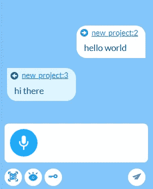

# 使用 Alan AI 使您的 Flutter 应用程序无需触摸并通过语音控制

> 原文：<https://blog.devgenius.io/make-your-flutter-apps-touchless-and-voice-controlled-using-alan-ai-a37d18b14be0?source=collection_archive---------8----------------------->



使用 Flutter 和 Alan AI 构建一个语音问答应用程序

随着 UI/UX 的最新趋势，与机器交互变得比以往任何时候都容易。我相信你至少会和一个语音助手互动过，或者听说过基于手势的用户界面。让我们从基础开始，什么是接口，为什么它们很重要？

界面是人机交互发生的地方——例如，计算机鼠标、遥控器、虚拟现实、自动取款机，或者甚至是你汽车的仪表板，它允许你与你的汽车交互并控制你的汽车，这些都是用户界面的例子。

# 用户界面的演变

## CLI 或命令行界面

在过去，所有的人机交互都是在命令行界面上进行的。这包括记住并在黑屏上输入某些命令来完成任务。



学分: [r/linuxmasterrace](https://www.reddit.com/r/linuxmasterrace/)

现在，这在某些情况下可能非常有用，比如对我们程序员来说，但是，考虑到普通大众，它不是非常用户友好的。这导致了 GUI 的兴起。

## GUI 或图形用户界面

顾名思义，这包括将对象和任务表示为图形，还引入了鼠标(指针)，这使得计算机更容易使用，并导致大规模采用，后来还引入了触摸屏。



虽然图形用户界面很棒，但为什么不进一步简化交互，使之成为无触摸的用户界面呢？在无触摸的用户界面中，你甚至不需要触摸机器就能与它进行交互。介绍 VUIs。

## VUI 或语音用户界面

语音用户界面是通过语音控制的用户界面。语音助手的流行例子有 Alexa、谷歌助手、Siri、Cortana 等。VUIs 简化了交互，并使其适用于更多的观众，如视障人士。虽然你可能认为在你的应用程序或网站中有一个定制的语音助手非常困难，但有了像[艾伦·艾](https://alan.app/)这样的工具，它变得超级简单。

现在让我们进入有趣的部分，即*编码。*

# 走向声控问答 App

首先，我有一个简单的测验应用程序，它有 5 个基于是非题的问题，在测验结束时，它会显示用户的分数(每个正确答案+10，每个错误答案-1)。



测验屏幕和分数屏幕

> 步骤 1:在 Alan Studio 上创建一个项目

去 Alan Studio，如果你还没有帐号的话就注册吧。
**提示:**连接你的 GitHub 账号，星至少 5 个 Alan 的回购，切换到开发者计划。点击“创建语音助手”按钮，然后选择“空项目”，给它起个名字，你的项目就准备好了。

> 步骤 2:将 alan_voice 依赖项添加到您的应用程序中

转到您的 pubspec.yaml 文件并添加以下依赖项。



> 步骤 3:获取 Alan AI SDK 密钥并初始化

转到 Integrations 选项卡，复制 Alan SDK 密钥。



获取 SDK 密钥

现在转到你的 main.dart 文件，像这样初始化 Alan AI 按钮:

```
@override
  void initState() {
    initAlan();
    super.initState();
  }

  void initAlan() {
    AlanVoice.addButton(
        "YOUR_SDK_KEY",
        buttonAlign: AlanVoice.BUTTON_ALIGN_RIGHT);
  }
```

> 第五步:运行应用程序

你会注意到 Alan Voice 按钮出现在屏幕的右下角。要向左移动，您可以写:

`buttonAlign: AlanVoice.BUTTON_ALIGN_LEFT`。

点击按钮，说 *hello world* 来测试默认脚本，并检查 Alan 是否按照脚本中指定的正确回复进行响应。

**专业提示**:您也可以从集成选项卡定制 *Alan 按钮视觉样式*。



> 步骤 6:编写语音脚本

声音脚本是项目的对话场景。它应该包含用户可以发出的所有可能的语音命令以及需要采取的相应操作。一个项目也可以有多个声音脚本。为了定义语音命令，我们使用意图。

**意图:**
意图是接受两个参数的函数:
1。调用此命令的字符串
2。指定 Alan 响应的 arrow 函数。
例如:

```
intent('hello world', p => {
    p.play('(hello|hi there)');
});
```

这里的`p`是一个特殊的对象，允许我们访问 Alan 的方法和预定义的对象。
播放功能是最常用的响应功能。可用于以下:
1。作为响应函数
2。用于向客户端应用程序发送命令。

您也可以使用`reply()`函数来获得更小更简单的响应，如下所示:

```
intent('Hello world',
    reply('Hello'));
```

**使用调试聊天:**
调试聊天是我们测试语音脚本的地方。您可以键入或按下按钮并说话来测试您的脚本。
在聊天中键入 hello world，看看艾伦是否做出了正确的回应(与应用程序中的回应相同)。



在开始编写我们的第一个声音脚本之前，让我们试着理解更多的概念。

**插槽**
插槽用于从用户输入中识别和检索信息。有两种主要类型的插槽。这些是:
1。用户定义的插槽(例如，在我们的情况下答案插槽)
2。预定义槽(如日期、时间、位置、名称、序号、数字)
其他类型包括*正则表达式*和*动态*槽。

**语境:**
与其字典含义类似，语境是指围绕一个语音命令的情境，以帮助语音助手更好地理解用户的需求。

*   也可以从这里了解模式和替代方案:[https://alan.app/docs/server-api/patterns/](https://alan.app/docs/server-api/patterns/)

这些都是我们今天脚本中要用到的概念。

这是我们的脚本看起来像什么。通过评论可以更好的理解。

```
//The list of questions for our quiz app.
const questions = [
    { questionText:'Flutter is open-source', answer: 'true' },
    { questionText:'Amazon owns Flutter', answer: 'false' },
    { questionText:'Flutter for Web and Desktop is now stable', answer: 'true' },
    { questionText:'Sparky is Flutter\'s official mascot', answer: 'false' },
    { questionText:'Flutter was released in 2020', answer: 'false' },
];//This intent is the starting point of our app.
//The user can say Start, Start the quiz or Let's begin to start the quiz.
intent('Start (the quiz|)','Let\'s begin', p => {
    p.play('Instructions for the quiz: You can play this quiz either using the G.U.I that is by pressing the buttons on your screens or play it with touchless voice interactions');
    p.play('Say ok to start the quiz');
    //Go to the readQuestion context
    p.then(readQuestion);
});//initialising variables
let index = 0;
let score = 0;let readQuestion = context(()=>{
    intent('(Ok|Yes)',p=>{
    if(index>0){
        //send the command to the voice app in order to update the question on the screen.
        p.play({command: 'next', item: score});
    }
    //Read the question at the current index.
    p.play(`${questions[index].questionText}. True or False`);
    //Go to the getAnswer context
    p.then(getAnswer);
    });

})let getAnswer = context(()=>{
    //Get the answer i.e either true or false
    intent(`$(ANSWER true|false)`, p=>{
        if(p.ANSWER.value == questions[index].answer){
           //If the answer is correct, update the score
           score += 10;
           p.play('(That\'s right|Great going)');
        }
        else{
           //For every wrong answer deduct 1 from the score
           score -= 1;
           p.play('Sorry, That\'s not right');
        }

        //increment the index by one
        index++;

        //Read the next question if there are more questions left
        if(index < questions.length){
        p.play('(Are you|) Ready for the next question?'); 
        p.then(readQuestion);
        }
       else{
               //Otherwise got to the score page
               p.play({command: 'next', item: score});
               p.play(`Your score is: ${score}`);
               p.resolve();
               p.play('Thank you for playing!');
               index=0;
               score=0;
           }
    });
});
```

注意，我们通过`p.play({command: 'next', item: score})`向客户端应用程序发送命令。让我们在应用程序中处理这个问题。像这样更新 initAlan()函数:

```
void initAlan() {
    AlanVoice.addButton(
        "YOUR_SDK_KEY",
        buttonAlign: AlanVoice.BUTTON_ALIGN_RIGHT);AlanVoice.onCommand.add((command) {
      debugPrint("got new command ${command.toString()}");
      var commandName = command.data["command"];
      if (commandName == "next") {
        setState(() {
          score = command.data["item"];
          questionNumber++;
          quizBrain.nextQuestion();
        });
      }
    });
  }
```

您也可以使用 switch case 来代替 if-else-if，但是因为我们这里只有一个命令，所以 if 语句可以满足目的。

> 现在继续运行您的应用程序。按下艾伦按钮，并说开始看到它的行动。

瞧啊。这是你的第一个声控应用。在这里可以找到完整的代码。🎉

[](https://github.com/Aaliya-Ali/voice_quiz_app) [## GitHub-aa liya-Ali/voice _ quiz _ app:用 Flutter 和 Alan 搭建的简单的语音控制问答 app…

### 一个新的颤振项目。这个项目是颤振应用的起点。一些帮助您入门的资源…

github.com](https://github.com/Aaliya-Ali/voice_quiz_app) 

有关更多信息，请参考 Alan AI 文档。

[https://alan.app/docs/](https://alan.app/docs/)

如果你觉得这篇文章很有见地，别忘了留下一些掌声👏