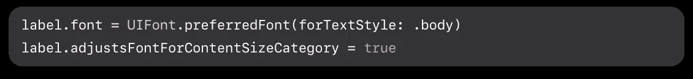

# 让您的 iOS 应用程序可访问

> 原文：<https://blog.devgenius.io/make-your-ios-app-accessible-a2d28a6a1222?source=collection_archive---------10----------------------->

## 了解如何在考虑所有用户的情况下测试您的 UIKit 应用程序

本·科尔德在 [Unsplash](https://unsplash.com?utm_source=medium&utm_medium=referral) 上的照片

为了准备[全球无障碍宣传日](https://accessibility.day/)，我们将讨论开发者如何让他们的 iOS 应用程序无障碍。数字无障碍现在比以往任何时候都更加重要。由于他们的网站和应用程序不符合 ADA 标准，很多公司被起诉。世界上大约有 10 亿人患有残疾。如果应用程序是不可访问的，那么对于依赖可访问性(a11y)特性的大部分用户来说，这会造成糟糕的用户体验。

苹果提供了大量关于设计和开发可访问性指南的文档，并通过 Xcode 提供了一个叫做 [Accessibility Inspector](https://developer.apple.com/library/archive/documentation/Accessibility/Conceptual/AccessibilityMacOSX/OSXAXTestingApps.html) 的工具。该工具帮助开发人员审计和测试他们的应用程序的各种功能。

了解开发和测试用户界面的不同方法，并牢记所有用户。

# 动态类型

[动态类型是 iOS 的一项功能，可以让应用程序的文本内容根据用户的字体大小偏好进行缩放。](https://developer.apple.com/documentation/uikit/uifont/scaling_fonts_automatically)

Apple 支持自定义字体，并提供源代码来配置标签的文本样式。

来源:[https://developer . apple . com/documentation/ui kit/ui font/scaling _ fonts _ automatically](https://developer.apple.com/documentation/uikit/uifont/scaling_fonts_automatically)

如果您发现上面的代码不起作用，或者当文本的字体大小发生变化时出现了不同的 UI 问题，请仔细检查自动布局约束以及默认情况下启用或禁用的属性。

要了解如何在您的设备上更改字体大小，请在此按照[这些步骤进行](https://support.apple.com/en-us/HT202828)。

## 技巧

当你在开发你的特性时，让你的一些模拟器保持大文本特性。这将节省你以后的时间，特别是如果你的产品在发布前通过了 a11y 审核。

# 画外音

iPhone 上的屏幕阅读器叫做 VoiceOver。对于开发人员来说，学习如何使用 VoiceOver 来测试预期的体验是有益的。Apple 提供了一份关于如何练习使用 VoiceOver 的支持文档。一旦你习惯了，打开它，导航到你的应用程序，然后闭上眼睛。通过使用 VoiceOver 成功导航和使用功能来测试用例。如果很难，那就有工作要做。

UIKit 提供的许多 UI 对象可以像 UIButton 的标题一样大声读出。但是，如果使用自定义视图，则需要额外的配置，以便为用户提供最佳体验。如果开发人员设置了辅助功能标签和辅助功能提示，VoiceOver 会读出它们。这些属性不应与[*accessibility identifier*](https://developer.apple.com/documentation/uikit/uiaccessibilityidentification/1623132-accessibilityidentifier)*混淆，后者仅用于 UI 自动化测试目的，不会影响最终用户。*

## *技巧*

*除了手动测试(这是测试任何 a11y 错误的最佳方式)之外，您还可以进行自动化测试，以确保所有 UI 对象都定义了 accessibilityLabel。*

# *颜色和对比度*

*与你的团队一起检查你的应用程序的设计，以确保所使用的颜色不难看出。一个好的指导方针是确保文本对比度至少为 4.5 比 1。您可以使用“辅助功能”检查器的颜色对比度计算器进行仔细检查，方法是打开检查器，然后在 Mac 的顶部菜单栏中选择“窗口”->“显示颜色对比度计算器”。要了解更多关于颜色和对比度的信息，苹果公司有一个很好的指导方针。*

## *技巧*

*Apple 和 Deque 都建议使用系统提供的颜色，以获得文本和背景色之间的最佳对比度。你也可以在这里参考[德克的色彩对比最佳实践](https://www.deque.com/blog/ios-color-contrast-best-practice-increase-contrast/)。*

# *结论*

*可访问性需求有各种形式和大小，所以一定要考虑到最终用户，迎合所有情况。始终手动测试您的应用程序。*

*记住要快速并经常失败，以避免将不可访问的代码交付到产品中。自己审核应用程序，确保应用程序符合要求。大书呆子牧场有一篇关于如何彻底审计你的应用程序的文章。这将确保您发布一个完全可访问的移动应用程序，并且最终用户会乐于使用您的产品。*

*更多 iOS 开发内容，一定要关注我的 Medium！*

# *资源*

*   *[雷·温德里希——通过教程自动布局——动态类型](https://www.raywenderlich.com/books/auto-layout-by-tutorials/v1.0/chapters/11-dynamic-type)*
*   *[苹果——在你的应用程序中支持 voice over](https://developer.apple.com/documentation/accessibility/supporting_voiceover_in_your_app)*
*   *[LinkedIn 工程—自动化可访问性测试](https://engineering.linkedin.com/blog/2020/automated-accessibility-testing)*
*   *[Deque —可访问性最佳实践](https://www.deque.com/blog/category/accessibility-best-practices/)*