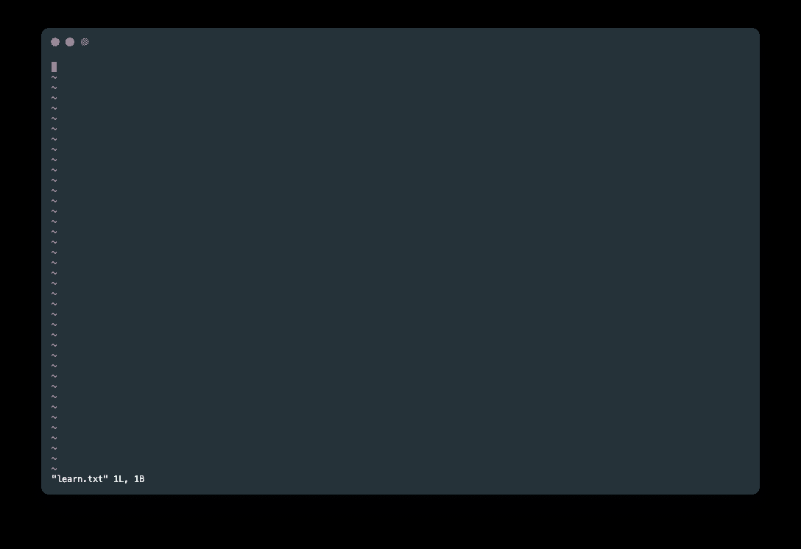
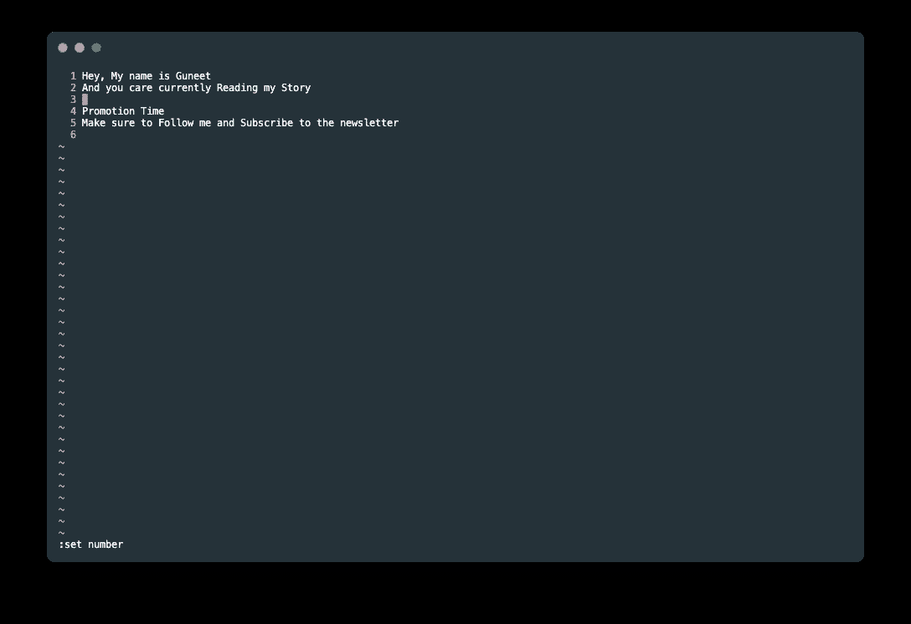

# 使用 Vim 从头开始制作您自己的优秀代码编辑器 EP1

> 原文：<https://blog.devgenius.io/make-your-own-awesome-code-editor-using-vim-from-scratch-ep1-768336e40a3a?source=collection_archive---------6----------------------->

我假设你从来没有听说过 Vim 这个名字，即使你听说过，你也很难从 Vim 中退出，不要担心我们将从零开始，从打开和关闭 Vim 到使用 Vim 制作我们自己的代码编辑器。


# Vim 是什么？

谷歌:这是一个免费的开源文本编辑器

**By Me:这是 Ms. Word 的终端，它允许使用终端编辑文本文件。**

你可以在官方文档上了解更多。

## 如何安装？

如果您使用的是 Mac/Linux，很可能您已经安装了 vim，您可以使用`vim — version`，**进行检查。如果它返回您 vim 的版本，那么您可以跳过下一节**

但是如果你面临一些事情`vim not found`，你将不得不安装 vim，Mac/Linux 用户可以下载使用

```
**brew install vim**
```

Window 用户可以直接从[官方网站](https://www.vim.org/download.php)下载。

# 第一次尝试

你可以用这种方法打开一个文件

```
vim <fileName>
```

我将创建一个名为 learn.txt 的文件，并用`**vim learn.txt**` **打开它。打开文件后，你会看到一个可怕的屏幕，看起来有点像这样。**



现在，在您感到害怕并逃跑之前，让我们使用

`:q` —如果您没有进行任何更改，只是想退出 vim，如果您进行了更改，它会显示一些错误，您尝试退出它，因为您需要判断是保存还是放弃该数据

`:wq` —保存后退出。

`:q!` —退出并放弃更改。

# 编辑文件

尝试使用 vim 再次打开该文件。现在尝试自己退出文件，不要担心你的键盘工作正常，这只是因为你目前处于命令模式

嘿，但我没有告诉你任何模式，不要这样欺骗你说，这是从零开始。等等等等

## Vim 中的模式

所以在 Vim 中有两种模式

1.  命令模式—您可以称之为 Vim 的终端。在进入命令模式之前，不能对文件进行任何更改，**无论何时打开任何文件，默认情况下都是这样。在这种模式下，我们编写的用于退出 vim 的** `**:q**` **是一个命令。**
2.  插入模式—这是一种文件编辑模式，您可以在其中编辑文件。

## **改变模式**

1.  如果你想从命令模式进入插入模式，只需按下`**i**`
2.  按下`**esc**`从插入模式进入命令模式

现在把模式改为插入模式来编辑文件，当你点击 I 时，你会发现

`**— INSERT —**`

写在下面，表示您处于插入模式。现在你可以写任何你喜欢的东西。完成更改后，切换到命令模式，然后使用`wq`保存并退出 vim。

嘿，你终于来了，如果你觉得有帮助的话，记得关注我，订阅邮件列表。

# 命令模式

你不认为目前 vim 看起来很无聊，如果它看起来一样，我肯定不会写这个，但我们可以按照我们的方式让它看起来很棒。

1.  首先，我需要行号，以便我可以使用

```
:set number
```

你会有这样的东西。看起来好多了。



2.如果你正在编程，你肯定希望 cim 自动缩进，我们可以用

```
:set autoindent
```

3.目前颜色模式对我来说很无聊，所以我们甚至可以用

```
:colorscheme darkblue
```

在配色方案中有许多选项，您可以通过按选项卡找到它们

4.你也可以启用鼠标，如果你是程序员，我不建议你这么做

```
:set mouse=a
```

但是有一个你可能会遇到的问题是，如果你试图保存并退出，并试图再次打开 vim，你会再次看到那个令人厌烦的屏幕，这是非常有问题的，因为我们不想再次编写所有的配置。

因此，我们需要通过以下方式对 vim 的配置文件进行修改，将它作为我们的 vim 的默认配置

```
vim ~/.vimrc
```

现在只需在插入模式下复制并粘贴以下代码，然后保存它

```
set number
set relativenumber
set autoindent
colorscheme darkblue
```

保存后，再次打开该文件，我们就恢复了所有的配置。

还有很多这样的功能，我推荐使用[备忘单](https://phoenixnap.com/kb/vim-commands-cheat-sheet)，这将使你下次使用 vim 时更加自信，在这一集里，我们将坚持到这里，现在开始使用 vim 做一些疯狂的事情。

这样在下一集里，你就有足够的信心来制作我们自己的代码编辑器。

> **我希望你喜欢它，并从这个故事中学到很多，如果你不想错过我发布另一个故事的任何时间，请确保关注我并订阅以获得电子邮件更新。**

*你可以关注我的*[***Twitter***](https://twitter.com/Guneetsingh02)*和*[***LinkedIn***](https://www.linkedin.com/in/guneetsinghtuli/)*在我分享更多信息的地方。*