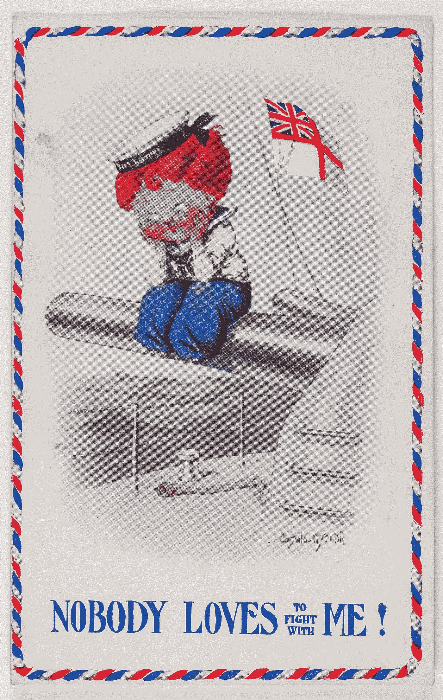
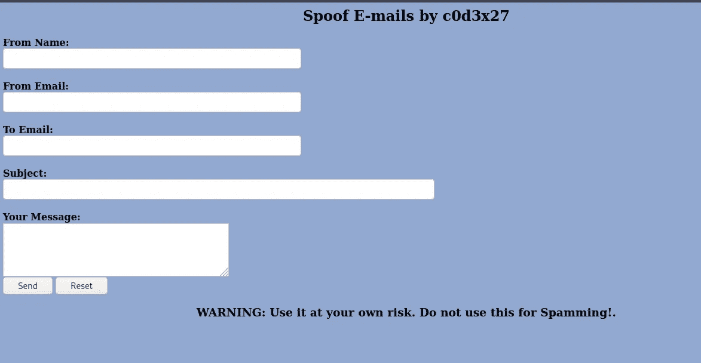

# 制作你自己的电子邮件欺骗脚本，发送电子邮件成为你想成为的任何人

> 原文：<https://blog.devgenius.io/make-your-own-e-mail-spoofer-script-and-send-e-mails-as-anyone-you-want-to-be-229208965b08?source=collection_archive---------0----------------------->

## 发送电子邮件时，您可以模仿任何人。

维多利亚博物馆在 [Unsplash](https://unsplash.com?utm_source=medium&utm_medium=referral) 拍摄的照片

我为了做这种攻击/恶作剧。网站会让你为此付费。今天你将学习如何使它变得私密、安全和自由。

*免责声明:使用此* ***演示脚本*** *风险自担。不要用它来发垃圾邮件或伤害他人。*

你有多少次梦见用一封导入邮件来捉弄你的朋友、家人或同事？比方说，给别人发一封看起来像是来自唐纳德·特朗普或奥巴马的电子邮件？现在你可以做了。只有——如果你想搞恶作剧的话。黑客智慧呢？

在阅读了一些对网络安全如何工作知之甚少或一无所知的人的严厉评论后，我推断他们中的许多人认为我们需要超能力和疯狂的技能来入侵。人们没有意识到也没有理解，黑客的存在只是因为其他人犯了错误。怎么会？无论何时建立网络、编写代码、应用程序、开发软件，或者最大的错误——人们信任他人。

# 社会工程

社会工程是操纵人们执行行动或泄露机密信息的艺术，而不是通过闯入或使用技术破解技术。虽然类似于欺骗或简单的欺诈，但该术语通常适用于以信息收集、欺诈或计算机系统访问为目的的诡计或欺骗；在大多数情况下，攻击者从不与受害者面对面。使用模仿的社会工程(例如通过电话获取信息，或破门而入)被非正式地称为 blagging。除了犯罪目的，社会工程也被讨债人、逃债追踪者、私家侦探、赏金猎人和小报记者所利用。谷歌研究人员的一项研究发现，涉及分发假冒杀毒软件的所有域名中，多达 90%使用了社会工程技术。

# 剧本

使用下面的脚本，我们可以发送电子邮件冒充公司内部的任何人。主持 Bug Bounty 计划的公司不接受这些类型的攻击为有效报告。原因很简单，这些攻击成功的几率很高。

这个脚本概念非常简单，不言自明。使用更先进的代码功能，您将有可能附加文件，照片，或任何类型的文件，你想要的。

# 结果呢

正如你从照片中看到的，你只能选择发送电子邮件。接收端不能回复。不，这将阻止黑客伤害他人，因为你可以添加一个链接到任何恶意网站单独与您的邮件正文。

# 如何

在[www.000webhosting.com](http://www.000webhosting.com)之类的网站做个账号，去**上传文件**，在公共目录做个文件，命名为**index.php。**在这个文件里面粘贴代码，就这样

玩得开心！