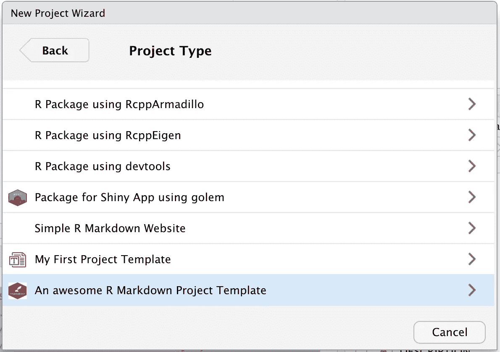
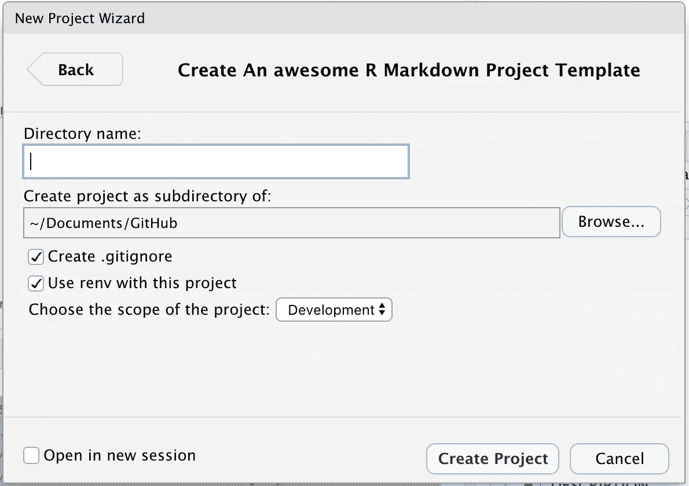

# 制作您自己的 RStudio 项目模板

> 原文：<https://blog.devgenius.io/make-your-own-rstudio-project-template-1f77c4888e79?source=collection_archive---------2----------------------->

如何确保团队中的每个人都使用相同的蓝图。



自定义 RStudio 项目模板。图片由作者提供。

我最喜欢的 R 包之一是`golem`。只需几次点击，你就可以为你闪亮的应用程序创建一个可复制的起点。使用像`golem`这样的框架在团队中很重要:它确保每个开发人员从相同的蓝图开始。

作为一名顾问，我与无数的团队合作过，每个团队的每个开发人员都以自己的方式工作。这在由分析师而不是传统开发人员组成的团队中尤其如此。虽然在某些情况下这是可以接受的，但这使得团队成员之间更难分担工作。

如何才能使我们的 R 项目标准化？答案取决于你做什么。如果你用闪亮，那就用`golem`。如果你开发一个包，那么你的工作流的结构是由一个 [R 包](https://medium.com/@adrian.joseph/set-up-r-for-success-b12288afc704)的标准设计定义的。

但是，如果您有一个 R Markdown 报告的定制结构，并希望用作所有数据分析项目的参考，该怎么办呢？您可以将它存储在一个共享文件夹中，让您的开发人员从那里访问它。你可以有一个专门的回购来分叉。但是您也可以从`golem`复制并创建自己的 RStudio 项目模板。

使用 RStudio 项目模板的想法并不新鲜。RStudio 从 1.1 版本开始就支持自定义模板。然而，我只是最近才看到它们的实际实现。我想可能会有更多的开发人员在他们的团队中使用这种技术。

# 基础知识

定制模板背后的基本思想是根据一些定义的规范创建一个 R 包。一旦安装完成，这个包将通过`New Project`向导提供 RStudio 模板。为此，我们需要三种原料:

*   一个模板。
*   创建项目模板的函数。
*   文件`rstudioProjectTemplate.dcf`。

# 模板

就本指南而言，模板的目的无关紧要。我们将使用一个带有 R Markdown 报告的简单模板。降价报告是一个借口。您可以使用任何您喜欢的东西来创建您的项目模板。

我们将模板保存到`./inst/<YOUR TEMPLATE>`中。

# R 包

正如所料，我们遵循 R 包的标准结构。这里是重要部分的概述。

```
.
├── DESCRIPTION
├── NAMESPACE
├── R
│   └── create_project.R
└── inst
    ├── rstudio
    │   └── templates
    │       └── project
    │           ├── rmarkdown_icon.png
    │           └── rstudioProjectTemplate.dcf
    └── templatedemo
        └── [...]
```

关键要素是:

*   `R`文件夹包含我们创建项目的逻辑。
*   `./inst/templatedemo`文件夹包含我们项目模板的副本。
*   `.inst/rstudio/templates/project/rstudioProjectTemplate.dcf`文件包含 UI 向导的规范。

# 创建项目的函数

创建项目的函数放在`R`文件夹中。您必须拥有这个函数，因为它是用来初始化向导中的模板的。该函数可以有任何名称，只要它匹配在`dcf`文件的`Binding`参数中指定的名称(见下文)。该函数的第一个参数必须始终是`path`。这将是我们创建新项目的路径。我们将在后面看到如何定义额外的参数。

让我们来分解这个函数的主要部分。

## 争论

如上所述，第一个也是唯一一个强制参数是`path`:我们需要告诉 RStudio 我们想在哪里创建包。所有其他参数都可以指定，或者作为省略号`...`传递。我们可以使用语法`dots <- list(...)`来收集所有未命名的参数。

## 逻辑

这个函数包含了模板所需的所有逻辑。在我们的具体案例中:

*   它将模板从模板安装文件夹复制到指定的`path.`
*   它激活`renv.`
*   它安装依赖项。
*   如果需要，它会初始化一个 repo
*   它向新项目`readme`添加了一些跟踪信息。

您可以在本文末尾链接的库中看到完整的代码，但这里是主要的代码块。

**复制代码**

当我们安装包时，模板保存在 R 库中。我们的`create_rmarkdown_project`函数会将模板从 R 库中复制到用户指定的位置。

**更新参考文献**

当我们创建模板时，我们在适当的位置放置占位符。例如，在描述文件中，包的名称是`templatedemo`。当用户创建新项目时，我们用用户指定的实际名称替换所有占位符。上面的代码片段实现了这一点。它得到一个我们复制的所有文件的列表，然后遍历它们寻找关键字`templatedemo`。然后，该关键字被替换为用户的新项目名称。

**其他任务**

在向导 UI 中，我们允许用户指定更多的参数。这部分代码基于额外的参数采取行动:激活`renv`，使用`.gitignore`，注册`R_CONFIG_ACTIVE`变量。

# 向导用户界面

这是我们的向导用户界面的样子。



我们的向导用户界面。图片由作者提供。

默认情况下，RStudio 会创建“目录名”和“将项目创建为子目录”字段。它们将一起构成我们的`create_rmarkdown_project`函数的`path`自变量。

页脚也由 RStudio 提供。我们不需要担心它。

我们定制的选项是关于`.gitignore`、`renv`和“选择项目范围”的选项。

向导界面被定义在`rstudioProjectTemplate.dcf`文件中。来看看我们的`dcf`。

前几行定义了一些通用行为:

*   `Binding`:用于创建项目的功能。
*   `Title`:模板的标题，显示在向导中。
*   `OpenFiles`:新项目打开后，在新会话中显示该文件。
*   `Icon`:显示在标题旁边的图标。应该是 64 KB 或更小的`png`。

`Binding`块下面的行定义了 UI 向导的不同元素。我们使用`CheckboxInput`和`SelectInput`。另一个选项是`TextInput`，它是一个自由文本输入，行为类似于“目录名”字段。这些输入中的每一个都有一个`Parameter`参数。这将被用作`create_rmarkdown_project()`函数的额外参数。

# 结论

仅此而已。真的，就是这么简单。用上面定义的最小结构创建一个 R 包，安装它，就可以开始了。只需使用`New Project`向导，您就有了一个所有团队或组织都可以使用的可复制项目。

感谢您的阅读，记得关注我以获得新故事的通知。

你愿意读更多我和其他作家的作品吗？通过以下链接订阅媒体:[https://medium.com/@adrian.joseph/membership](/@adrian.joseph/membership)

# 参考

[老媒体关于这个主题的文章。](https://medium.com/towards-data-science/using-rstudio-project-templates-to-help-the-project-standardization-in-data-science-teams-a963db12abac)

[模板文档。](https://rstudio.github.io/rstudio-extensions/rstudio_project_templates.html)

[该项目的储存库。](https://github.com/theasjblog/rstudiotemplate)