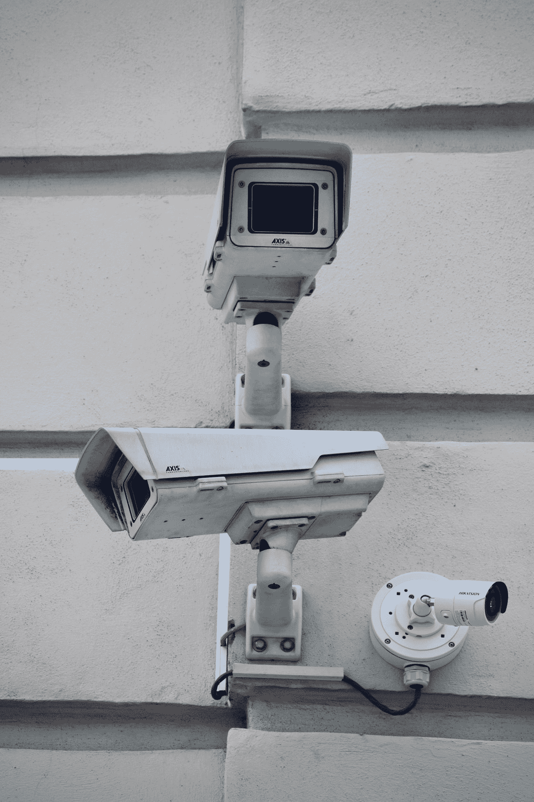

# 让你的电脑通知你的手机，无论何时有任何动静

> 原文：<https://blog.devgenius.io/make-your-pc-notify-your-phone-whenever-there-is-movement-around-it-c6c4ccd734b7?source=collection_archive---------2----------------------->

## 不用花钱，只需使用你的电脑就能让你的家更安全

阿诺·塞纳尔在 [Unsplash](https://unsplash.com?utm_source=medium&utm_medium=referral) 拍摄的照片

有多少次你不在电脑旁边，总有人想用？你有兄弟姐妹不能管好自己的事吗？嗯，使用 **Python** 和 **Opencv2** ，我们可以制作一个应用程序，它将使用你的计算机来检测周围的任何移动，并在检测到任何移动时向你发送**电报**通知。该应用程序还可以用作您整个房子的某种家庭安全应用程序。

# 本教程需要的工具

*   **带摄像头的电脑**
*   **电报**
*   **Python 3**
*   **python/opencv 2 基础知识**

# 带摄像头的电脑

与手机不同，电脑没有运动传感器。因此，直到现在，我们还不能让它们探测到人们在它周围移动。但是有一样东西是所有电脑都有的，相机。使用一个名为 **Opencv 的库，**我们可以让摄像机检测任何计算机周围的运动。

# 电报

我们将需要一个电报机器人来获得免费通知我们的手机。由于不是每个运营商都有免费的**短信**，当任何人都可以下载并且完全免费时，这个应用程序可以发挥很大的作用，甚至更大。

# Python3

由于我使用 python 3.6 制作了这个应用程序，我会建议你保持这种方式。我不能保证这在 python 2 中也能工作。

# python/Opencv2 基础知识

当然，即使你不知道如何编码，你也可以遵循这里提到的入侵，让一切完美地工作。然而，知道自己在做什么总是更好。这将有助于你修复错误，或者只是给这个神奇的应用程序增加新的功能，我将在这篇文章的最后提到这一点。

这个项目使用的代码将在会议中解释和给出。使用这种方法，你将理解所使用的每一行代码，即使这是你第一次钻研 python。

> 如果你真的等不及了，就跳到本教程的最后一部分，在那里你会找到整个脚本。

# Guard.py 代码

这里我们有 **Opencv2** 在**第 1 行，**由于明显的原因，你可能甚至没有在你的计算机上安装这个包。有两种安装方式

*   选项 1 —主模块包: *pip 安装 opencv-python*
*   选项 2 —完整包(包含主模块和贡献/额外模块): *pip 安装 opencv-contrib-python* (查看来自 [OpenCV 文档的贡献/额外模块列表](https://docs.opencv.org/master/))

**第二行:**是一个变量。我的叫 *guardcam* 。 **VideoCapture()** 将代表您电脑旁边的摄像头。使用 **0** 将适用于大多数计算机，但是根据连接的摄像机数量，您需要添加 **1** 而不是 **0**

**第 3 行:**使用 while 循环，基本上是保持摄像头打开，读取摄像头前发生的一切。**线** **4** 和 **5** 是用来检测运动的。第 **4** 行的变量用于分析静止物体，而第**行**5 的变量用于检测运动物体。这就是我们如何比较帧来检测运动。这两个框架上的任何变化都将被视为一个移动。这将是**线 6** 的结果，因为线 **6** 跟踪 **4** 和 **5** 变量。

**第 7 行:**为了避免检测对象时出现错误，我们将从这些帧中去除颜色。顾名思义，你需要把它转换成黑白。线 **8** 将去除线 **7** 的所有亮度，同时给图像一点模糊。 *5* ， *5* ，是赋予它的模糊程度。

**第 9 行:**使用 threshold，我们可以在录制时消除图像上的噪声，从而为摄像机前移动的任何物体提供更好、更明亮的图像

**10 号线:**与**9 号线**相对。在个性化你需要或想要的东西后，这会为你放大它。在 ***相互作用中，*** 3 是你希望这个被放大的次数。

**第 11 行:**这里我们做一个长方形。每当人们使用社交媒体过滤器拍照或在人脸识别检测程序中，他们都会在脸上看到相同的矩形。任何在摄像机前移动的物体都将得到这些矩形中的一个，这表明一个物体正在移动。

**第 13 行到第 17 行**:定义矩形的高、宽、颜色等等。通过改变线 **17** 中的数字 *2* ，它将给出那些矩形上的线的更粗版本。改变( *0，55，0* )会改变它的颜色。就像现在这样，你会有一个绿色的矩形。

## **Ntfy 电报**

在这篇报道之后

 [## 如何在您的电脑上运行完脚本或命令时获得电话通知

### 我们可以告诉我们的系统在任何任务完成后直接发送通知到我们的手机。免费使用一个我们都…

medium.com](https://medium.com/dev-genius/how-to-get-a-phone-notification-whenever-a-script-or-command-is-done-running-in-your-pc-ec04d0a82f29) 

在你的电脑上安装 **ntfy telegram** ，每当使用你的终端执行一个脚本时，你的手机就会收到通知。在所有东西都启动并运行之后，将 **ntfy** 导入到这个项目中，创建一个变量，并在该函数中调用 **ntfy** ，为了方便起见，甚至使用了*别名*。您将在第 **17 行**和第 **18 行之间添加该变量。**这是整个项目中最重要的部分，因为每当有人在你的电脑前移动，你就会收到一封通知到**的电报。第 18 行**用于退出程序，按下字母“ **q** ”。如你所知，整个程序依赖于一个 while 循环。这就是你阻止它的方法。

# 该应用程序

# 可选择的

还记得一开始我告诉你，你需要了解 python 的基础吗？原因如下——你不仅可以直接在手机上收到通知，还可以通过特殊命令添加更多功能。ex；在任何人可以触摸它之前关闭它，注销，播放视频告诉人们你正在看他们，音乐，闹钟声，或者只是一个自动记录命令来记录当时移动的对象。

# 结论

正如我前面所说，这个应用程序可以有许多不同的用途。不仅要保护你的电脑，还要监视你的整个房子。当然，你可能不想让你的网络摄像头 24/7 运行。一个选择是买一个便宜的 20 美元的，并安装在一个更高的地方。使用这种方法，无论你什么时候不在家，你都可以监视整个房子。希望你喜欢！