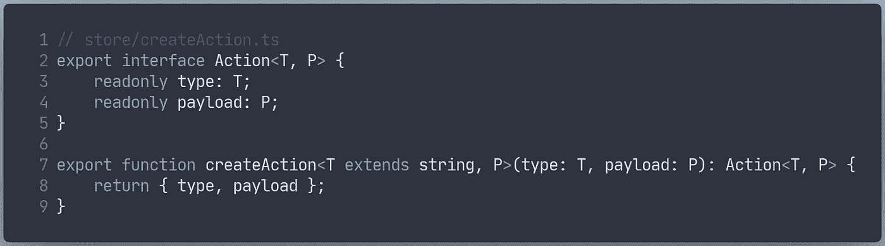
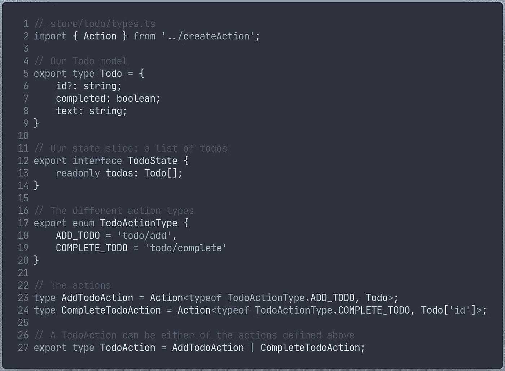
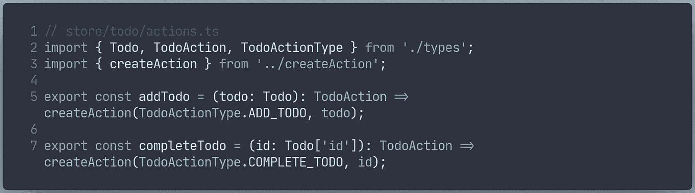
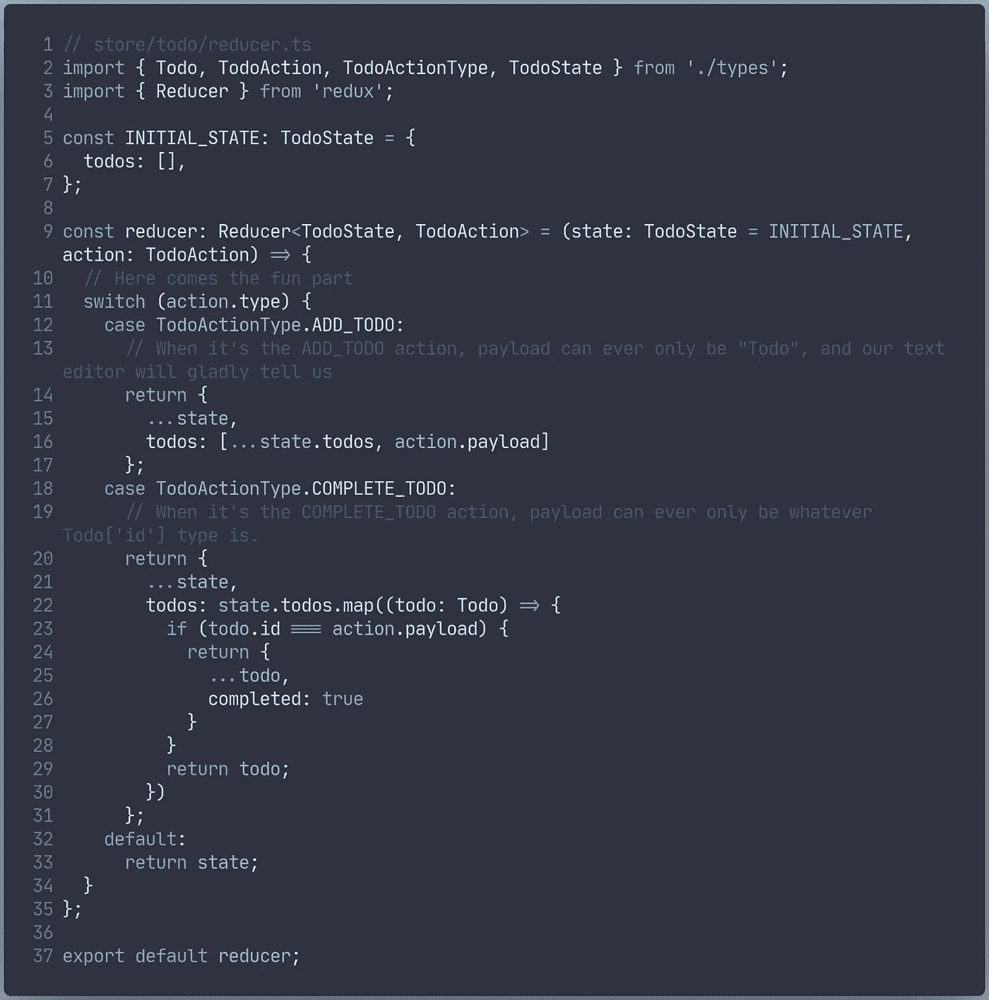
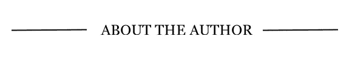

# 使您的 redux 操作类型安全

> 原文：<https://blog.devgenius.io/make-your-redux-actions-type-safe-c2e99d4b0dbe?source=collection_archive---------8----------------------->

## 应用设计模式

## 使用 TypeScript 键入您的 redux 存储以避免错误

[UX 店](https://unsplash.com/@uxstore?utm_source=medium&utm_medium=referral)在 [Unsplash](https://unsplash.com?utm_source=medium&utm_medium=referral) 上拍照

因此，您在开发 React 应用程序时已经使用了 TypeScript 一段时间，并且希望了解如何使您的整个 redux store 类型安全，那么这篇文章就是为您准备的。

我自己使用 TypeScript 已经有几年了，我必须承认，我已经从一个铁杆“纯 JS”开发人员一跃成为永不回头的开发人员。TypeScript 无疑改变了我做 web 开发的方式——它要么是前端，要么是后端。

对于那些还不知道什么是[*TypeScript*](https://www.typescriptlang.org)*的人来说，它是一个“编译成普通 JavaScript 的 JavaScript 的类型化超集”。这意味着我们可以向 JavaScript 添加类型、接口、泛型等等。*

## 好吧，给我看看代码

但在我这么做之前，你需要理解背后的逻辑。因此，为了分解它，为了让我们有完整的类型安全，我们需要:

1.  定义什么是动作
2.  定义我们可以执行的操作
3.  根据这些行动采取行动

## **定义动作类型**

活动类型和通用活动创建者

动作是一个带有一个`type`和一个`payload`的简单对象。我们保持这些通用的，因为动作将是不同的类型并且包含不同的有效载荷。

## 定义可能的行动

请花点时间理解这段代码。在第 5–9 行，我们定义了我们的模型，todo。在第 12–14 行，我们定义了我们国家的结构。我们保持简单，只存储一个待办事项列表。在第 17–20 行，我们声明了动作类型，这将是我们决定用户分派什么动作的关键。然后在第 23 行和第 24 行，我们使用之前定义的`Action`类型定义了可以执行的实际操作。有了这些，我们就可以导出`TodoAction`，它可以是我们已经声明的任何动作。

## 好了，现在我已经添加了很多代码，我该如何使用它呢？

简单，就像这样:

您创建您的操作，当您在组件中调度时将调用的函数。他们所要做的就是接受所需的输入，并返回一个`TodoAction`给我们的减速器来处理。

它看起来会像这样:

当我们输入了动作后，我们就在我们的 reducer 中获得了完全的类型安全。这意味着我们编辑器中的自动完成特性/智能感知将自动知道不同动作中的`payload`的类型。

这将使你免于在你的`actions.ts`和你的`types.ts`之间来回跑来跑去，看看有效载荷到底是什么样子。不要告诉我你从来没有用类似`completeTodo({ id: 1 })`的东西调用过一个动作，你应该用`completeTodo(1)`来调用它。很容易犯这个错误，所以如果你预先定义了你的动作，你就不会再认为一个动作是错误的，你的 reducer 将总是有类型安全来正确地执行它。

Jakob Gaard Andersen 是一家发展最快的银行的软件工程师，他在 React 中开发面向客户的应用程序。在担任目前的职位之前，他来自四大咨询公司之一，在那里他还在 Novo Nordisk、rsted、丹麦劳动力市场和招聘机构以及 SKAT 的多个项目中发挥了他的技能。

*连接上* [*LinkedIn*](https://www.linkedin.com/in/jakob-gaard-andersen/)

## 雅各布·加德·安德森的其他文章，你可能会感兴趣。

 [## 正确处理加载和错误状态

### 使用状态对象

medium.com](https://medium.com/dev-genius/handling-loading-and-error-states-the-right-way-a9bbefd0d7cc)