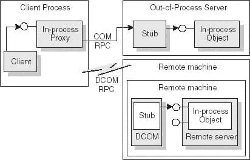
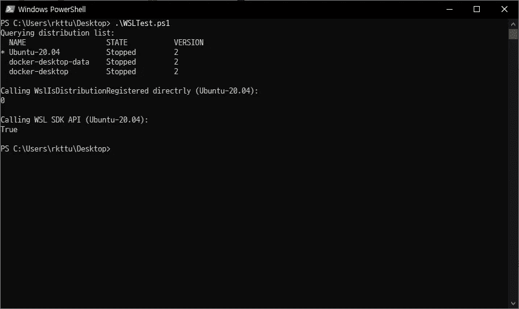
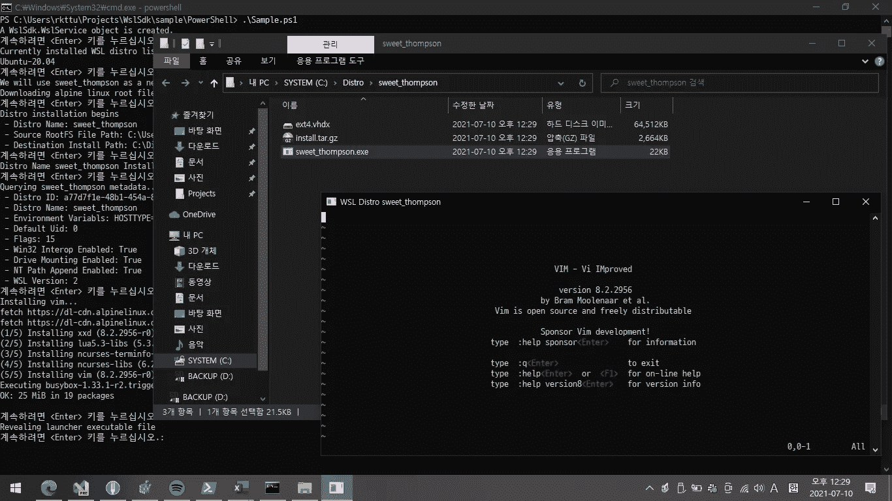
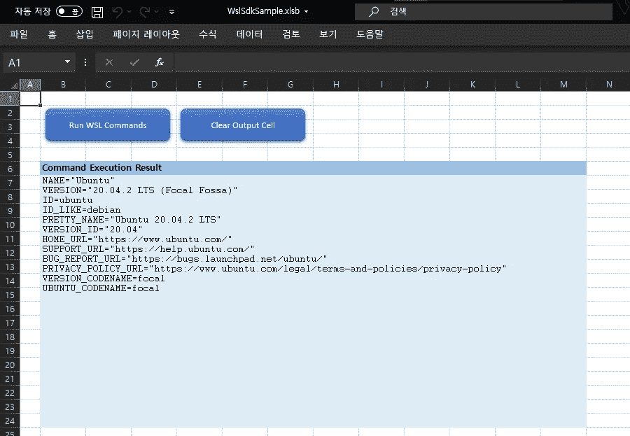
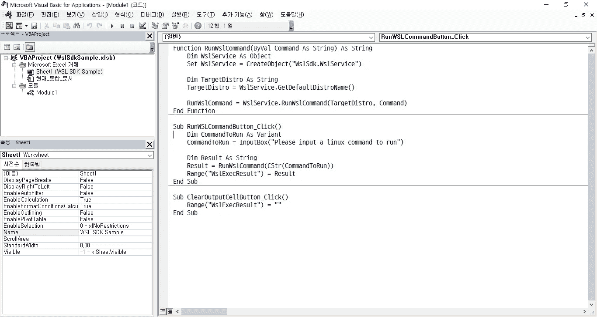

# 让您的 WSL 环境可编程

> 原文：<https://blog.devgenius.io/make-your-wsl-environment-programmable-72be5907d1ff?source=collection_archive---------1----------------------->


在 [Unsplash](https://unsplash.com/s/photos/penguin?utm_source=unsplash&utm_medium=referral&utm_content=creditCopyText) 上由 [Derek Oyen](https://unsplash.com/@goosegrease?utm_source=unsplash&utm_medium=referral&utm_content=creditCopyText) 拍照

我自从 WSL 架构首次亮相就被它迷住了。它拥有优雅漂亮的架构，可以实现 Windows 和 Linux 世界之间的互操作性。最后，我深入研究了 WSL Win32 APIs、它的注册表模型和内部模型。

但是只有少量 WSL API 文档和示例。后来，我意识到微软并不打算将 WSL API 用于一般用途，而是 WSL 发行版开发者。此外，被称为 WSL.exe 和发行版启动器的 CLI 工具正在移动部件(因为每个 Windows 10 主要版本都有不同的功能和命令行选项)。所以这些情况使得 WSL 环境很难自动化。

经过多次试验和错误，我开发了一个小而有效的自动化工具，叫做 WSL SDK。这个工具是一个进程外风格的 COM 服务器，所以你可以用任何 COM 支持的语言访问 SDK。

在本文中，我想分享 WSL SDK 的演练，以克服使用官方 Win32 WSL APIs 的困难。

# WSL 的隐藏宝藏

如果您对 WSL APIs 感兴趣，您可能会得到关于该 API 的提示。例如，API WslLaunch 返回一个 HRESULT 代码。一个与 WSL 相关的 COM 接口在其内部组成中称为 LxssUserSession，这个 API 包装了 COM 对象。

可悲的是，内部的 COM 对象完全被微软隐藏了，看起来这是故意的。我想这个方向是有合理的决定的。但是，它的内部 COM 对象也没有很好的文档。

# WSL APIs 不友好

正因为如此，WSL APIs 有一些众所周知的设计行为。如果您通过 PowerShell、LINQPad 或任何支持 COM 的环境使用 P/Invoke 调用 WSL API，您将无法访问任何 WSL API。许多爱好者尝试了 API，但没有运气。

这是为什么呢？我提到的那些环境已经通过另一个 CoInitializeSecurity 调用启动了。遗憾的是，WSL APIs 需要一个特定的初始化参数。并且 CoInitializeSecurity 在某处被调用；您再也不能调用 CoInitializeSecurity。为了克服这个问题，不可避免地，我应该选择进程外模型。

# 挖掘旧样本

然而，进程外模型使得使用 API 的步骤很繁琐。您应该检查该进程是否存在。您必须定义如何与外部进程(如管道、内部网络或任何封送协议)进行通信。此外，这种方法很难扩展和维护 API 调用和功能。

我在这一点上坚持了很长时间。但是，多亏了微软开发的名为 All-In-One Code Framework 的老项目，我找到了一个漂亮的解决方案。是的。进程外 COM 服务器模型！所以我修改了示例进程外 COM 服务器代码，它工作起来非常棒。

# 在后台

当客户端应用程序通过 COM API 请求 WSL SDK 服务对象时，Windows 会自动启动可执行文件以获取适当的对象引用。然后，用代理接口包装它，客户端应用程序检索该引用。为了更好的理解，请看下图。



摘自[http://doc wiki . embarcadero . com/RADStudio/Sydney/en/In-process、_Out-of-process、_and_Remote_Servers](http://docwiki.embarcadero.com/RADStudio/Sydney/en/In-process,_Out-of-process,_and_Remote_Servers)

WSL SDK 可执行文件调用带有正确参数的 CoInitializeAPI 来与 WSL APIs 通信。然后启动一个消息泵来处理外部 RPC 请求和任何与 Windows GUI 相关的请求。当请求对象引用时，其引用计数将增加或减少。然后计数达到零；可执行进程将关闭。再次，另一个请求到达，相同的回合将再次发生，直到从注册表中注销 COM 信息。

所以 WSL SDK 将 COM 安全模型从应用程序的安全模型和 WSL 的需求中分离出来。以及由操作系统的基础结构和引用计数机制处理的进程生命周期管理。每个 WSL SDK 客户端都不需要关心任何细节。他们像往常一样请求 WSL SDK 接口，一切进展顺利。

# 将直接 P/Invoke 与 WSL API 进行比较并使用 WSL SDK

我将展示一个简单的演示。



将直接 P/Invoke 与 WSL API 进行比较并使用 WSL SDK

PowerShell 示例代码如下所示。我摘录了 GitHub 问题【github.com】WSL API 在 PowerShell 问题#4058 中不起作用的示例代码微软/WSL(T3)。

```
# Excerpted from [https://github.com/microsoft/WSL/issues/4058](https://github.com/microsoft/WSL/issues/4058)
Write-Host 'Calling WslIsDistributionRegistered directrly (Ubuntu-20.04):'
Add-Type -TypeDefinition @'
using System.Runtime.InteropServices;public class wslutil
{
 [DllImport("wslapi.dll", CharSet = CharSet.Unicode)]
 public static extern uint WslIsDistributionRegistered([In, MarshalAs(UnmanagedType.LPWStr)] string distributionName);public static void Main(string[] args)
 {
  System.Console.WriteLine(WslIsDistributionRegistered("Ubuntu-20.04"));
 }
}
'@
[wslutil]::Main({})
Write-Host
```

PowerShell 代码引用了 WSLAPI.dll 的 C-function。从表面上看，这是有道理的，而且应该很有效。但是代码返回零，不反映当前状态。

但是，WSL SDK 会返回正确的值。

```
Write-Host 'Calling WSL SDK API (Ubuntu-20.04):'
$DistroName = 'Ubuntu-20.04'
$obj = New-Object -ComObject 'WslSdk.WslService'
$Result = $obj.IsDistroRegistered($DistroName)
Write-Host "$Result"
Write-Host
```

本质上，这两个代码都依赖于 WslIsDistributionRegistered 函数，但是 PowerShell 已经调用了 CoInitializeSecurity，这不符合 WSL APIs 的要求。因此，第一个示例不适用。

# 演示:沙盒 WSL 发行版

我将展示另一个更复杂的示例脚本。下面的代码将自动从官方镜像下载 Alpine Linux 根文件系统映像。然后，将 VI 改进的编辑器添加到发行版中。

```
$ErrorActionPreference = "Stop"
$obj = New-Object -ComObject 'WslSdk.WslService'
Write-Output 'A WslSdk.WslService object is created.'
Pause# Get installed distro list
Write-Output 'Currently installed WSL distro list: '
$list = $obj.GetDistroList()
Write-Output $list
Pause# Generate Random Name
$RandomName = $obj.GenerateRandomName($false)
Write-Output "We will use $RandomName as a new distro"# Download Alpine Linux RootFS Image
Write-Output 'Downloading alpine linux root file system image'
$TargetUrl = '[https://dl-cdn.alpinelinux.org/alpine/v3.14/releases/x86_64/alpine-minirootfs-3.14.0-x86_64.tar.gz'](https://dl-cdn.alpinelinux.org/alpine/v3.14/releases/x86_64/alpine-minirootfs-3.14.0-x86_64.tar.gz')
$RootfsFilePath = "$env:TEMP\alpine.tar.gz"
$InstallPath = "C:\Distro\$RandomName"
Invoke-WebRequest -UseBasicParsing -Uri $TargetUrl -OutFile $RootfsFilePath
Pause# Register Distro
Write-Output "Distro installation begins"
Write-Output " - Distro Name: $RandomName"
Write-Output " - Source RootFS File Path: $RootfsFilePath"
Write-Output " - Destination Install Path: $InstallPath"
$obj.RegisterDistro($RandomName, $RootfsFilePath, $InstallPath)
Pause# Distro Register Check
$Result = $obj.IsDistroRegistered($RandomName)
Write-Output "Distro Name $RandomName Installed: $Result"
Pause# Metadata Query
Write-Output "Querying $RandomName metadata..."
$o = $obj.QueryDistroInfo($RandomName)
Write-Output " - Distro ID: $($o.DistroId())"
Write-Output " - Distro Name: $($o.DistroName())"
Write-Output " - Environment Variabls: $($o.DefaultEnvironmentVariables())"
Write-Output " - Default Uid: $($o.DefaultUid())"
Write-Output " - Flags: $($o.DistroFlags())"
Write-Output " - Win32 Interop Enabled: $($o.EnableInterop())"
Write-Output " - Drive Mounting Enabled: $($o.EnableDriveMounting())"
Write-Output " - NT Path Append Enabled: $($o.AppendNtPath())"
Write-Output " - WSL Version: $($o.WslVersion())"
Pause# Run WSL command
Write-Output "Installing vim..."
$res = $obj.RunWslCommand($o.DistroName(), "apk add vim")
Write-Output $res
Pause# Revealing launcher executable
Write-Output "Revealing launcher executable file"
Start-Process -FilePath "$env:windir\explorer.exe" -ArgumentList "/select,$InstallPath\$RandomName.exe"
Pause# Unregister Distro
Write-Output "Unregister $RandomName distro..."
$obj.UnregisterDistro($RandomName)
Pause# Get installed distro list
Write-Output 'Currently installed WSL distro list: '
$list = $obj.GetDistroList()
Write-Output $list
Pause$obj = $null
```

它是一个基本的根文件系统映像，不是为 WSL 设计的。正如您已经知道的，WSL 支持导入任何符合处理器体系结构的 Linux 根文件系统映像。



沙盒 WSL 发行版

WSL SDK 甚至可以在 PowerShell 环境中处理动态分发注册和操作。

只是为了好玩，即使在 Microsoft Excel 中，也可以与 WSL 环境进行交互。



使用 VBA 通过 Excel 运行 WSL SDK



在 Microsoft VB for Applications 中实现 WSL 自动化

您可以在这里访问 WSL SDKs 的各种示例代码:[https://github.com/wslhub/wsl-sdk-com/tree/main/sample.](https://github.com/wslhub/wsl-sdk-com/tree/main/sample.)

# 未来路线图

由于 https://github.com/marketplace/actions/setup-wsl 插件和 GitHub 团队决定在他们的 Windows 服务器工作负载中启用 WSL 组件，我最近创建了一个 GitHub 动作管道。

正因为如此，我可以为 WSL SDK 创建一个持续的集成，这使得发布更有信心。(https://github . com/WSL hub/WSL-SDK-com/actions/workflows/WSL-SDK-com-build . yml)这项工作是 WSL SDK 路线图的一项重大成就。

此外，我的遗愿清单包含了这些目标。

*   免注册 COM 服务器(如果可能)
*   ARM64 原生支持
*   在我以前的另一个项目中采用 WSL SDK(WSL Manager)
*   各种语言包装器(C#、Python、Go-lang、PowerShell 或任何 COM 支持的语言)

如果你对 WSL SDK 项目感兴趣，请过来为 GitHub repo 做贡献。(【https://github.com/wslhub/wsl-sdk-com】T4)