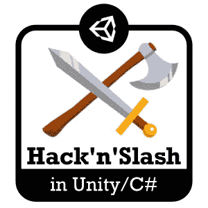
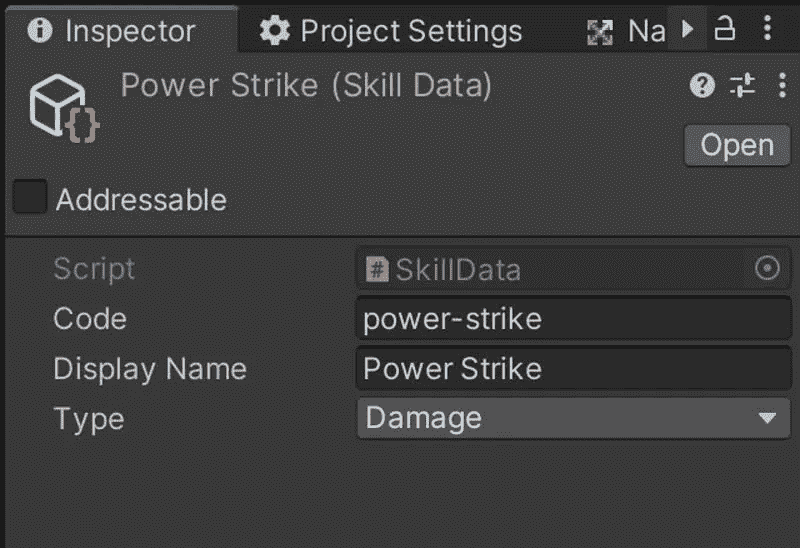
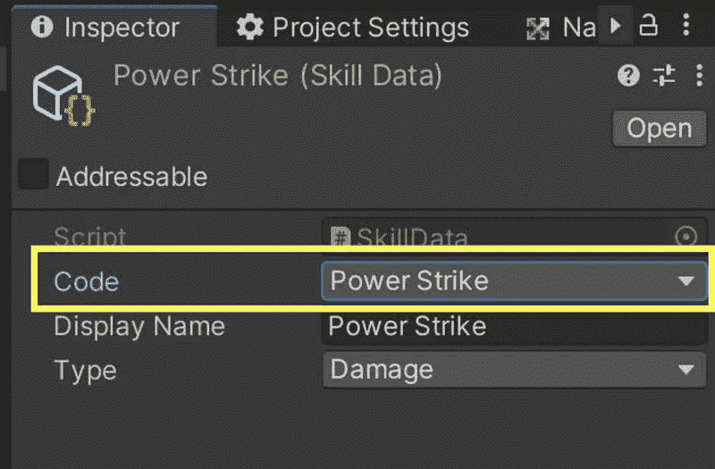
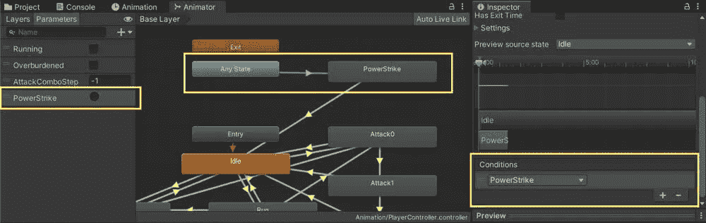
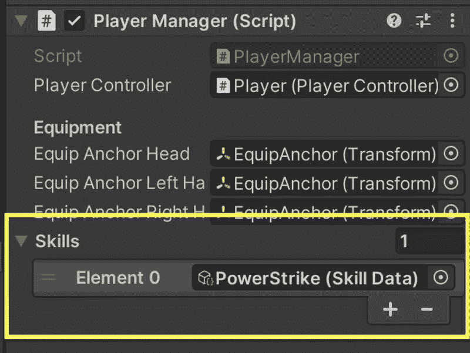
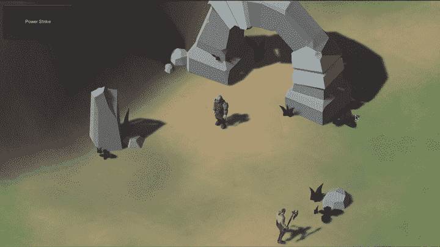
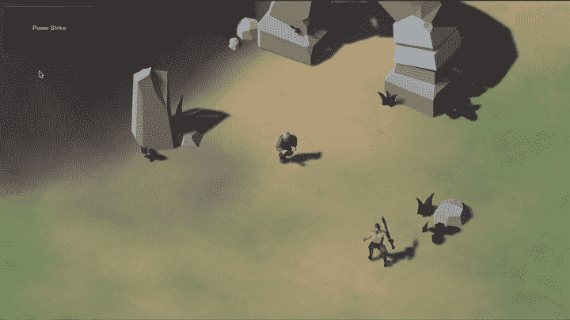

# 制作一个黑客斜线#23:增加一些技能和权力！1/2

> 原文：<https://blog.devgenius.io/making-a-hackn-slash-23-adding-some-skills-and-powers-1-2-4194deda4449?source=collection_archive---------11----------------------->

## 让我们继续劈砍吧，给我们的英雄一些特殊技能！

[*【⬅️】教程#22:提升我们的球员统计*](https://medium.com/codex/making-a-hackn-slash-22-improving-our-player-statistics-acd29fe1b9a5)*|*[*TOC*](https://medium.com/c-sharp-progarmming/making-a-hackn-slash-game-in-unity-c-6ec315e75816)*|*[*教程#24:增加一些技能和威能！2/2 ➡️*](https://mina-pecheux.medium.com/making-a-hackn-slash-24-adding-some-skills-and-powers-2-2-4032ec4ac117)

在前一集，我们研究了英雄的基数统计，以及如何从中得出一些有趣的变量。这是一个让我们的角色在整个冒险过程中增强力量的好方法，特别是在战利品方面，但是这通常不是黑客和斜线玩家可以使用的唯一工具…

…另一个关键因素是特殊技能和超能力！

这些可以是非常多样的，从纯粹的攻击提升到即时治疗，或者区域混乱法术，或者一些传送机制。找到正确的技能取决于你自己，以及你在游戏中所处的宇宙类型。

但是，我们仍然可以讨论如何实现这样的系统，并通过一个简单的例子来进行实践:)

所以，在这几集里，让我们深入了解特殊的法术和技能！

# 为我们的技能定义数据

首先，让我们想想如何定义我们的技能。在本文中，我们将举一个基本的例子:“强力打击”，即对敌人造成额外伤害的特殊近战攻击。我们希望这个技能有一个唯一的引用，一个显示名称，一个值类型(例如可以是“伤害”或“治疗”)和一个实际计算这个值的方法。

像往常一样，前三个参数可以很容易地打包到一个可脚本化的对象中:

然而，对于值计算函数来说，它要复杂一些。由于我们不能在检查器中编辑 C#，我们必须把它写在某个地方，并把它链接到我们的其他数据。但是最好避免在我们的`SkillData`类中有一个大的 if-else if 检查，那么我们如何从其他地方“提取”这些信息呢？

这里一个很酷的技巧是使用委托。基本上， [C#委托](https://docs.microsoft.com/en-us/dotnet/csharp/programming-guide/delegates/)是一种将函数的原型声明为类型的方式，这样你就可以将函数作为输入传递给另一个函数。

例如，假设我们创建了另一个名为`SkillEffects`的脚本，它包含一个静态类。这是我希望最少使用所有实际技能计算函数的地方。嗯，我可以在我的`Skills`名称空间中声明一些没有输入参数也不返回值的全局委托:

然后在我的类中使用它来创建一个字典，将特定的技能代码映射到它的计算函数:

我在这里所做的是告诉程序，任何技能计算函数都有一个类似于在`SkillEffect`委托中定义的原型:没有输入参数，也没有返回值。

现在，我只需要给`SkillData`对象添加一些传递方法，让它自动选择正确的逻辑:

为了彻底起见，我们可以通过保留一个允许技能代码的列表来使整个系统更加健壮:这将允许打字错误和其他愚蠢的错误破坏行为。为此，让我们再次用我们的技能代码定义一个 enum 让我们把它放在第三个名为`SkillCodes`的文件中，因为在一个成熟的项目中，这个列表可能会很长:

然后，在我们的`SkillData`中，我们将把`code`字段的类型改为这个枚举类型:

最后，我们只需要替换我们的`SkillEffects`类中的类型，我们就完成了！

这意味着，现在，在检查器中，我们有一个可能值的下拉列表，这使得它更容易得到正确的；)

好了，有了这个快速设置，让我们开始有趣的部分，实际上开始使用这个技能！

# 利用我们的技能一击制敌！

## 触发特定的动画

在这里，我们将保持事情的简单性，假设我们的强力打击会立刻在我们的角色面前打出一拳，并造成疯狂的伤害。这样，如果我们面对的是前几集的野蛮敌人，我们应该可以一拳干掉它。

我们想要的是让我们的技能计算值触发所有这一连串的事件。换句话说，它应该得到一个对玩家控制器的引用，并让它启动一个特定的动作，反过来，它将使用一个类似于我们正常攻击动作的事件来攻击敌人。

实际上，为了简单起见，我将重用我的第一个攻击动画——但是我将把它复制到我的动画制作工具中的另一个状态“强力打击”。这样，我可以将它链接到“任何状态”工具:这意味着无论动画师当前处于哪个状态，我们都能够直接转换到“强力打击”状态。

为了完成这个转换，我将使用一个名为“PowerStrike”的新触发变量；然后，为了最终转换回“空闲”状态，我将把它留空，只是等待动画结束。

这是我更新的动画师的所有这些补充:

为了让技能强制触发这个触发器，让我们给我们的`PlayerController`添加一个新函数，名为`TriggerState()`:

注意，这个逻辑假设你的技能状态和触发状态的名称是相同的。

然后，在`SkillEffects`脚本中，让我们更新我们的`PowerStrike()`函数，让它找到玩家，获取它的`PlayerController`脚本组件并调用该函数。我也会重置攻击组合，因为技能应该可以打断任何一系列的攻击。我们还需要一种方法来告诉玩家它应该造成额外的伤害，但是我们马上就会看到:

我在这里调用的`ResetAttackCombo()`很容易在我们的`PlayerController`中编码:

## 测试一下！

现在，假设我们在`PlayerManager`脚本中添加了一些测试 GUI 按钮来测试这个工作流。我将使用 Unity 的 IMGUI 来快速完成它——重点是在屏幕上有一个按钮，我可以点击它来调用我的强力打击技能，就像这样:

其中我的`_skills`数组是在检查器中手动填充的(最终，当然应该有一个解锁/学习新技能的逻辑，这将逐渐填充该数组):

如果我点击游戏中的按钮，我会看到角色确实出拳了，正如我所料:

## 造成额外伤害！

但是，就目前而言，这一击与普通攻击没有区别。我们将在下一个教程中看到如何添加一些视觉效果来展示这种一击即中的神奇和异想天开的力量——不过现在，我们将专注于数据和逻辑。

我们需要告诉玩家这一拳是特殊的，有特定的伤害。让我们在我们的`PowerStrike()`函数中这样做:我们将在我们的`PlayerController`上设置一些静态变量(没有污染生态系统的风险，因为我们在整个游戏中只有这个脚本的一个副本)，并定义一些“覆盖损害”:

然后，在我们的`PlayerAttackManager`中，我们将检查这个值是否被设置。如果是，我们使用它；否则，我们像以前一样计算损害:

如果你重新运行游戏，你瞧！你会发现你的强力打击真的很强大:)

## 重置损坏覆盖

当然，我们也需要重置这个伤害覆盖，这样接下来的普通拳就不会突然受到这个覆盖伤害。要做到这一点，我们可以重用之前的回调系统，并在动画结束时重置该值，此时技能已经施放:

如果你试着将强力打击从敌人身上移开，然后对野兽进行正常的重击，你会发现它确实恢复到正常的伤害量；)

# 结论

在第一部分中，我们实现了我们的基本技能数据结构，并且我们看到了如何定义一个角色转换时要执行的逻辑的快速示例。

下一次，我们将继续致力于这个系统，并增加几个功能，如冷却，一些用户界面显示和尼斯 VFX！

*阅读更多我的内容，以及许多其他伟大作家的自媒体文章，* ***考虑成为会员吧！*** *你的会员费直接支持你阅读的作家。*

 [## 通过我的推荐链接加入媒体

### 阅读 Mina Pêcheux(以及媒体上成千上万的其他作家)的每一个故事。您的会员费直接支持…

mina-pecheux.medium.com](https://mina-pecheux.medium.com/membership) 

[*⬅️教程#22:提升我们的球员统计*](https://medium.com/codex/making-a-hackn-slash-22-improving-our-player-statistics-acd29fe1b9a5)*|*[*TOC*](https://medium.com/c-sharp-progarmming/making-a-hackn-slash-game-in-unity-c-6ec315e75816)