# 做一个黑客斜线#24:增加一些技能和权力！2/2

> 原文：<https://blog.devgenius.io/making-a-hackn-slash-24-adding-some-skills-and-powers-2-2-4032ec4ac117?source=collection_archive---------9----------------------->

## 是时候结束我们的黑客教程，完成我们的技能系统了！

[*⬅️教程#23:增加一些技能和异能！1/2*](/making-a-hackn-slash-23-adding-some-skills-and-powers-1-2-4194deda4449)*|*[*TOC*](https://medium.com/c-sharp-progarmming/making-a-hackn-slash-game-in-unity-c-6ec315e75816)*|*[*教程#25:期末笔记&总结➡️*](https://mina-pecheux.medium.com/making-a-hackn-slash-25-final-notes-sum-up-9f330ef686ec)

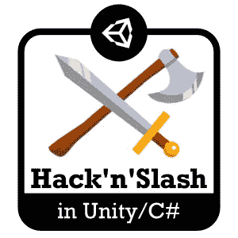

好了，我们即将结束这个黑客和斜线教程！我们已经看到了很多东西，实现了几个与 RPG 相关的系统，并且看到了很多很酷的优化技巧。所以，今天，我们需要完成最后一个系统:特殊技能！

上一次，我们准备了数据和基本逻辑，所以现在我们的英雄能够发动毁灭性的攻击，一击制敌。

这很酷，但显然这里缺少了一些东西；)

在本文中，我们将通过实现以下特性来扩展我们的系统:

*   设置冷却时间…或者成本:是的，因为，现在，没有什么可以阻止你一次又一次的发送最后一击，这将使你的 RPG 非常容易加速运行！
*   添加 UI 和输入动作:到目前为止，我们只是在左上角设置了一个调试 UI——这很方便，但还没有准备好，对吗？
*   展示一些伟大的 VFX:因为这就是咒语的意义所在——闪光和欢乐的爆发！:)

# 增加冷却时间

好的，首先，让我们来关注一下我们的法术的冷却时间。

每当一款游戏赋予你如此强大的能力时，付出一定的代价似乎是合乎逻辑的。这个代价可以是一些稍微减少的能量或魔法条，或者只是你必须等待的时间，直到你可以再次施展法术。很多游戏居然两者同时使用！

在这里，我将只关注冷却时间，因为我认为这是最难实现的。简而言之，我们需要一些机制来将一个法术标记为当前不可用，然后在冷却结束后重置它。

第一步是在我们的`SkillData`课程中定义这个冷却时间:

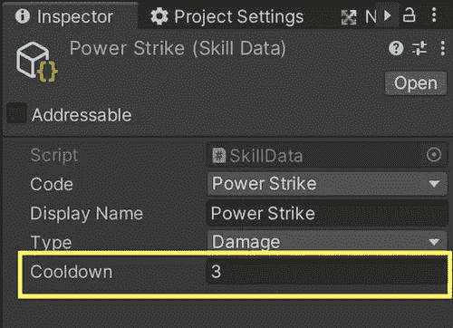

现在，当我们转换它时，我们将在对象中存储一个标志，将它标记为不可用，我们将确保，如果这个标志打开，那么`Cast()`函数只是提前中止，不做任何事情。我还会将我们的返回值转换为一个布尔值，这样我们现在就可以知道该技能是否已经施展:

顺便说一下，由于这个变量是私有的，但也被 Unity 加密，我们必须确保在游戏开始时它被正确地设置回`false`，就像这样:

该过程的复杂部分是找到一种方法，在冷却延迟过去后触发该`_inCooldown`布尔标志的某种重置。当我们想等待一段时间时，我们通常有两种选择:

*   使用`[Invoke()](https://docs.unity3d.com/ScriptReference/MonoBehaviour.Invoke.html)`调用同一个类中没有参数的函数
*   或者启动协程

问题是这两种技术都要求我们在一个`MonoBehaviour`类中！这里，我们想在我们的`SkillData`脚本中调用它，它继承自`ScriptableObject`类。

因此，我们需要使用第三种选择:C#异步任务系统。

作为一个快速复习，异步代码的思想是，不是启动一个进程并让它完全在一个单一的镜头中运行，而是不时地以小的步骤运行逻辑，并不时地将手放回主例程以模拟并行进程。

C#任务是异步编程的另一种方式。这个内置的 C#工具可以让你用`await` / `async`关键字创建异步代码，就像 Javascript 或 Python 的最新版本[中的](https://docs.python.org/3/library/asyncio-task.html)[承诺的那样，这使得编码和阅读变得非常容易。](https://developer.mozilla.org/en-US/docs/Web/JavaScript/Reference/Global_Objects/Promise)

然后，基本上，通过在内部缓冲区中对任务进行排队，并将它们通过管道连接在一起或并行放置，您可以很容易地让您的代码在一段时间后执行，当条件满足时，一旦另一个任务完成运行，或者如果它失败了…为了完成所有这些，您只需将您的函数定义为`async`，从这一点开始，您可以在函数体中使用`await`关键字来获得异步任务的结果。

在这里，我们实际上不必链接任务或获取返回值，所以我们可以这样使用它:

如果你试着这样做并添加一些调试，你会发现这个法术在冷却时间没有结束的时候确实被封锁了。然而，由于我们目前在使用强力打击和正常出拳时有相同的动画，当你左键点击时，我们可能会感到困惑…

…所以首先让我们替换我们的动画师中的动画！我将使用我的拳击链中的第二个动画，如下所示:

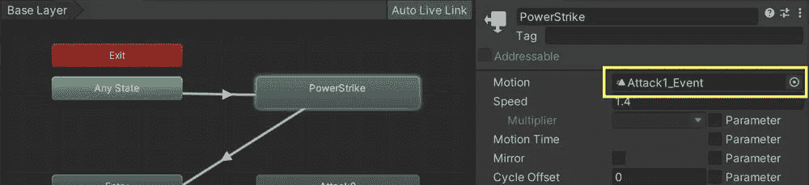

现在，如果我们尝试一下，我们会看到我们可以施展我们的特殊技能，但 3 秒钟内我们不能再次触发它:)

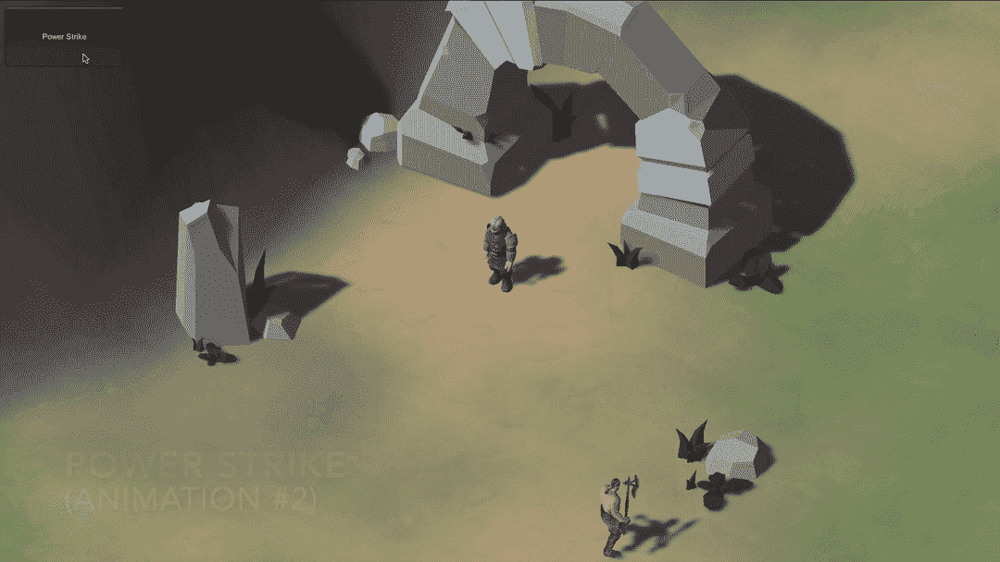

相当不错…除了有一个不同的动画对于这种强大的力量来说有点太微妙了，不是吗？是时候和 VFX 玩玩了！

# 添加一些漂亮的 VFX！

好了，在这个教程中，我将使用来自[的 FX，这是让·马雷诺](https://assetstore.unity.com/packages/vfx/particles/cartoon-fx-free-109565)的免费卡通 FX，非常酷。我从第一组中选了一个叫做“Hit C White”的，看起来像这样:

现在，为了在我使用这个技能时真正展示它，我将首先在我的`SkillData`类中添加一个对这个预置的引用:

然后，当我投掷超级力量的重拳时，我将需要在我发送击中事件的时刻实例化这个预设(这将自动播放粒子系统动画)，然后在完成时销毁预设。

*注意:正如我们在之前的教程中所讨论的，你可以通过为 VFX 设置对象池来优化这一点，但是这里我将保持事情的简单性，并做一个普通的实例化/销毁方法，因为这不会发生在关键路径或太大的规模上:)*

这个库很酷的一点是，它准备了一个脚本，可以在预设完成执行时自动销毁它——所以我们甚至不用担心这个问题:只要我们有这个`CFX_AutoDestructShuriken`脚本，我们的预设就会在我们不再需要它时被清理掉。

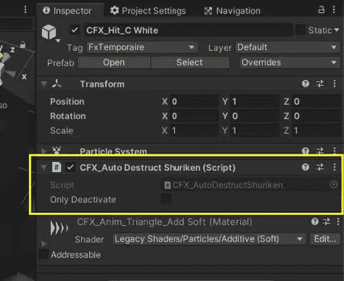

现在，为了在正确的时间实例化我们的 FX 预置，我们必须给我们的`SkillEffect`回调函数提供更多的信息。现在，它不接收任何东西——我们将传递给它`SkillData`对象，这样它就可以检查 FX 预置，并在需要时实例化。同时，我们也可以提取物体的伤害值。总而言之，这给我们带来了以下变化:

我们到了。我们的特殊技能现在有了一点 FX，明显区别于普通的重拳:)

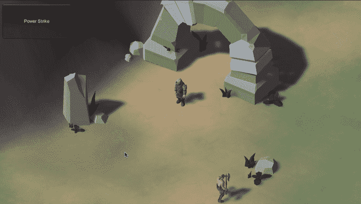

好了，接下来，为了继续改进我们的系统，我们必须把所有这些都添加到我们的 UI 中，这样玩家就可以很容易地触发技能，并在使用后获得足够的反馈！

# 在我们的用户界面中展示技能

现在我们已经让逻辑工作，让我们添加一些视觉信息告诉玩家这个技能。我们想在用户界面上放一个按钮，让玩家更容易记住他们目前拥有的技能，但不要忘记，我们还必须将技能的转换与一些输入键联系起来，以保持我们的游戏跨平台:)

我们还需要一些视觉指示器来显示这个技能现在是否处于冷却模式。

好吧，在本教程中，我将使用[中的一个图标，这是一个非常酷的免费图标包，由 Blink](https://assetstore.unity.com/packages/2d/gui/icons/free-rpg-fantasy-spell-icons-200511) 制作，用于我的强力打击(片场中一个名为“争吵者 1”的图标):

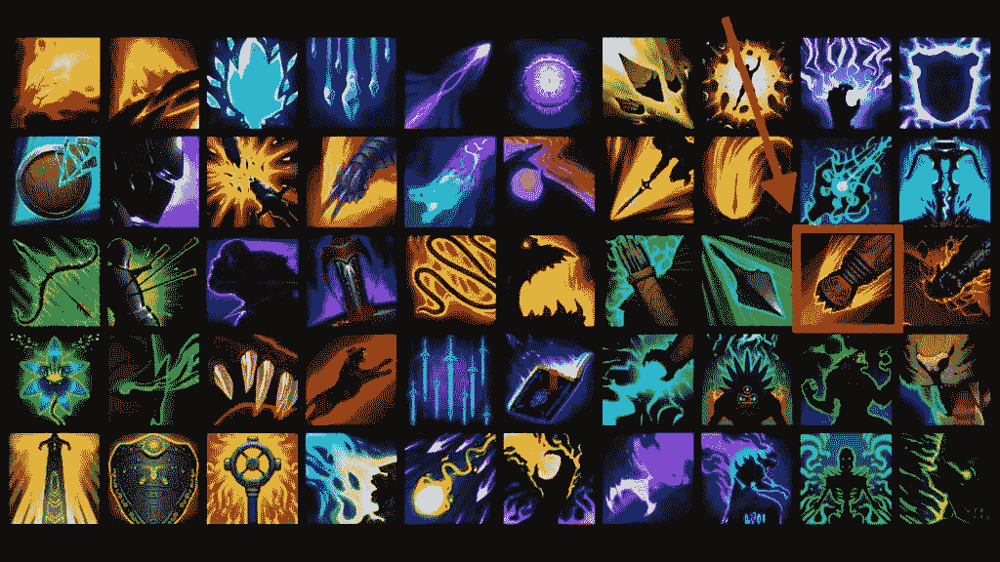

让我们在我们的`SkillData`中添加一个`Sprite`变量来引用这个图像:

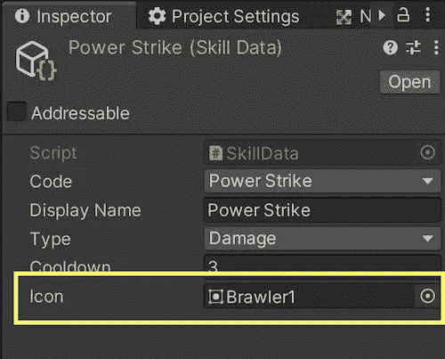

我们现在可以在 UI 中使用它来填充屏幕上某个地方的技能栏。但是首先，让我们为我们的技能按钮准备一个预置。我将使用与库存面板相同的背景和边框图像，并添加两个图像作为子图像:

*   “图标”，它显示了与该技能相关联的图像(例如，我刚刚从免费图标集中选择的图像)——该元素还有一个按钮组件，因此我们可以单击它
*   “冷却”，这是另一个图像，只是一个浅透明的黑色覆盖，将该技能标记为当前不可用

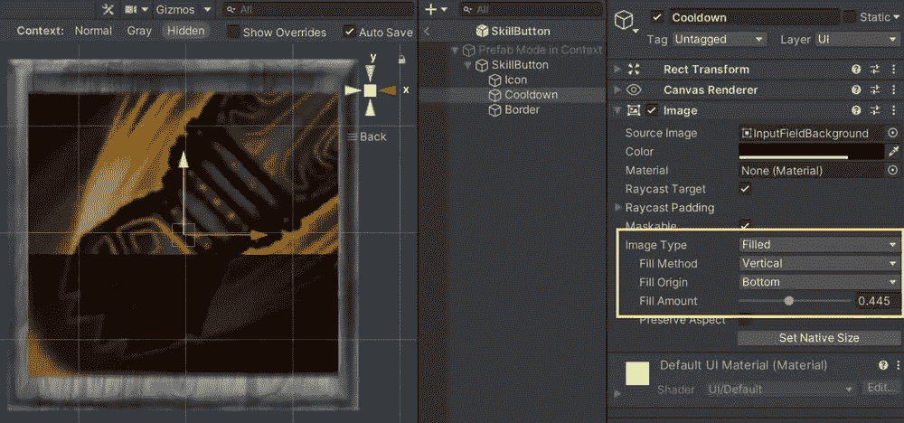

对于“冷却”图像，你会注意到它处于[“填充”模式](https://docs.unity3d.com/2018.3/Documentation/ScriptReference/UI.Image-type.html)，所以我可以通过在[0，1]范围内设置填充值来轻松改变它的高度。此外，对于“边界”图像，不要忘记关闭“光线投射目标”选项，这样它就不会阻止鼠标点击。

但是当然，默认情况下，图标是没有设置的——当我们将技能添加到技能栏时，我们希望在脚本中自动设置它。因此，我们实际上将禁用预设中的图标，并将冷却覆盖设置为填充 0:

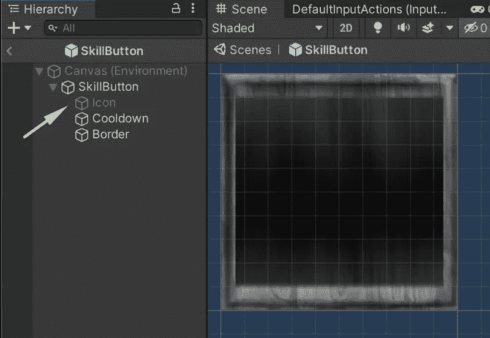

现在，我们必须用这个预置填充我们的场景来准备我们的技能栏。我将它放在屏幕左下角的水平布局组中:

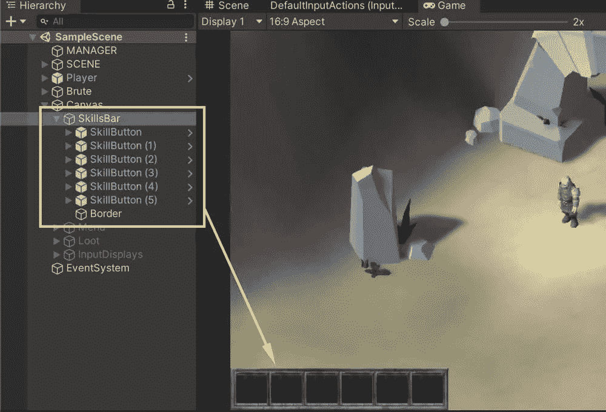

此时，我们的 UI 已经准备好了，但是完全是空的。下一步是创建一些全局 UI 管理器来设置和更新技能栏。我将用下面的代码创建一个名为`UIManager`的新类:

这里，我有一个对我的技能栏容器对象的引用，在`Awake()`方法中，我使用这个引用来获得对技能栏中每个槽的直接引用。

*注意:不要忘记将这个脚本添加到我们场景中的“经理”游戏对象中，并用适当的引用填充各个槽；)*

然后，让我们添加一个函数，用来自特定技能的数据设置一个特定的槽，并向我们的脚本添加一些单例引用，以便更容易地访问它(通常，使用这个全局访问器没有太大的风险，因为我们在场景中只有这个脚本实例):

请注意，我们必须将我们的技能存储在这里，这样当我们单击界面中的按钮时，就可以获得正确的引用。

在我们的`PlayerManager`中，我们将删除 test `OnGUI()`函数，当游戏第一次开始时，我们将使用我们手动输入的测试数据，并通过它来循环更新我们的 UI:

我们还必须将这些按钮链接到一些回调，我将让它们根据位置动态地施展正确的技能:

最后，让我们添加一个基本的冷却动画，以便“冷却”覆盖随着时间的推移而减少，并最终在冷却结束时消失。我们还必须打开和关闭覆盖图的“光线投射目标”属性，以允许鼠标点击下面的按钮:

如果你尝试重新运行游戏，你会看到你现在可以点击按钮触发技能！如果我们将鼠标悬停在用户界面上，为了正确地阻止左击触发我们正常的击键链，我们还需要在我们的`PlayerController`中添加几行代码:

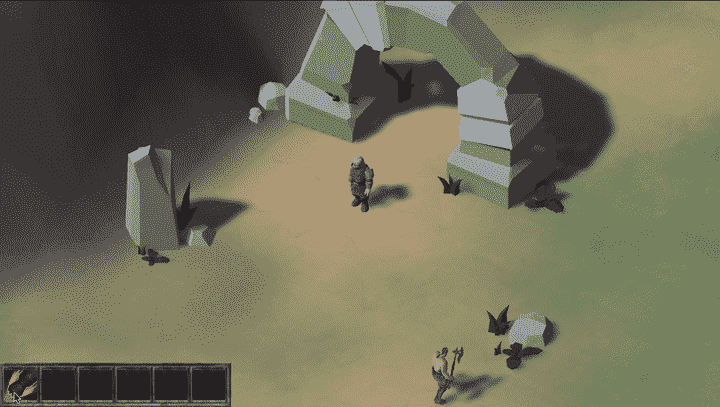

为了总结这个技能系统，我们可以添加一些输入，让玩家在桌面和主机上触发技能！

# 设置一些输入

对于这最后一部分，没有什么非常新的东西:我只是为我的六个 power slots 的输入动作对象添加一些输入。在游戏手柄上，我将使用四个主要按钮和缓冲器，这样整个输入方案在正常模式和菜单模式之间保持不变。

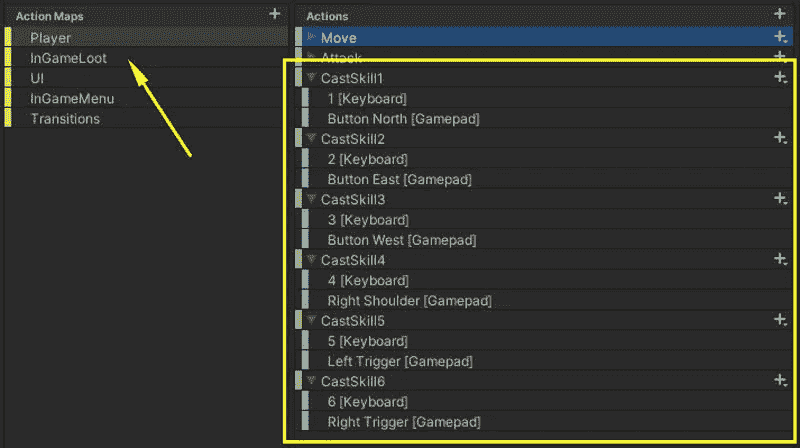

为了避免与战利品模式的冲突，我也把我们以前的战利品相关的输入移动到了他们自己的地图上，并且更新了代码来打开或关闭它:

然后可以在我们的`UIManager`中分配输入:

然后你可以重启游戏，你会看到你现在可以用这些新的快捷键触发技能了；)

# 结论

就是这样:我们今天已经完成了最后一个系统，我们的英雄现在可以对敌人进行强力打击，并在他们的口袋里获得所有有趣的东西:)

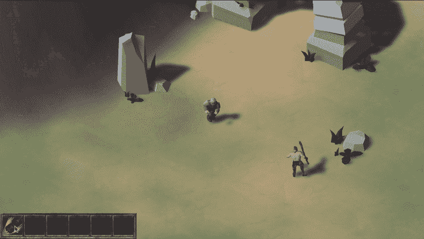

下周，我们将对如何在 Unity/C#中进行 Hack'n'slash 的这个系列进行最后的总结。

我希望你喜欢它，像往常一样，感谢你的支持和阅读！:)

*阅读更多我的内容，以及许多其他伟大作家的自媒体文章，* ***考虑成为会员吧！*** *你的会员费直接支持你阅读的作家。*

 [## 通过我的推荐链接加入媒体

### 阅读 Mina Pêcheux(以及媒体上成千上万的其他作家)的每一个故事。您的会员费直接支持…

mina-pecheux.medium.com](https://mina-pecheux.medium.com/membership) 

[*⬅️教程#23:增加一些技能和异能！1/2*](/making-a-hackn-slash-23-adding-some-skills-and-powers-1-2-4194deda4449)*|*[*TOC*](https://medium.com/c-sharp-progarmming/making-a-hackn-slash-game-in-unity-c-6ec315e75816)*|*[*教程#25:期末笔记&总结➡️*](https://mina-pecheux.medium.com/making-a-hackn-slash-25-final-notes-sum-up-9f330ef686ec)