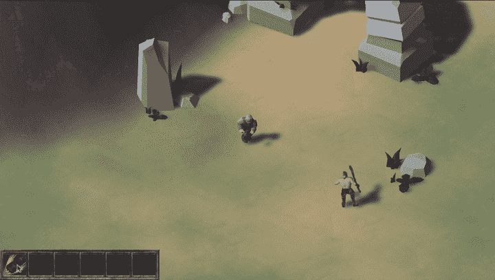

# 做一个黑客斜线#25:最后的笔记和总结

> 原文：<https://blog.devgenius.io/making-a-hackn-slash-25-final-notes-sum-up-9f330ef686ec?source=collection_archive---------7----------------------->

## 今天，让我们通过快速回顾我们所学的内容来结束我们的黑客教程系列！

[*⬅️教程#24:增加一些技能和异能！2/2*](/making-a-hackn-slash-24-adding-some-skills-and-powers-2-2-4032ec4ac117)*|*[*TOC*](https://medium.com/c-sharp-progarmming/making-a-hackn-slash-game-in-unity-c-6ec315e75816)

今天是我关于如何用 Unity/C#制作一个黑客游戏的教程系列的最后一篇文章！在过去的六个月里，在这 25 集里，我们讲述了相当多的特性和 Unity 技巧，希望能对你接下来的游戏项目有所帮助。

因此，请快速总结一下我们所看到的一切，这样我们就可以看到我们用这个原型实现了什么！

*别忘了整个项目都可以在我的 GitHub 上免费获得* [*！🚀*](https://github.com/MinaPecheux/UnityTutorials-Hacknslash)

# 第 1 部分:设置场景和主角

一开始，我们讨论了如何创建任何黑客攻击的核心机制:我们的英雄的[运动以及跟随他的摄像机。我们确保这个系统是跨平台的，这样我们就可以用鼠标和键盘或者游戏手柄来玩游戏。](https://mina-pecheux.medium.com/making-a-hackn-slash-1-moving-and-following-our-hero-a9121b725c94)

当然，我们也很快用小卫士的真实角色模型替换了我们的红色胶囊[。我们讨论了如何从 Mixamo 导入 FBX 模型或动画，以及如何自动执行这个导入步骤。](https://mina-pecheux.medium.com/making-a-hackn-slash-3-importing-a-3d-model-animating-our-hero-1-2-f23b37f36359)

# 第 2 部分:实现敌人 AI 和攻击系统

然后，我们转向另一个系统:[攻击机制](https://mina-pecheux.medium.com/making-a-hackn-slash-5-introducing-combo-attacks-45ce61eb9931)。我们设置了一个简单的三拳连击，让我们在堆叠时对场景中的敌人造成更高的伤害。

为了给这些敌人一些生命，我们使用了有限状态机，并给他们一个简单的人工智能行为，让他们发现我们的英雄，追逐它，攻击它…或者死亡，如果我们更快的话！

我们还开发了第一个可脚本化的物体和预设，我们甚至看了一下 TextMesh Pro 库[显示了一些不错的伤害弹出窗口](https://mina-pecheux.medium.com/making-a-hackn-slash-10-showing-damage-popups-1-2-80f4003abffa)。

我们还借此机会讨论了 unity 中管理资源的高级技术:可寻址资产。

# 第 3 部分:创建库存

然后，我们花了很大一部分教程来制作一个跨平台的功能完善的库存。在几周的时间里，我们添加了越来越多的控件来逐步改进这个系统的功能，最终我们有了一个相当复杂的系统来显示、排序、[丢弃](https://mina-pecheux.medium.com/making-a-hackn-slash-15-dropping-items-showing-item-selection-5d5fb9e93c02)或[拾取](https://mina-pecheux.medium.com/making-a-hackn-slash-17-adding-a-loot-system-1-2-ff8e5184f5a9)物品。

这意味着使用 Unity 的 UI Canvas 来处理 UI，学习更多关于新输入系统的知识，玩一些精灵动画。我们最终添加了一些[输入显示](https://mina-pecheux.medium.com/making-a-hackn-slash-19-showing-cross-platform-input-displays-68331f690489)来帮助玩家知道如何执行不同的动作。

# 第 4 部分:设备和技能

最后，我们在这个库存的基础上让英雄[装备一些物品](https://mina-pecheux.medium.com/making-a-hackn-slash-20-equipping-our-items-ccd51d9e65f1)和[提高他的统计数据](https://mina-pecheux.medium.com/making-a-hackn-slash-22-improving-our-player-statistics-acd29fe1b9a5)。我们看到了如何将物品放入或从装备槽中取出，以及它们如何升级或降级玩家的一些基本数据，这反过来会影响其他变量，例如攻击伤害。

最后，我们用一个基本技能系统[结束了教程](https://mina-pecheux.medium.com/making-a-hackn-slash-23-adding-some-skills-and-powers-1-2-4194deda4449)，让我们的英雄打出一记强力重拳，立即杀死敌人……还有一些 VFX 踢腿！

# 总结一下…

虽然这个教程比前一个要短，关于如何用 Unity/C# 制作一个 RTS 游戏，但制作起来真的很有趣，因为它让我可以更深入地了解一些主题，并为特定问题提供更先进的最新解决方案。

当然，就像上一个教程一样，这个系列并不意味着创建一个可以生产的游戏:它是关于发现各种常见的游戏开发技术和 Unity 的特性。所以，现在，你可以随意看看 GitHub 上的文件🚀并在以后自己的游戏项目中重新改编！

我真的希望你喜欢这个教程系列，并为你的下一个游戏项目学到一些东西——像往常一样，非常感谢你的支持和阅读，当然不要犹豫在评论中分享你对其他 Unity 教程的想法！:)

🚀 [*在我的 Github 上找到这个教程系列的代码！*](https://github.com/MinaPecheux/UnityTutorials-Hacknslash)

*如果你喜欢这个内容，你可以在* [*我的网站*](https://minapecheux.com/wp/) *:)* 上找到更多关于 tech、AI 和编程的博文

 [## 通过我的推荐链接加入媒体

### 阅读 Mina Pêcheux(以及媒体上成千上万的其他作家)的每一个故事。您的会员费直接支持…

mina-pecheux.medium.com](https://mina-pecheux.medium.com/membership) 

[*⬅️教程#24:增加一些技能和异能！2/2*](/making-a-hackn-slash-24-adding-some-skills-and-powers-2-2-4032ec4ac117)*|*[*TOC*](https://medium.com/c-sharp-progarmming/making-a-hackn-slash-game-in-unity-c-6ec315e75816)