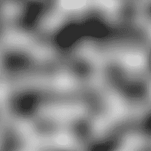
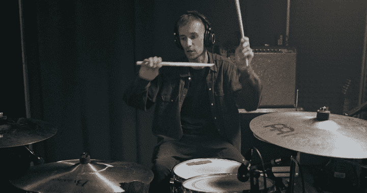
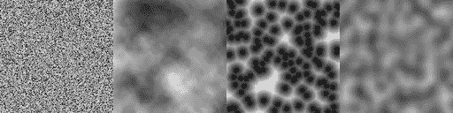
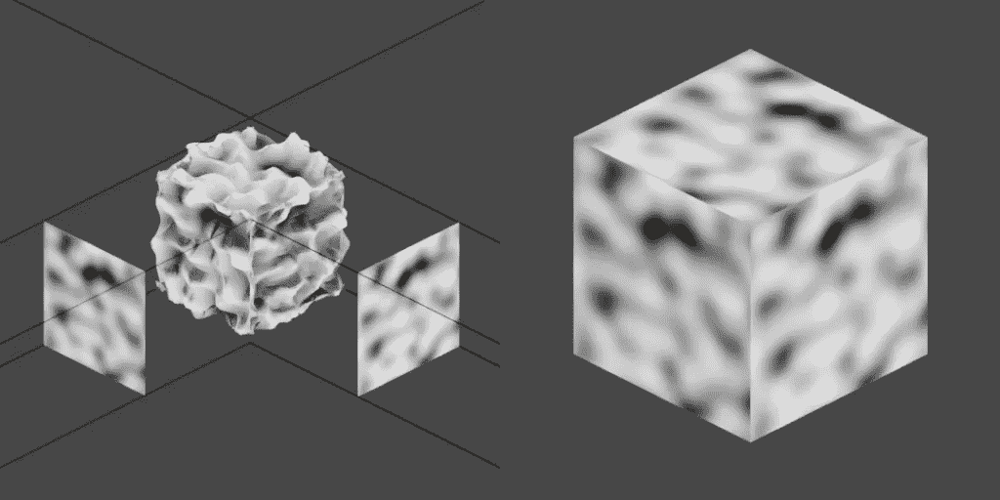
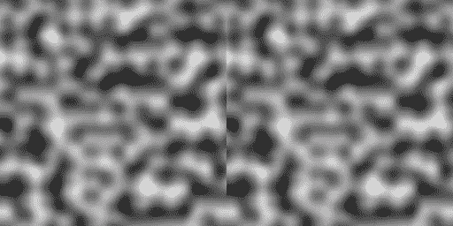
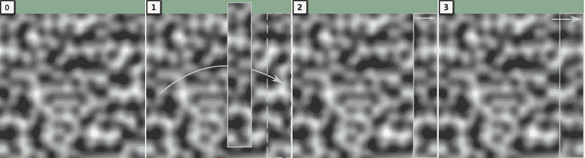
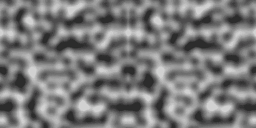
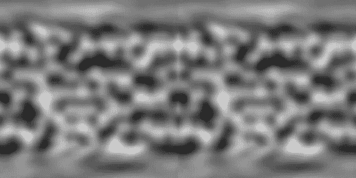
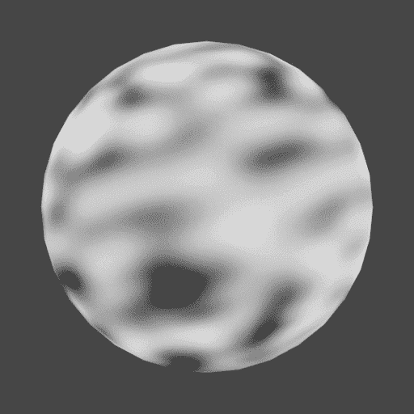
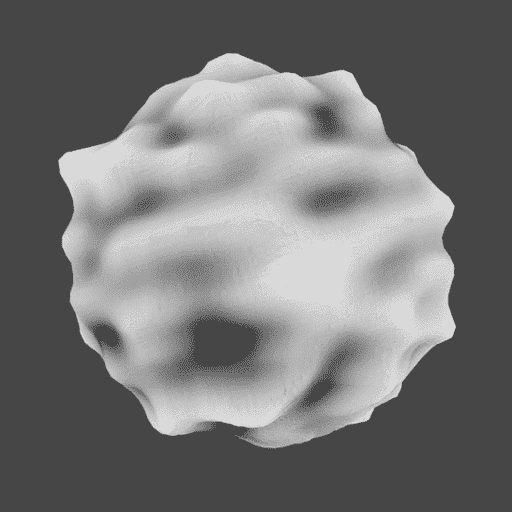

# 🎲在 C#中制造无缝的柏林噪声

> 原文：<https://blog.devgenius.io/making-a-seamless-perlin-noise-in-c-970f831ca878?source=collection_archive---------7----------------------->

## 让我们看看如何使用噪声进行程序生成！

对于我的很多项目，尤其是我经常工作的视频游戏，我需要创造一些随机但仍然可信的场景。因为我很懒，而且我是像《我的世界》或瓦尔海姆这样的探索游戏的粉丝，我总是最终回到创建程序生成的关卡。



# ❓什么是程序性生成？

简而言之，过程生成背后的思想是使用规则来定义引擎应该如何为您自动生成级别。

所以，基本上，不要预先手动准备所有关卡(通过设置准确的位置、颜色、旋转等等)。在游戏关卡设计阶段，你可以为**定义一组步骤和条件，**和**定义一台能够使用这些规则的机器****来自动创建有效关卡**。

最大的好处是，一旦你完成了引擎的制作，你就可以创建任意多的关卡(或者关卡的一部分)!此外，这一代人可以相当快，这就是《我的世界》或无人的天空如何让你沉浸在连续和无限的世界中。但是，当然，这通常比手工设计要难一些，因为你需要教你的软件正确和错误的模式……对我们人类来说，这看起来很直观，但是计算机不知道“逻辑生物群落”是什么意思！

过程化生成是一个非常庞大而复杂的话题。在你的生成引擎中有很多工具可以使用——然而，这些工具中的很大一部分依赖于**随机性**。这个想法是从随机值开始，然后以某种方式“**控制疯狂**”所以它是有效的。

总而言之，你做程序生成的时候，经常喜欢**闹**。



让我们制造一些噪音！cottonbro 的视频，来自 Pexels(https://www.pexels.com/)

不，不是声音噪音，是图像噪音！“噪音”一词在声学中最为人所知，但它也用于计算机图形学中，指产生程序纹理的伪随机函数。让我们打破这种“程序纹理”的概念。

*   首先，**纹理**是我们放在 3D 场景中物体上的 2D 图像。得益于 [**纹理贴图**](https://en.wikipedia.org/wiki/Texture_mapping) ，我们可以定义高度详细的信息，并将其包裹在一个 3D 物体的表面；这些信息可以是关于颜色，光线反射，凹凸变形…
*   其次，纹理有两种类型:

1.  **“数据存储”图像**以前有人用手画过

2.或者**“程序化的”计算机生成的**:这些是用数学公式计算出来的，通常是一个像素一个像素地创建纹理

在这些数学公式中，有一种众所周知的算法叫做“噪声”,它可以产生有用的纹理，可以应用于许多用例。许多 3D 软件在它们的文档中显示一些[噪声](https://docs.blender.org/manual/en/latest/render/materials/legacy_textures/index.html#types) [例子](https://developers.maxon.net/docs/Cinema4DPythonSDK/html/types/noise.html)。

下面是几个常见的:



4 种常见的计算机图形噪声(从左至右):白噪声、价值噪声、沃利噪声、柏林噪声——图片来自维基百科，作者:豪尔赫·斯托尔菲、马特姆泽、罗奇尼、马克西姆

# 🛠用柏林噪声工作

## 基础知识

最近，当我在做一个视频游戏项目时，我把注意力放在了我这一代的**柏林噪声**上。

这种噪声非常有趣，因为它是**非常可定制的**，它使区域之间的**平滑过渡**，并且它可以被**播种**，这意味着如果您给出完全相同的输入，您的噪声发生器将始终给出相同的结果。另一方面，这些输入中的微小变化会转化为非常不同的噪声。所有这些使得柏林噪声成为一个非常直观易用和强大的程序纹理原语。

正如你所看到的，噪波图是黑白 2D 图像，带有或多或少的重复模式。实际上，“黑白”也被称为“灰度”，因为你只有不同层次的灰色。我在[另一篇关于 ASCII 视频转换的帖子](https://medium.com/nerd-for-tech/doing-networked-video-ascii-art-in-python-4725b3ee552b)中提到过这一点:你的图像由*宽*高*像素组成，这些像素中的每一个都是从 0(纯黑)到 255(纯白)的值。中间的所有值对应不同的灰度。

噪音的伟大之处在于它可以用于很多事情:

*   [高度图](https://johnflower.org/tutorial/make-mountains-blender-heightmaps)和高程生成:黑色像素可以匹配到最低的区域，白色像素可以匹配到最高的峰值
*   密度贴图:当您在 3D 场景中添加对象时，您通常希望它们以一种“逻辑”的方式展开或组合在一起，通过使用平滑噪波贴图(如柏林或值噪波)，您可以为空白区域获得较暗的区域，为人口密集的区域获得较白的区域
*   直接颜色纹理:虽然这不是最常用的方法，但是你可以在你的物体上设置这些噪声来简单地在你的 3D 表面上显示它们(例如，一些白色噪声可以一个接一个地放在平面屏幕上来模拟一台旧的坏电视机；))
*   …

许多视频游戏使用柏林噪音来设置地形的高度，植被等等！

## 3D 的问题

只要你在 2D 方面或自上而下的水平上工作，噪音生成的程序纹理可以直接使用，没有太多的麻烦。但是当你到了 3D，它会变得有点复杂。假设您正在创建一个 3D 游戏，其中世界是一个立方体，并且您想要基于柏林噪声(这创建了一个高度图)在其上放置山脉。你如何在这个 3D 空间中应用 2D 纹理？

对于一个立方体来说，创建 3D 柏林噪声的一个简单方法是制作两个 2D 柏林噪声，并沿着一条边将它们缝合在一起。问题是，如你所见，这显然是错误的做法:



试图创建一个三维柏林噪声通过缝合两个 2D 柏林结果在一个非无缝纹理:我们看到切割！

第一个纹理粗暴地停止，第二个开始，而不考虑当前值。这是一种不是**无缝**或**可平铺**的纹理:你看到切割了。

现在，如果我告诉你我想把这个纹理放在一个球体上呢？你能想象到那时缝针会有多麻烦吗？嗯…


很难看，对吧？在这一点上，我知道我必须返工我的柏林噪声生成的纹理无缝，所以它将适应这种粗糙的缝纫。

## 制造无缝噪音

看上面的视频，你会发现有两个问题:

*   有一个**水平不连续**:当球体在电影开始时绕垂直轴滚动，我们看到纹理在纵向上不是无缝的
*   这里有一个垂直的不连续点:在球体的极点，所有东西都收缩成一个点——但是由于低纬度地区显示出完全不同的图案，我们看到了图案！

我们可以依次分离和处理这些不连续性。我们将假设我们已经有了一个 2D 柏林噪声发生器的 C#实现，例如通过遵循像[veno mus](https://code2d.wordpress.com/2020/07/21/perlin-noise/)的本教程。因此，我们有一个名为`GenerateNoiseMap()`的静态函数，我们可以调用它来创建一个 2D 浮点数组——它接受教程中详细介绍的各种参数:

```
float[,] noiseMap = Noise.GenerateNoiseMap(
  width,
  height,
  seed,
  scale,
  octaves,
  persistance,
  lacunarity,
  offset
)
```

## 修复水平不连续

现在，如果我重复我的噪波纹理，并将两个副本并排放置，很明显它们不匹配(我们在中间看到的垂直标记对应于上面电影中球体上丑陋的垂直缝合):



我们希望纹理的右侧与左侧同步，为了做到这一点，我们将:

*   决定给定的*针脚*尺寸
*   复制一个*线迹*像素宽的带在噪波左边，粘贴在右边
*   水平镜像此带，使带最左边的像素位于右边，带最右边的像素位于左边
*   对粘贴的透明带应用线性渐变，使其左边完全透明，右边完全不透明

我认为在这里，一张图片胜过百万个单词:



为了制作一个无缝的纹理，我们需要将一个带从一边复制到另一边，水平镜像并应用线性渐变来增加透明度。

这可以通过下面的 C#函数来完成:

一旦我们将它应用到我们的噪波贴图中，我们会发现它要好得多！当然，我们仍然可以看到一些缝线，但远没有以前那么糟糕，而且在更大的范围内，大多数未经训练的眼睛都无法注意到它:



同样，如果我们把这个新的纹理放到我们的球体上，我们会得到一个显著改善的结果！


现在，我们需要注意垂直的不连续性。

## 修复垂直不连续

第二个问题有点棘手。这一次，我们将不能简单地复制和粘贴一些像素。相反，我们需要逐行修改顶部和底部的纹理。更准确地说，我们必须:

*   找到一种方法将极点的所有像素“混合”在一起
*   然后，当我们接近赤道时，我们混合的像素越来越少
*   直到我们脱离缝合带，此时我们不再混合(即:我们让噪声保持原样)

为了混合像素，我们将计算**平均值**，换句话说，我们将计算**平均灰度值**，并将其分配给水平带上的所有像素。我们在计算中考虑的像素数取决于我们当前计算平均值的行:在第一行和最后一行，每个像素值都将被整行的平均值所取代；在第二行和倒数第二行，每个像素值将由整行减去左右像素的平均值来代替；诸如此类…

*注:对于数学爱好者——记住计算均值可以写成* [***卷积***](https://en.wikipedia.org/wiki/Convolution)*；所以在这里，我们简单地取一个* ***的动态内核大小*** *即取决于当前行。*

下面是相应的 C#代码—您会注意到，由于我们有镜像值，所以可以同时处理顶部和底部:

通过结合这个函数和`MakeSeamlessHorizontally()`，我们最终得到了一个非常不同的噪声纹理，与之前的相比:



它本身看起来相当丑陋，你可能会认为这不会有帮助。但是当我们把它放到球面上，我们最终得到了一个很好的结果！在这一点上，我们可以看到缝线，但它们没有以前那么明显了…



如果我们在我们的球体上使用这个纹理作为高度图，它总体上是有效的，甚至在我们的球体上——它还不完美，但至少没有可怕的不连续性！:)



# 结论

**程序生成**是一种创造(理论上)无尽游戏的神奇方式，但它不是一个容易掌握的工具。**噪波**是生成程序纹理的一种常见方式，它们可以用作高度图、密度图、普通的旧颜色纹理……它们功能强大且有些可控**伪随机数学函数**允许我们在提供给关卡创建引擎和一些规则时，以一种“逻辑”的方式填充场景。

从 2D 到 3D 可能是复杂的，更一般地说，让我们的纹理**无缝**总是有价值的。然而，通过使用一些基本的复制/粘贴，线性透明遮罩和平均，我们可以修改噪声纹理，使它们成为可平铺的。

多亏了这些技术，我们可以创建各种程序纹理，这些纹理甚至适用于像球体这样要求更高的几何图形。

*阅读更多我的内容，以及许多其他伟大作家的自媒体文章，* ***考虑成为会员吧！*** *你的会员费直接支持你阅读的作家。*

[](https://mina-pecheux.medium.com/membership) [## 通过我的推荐链接加入媒体

### 阅读 Mina Pêcheux(以及媒体上成千上万的其他作家)的每一个故事。您的会员费直接支持…

mina-pecheux.medium.com](https://mina-pecheux.medium.com/membership)