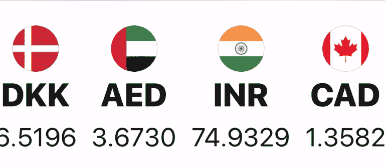
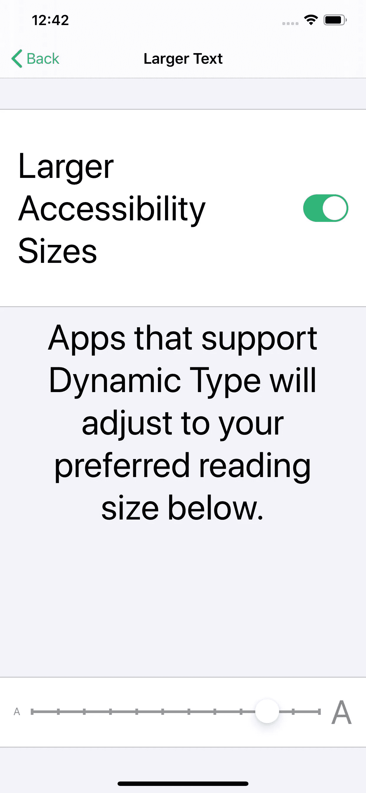
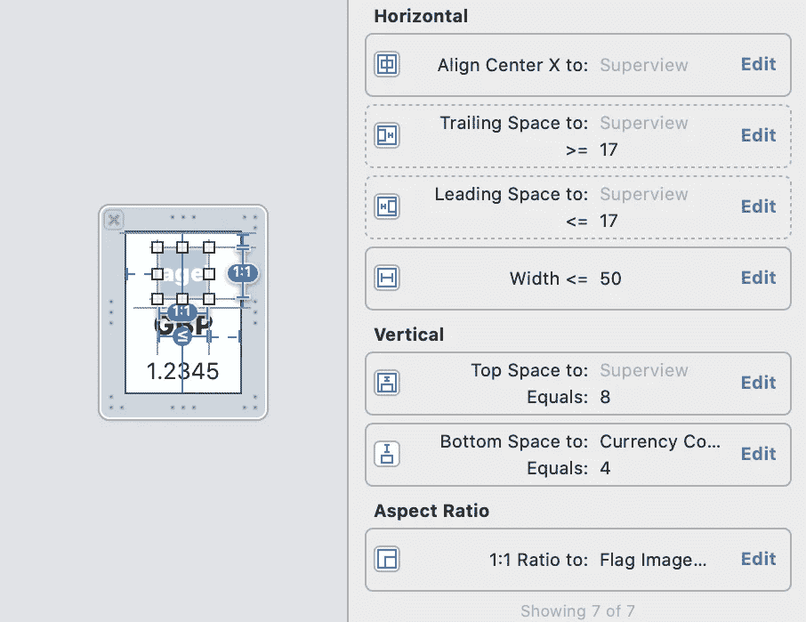
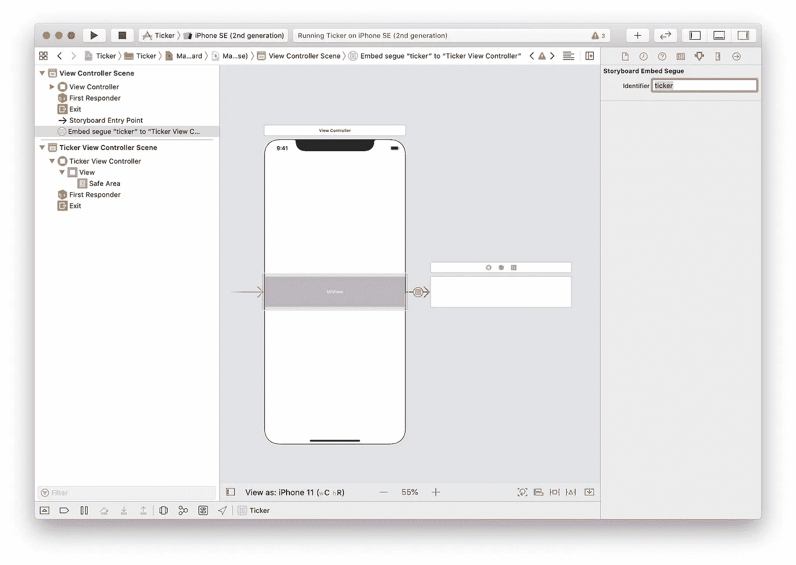
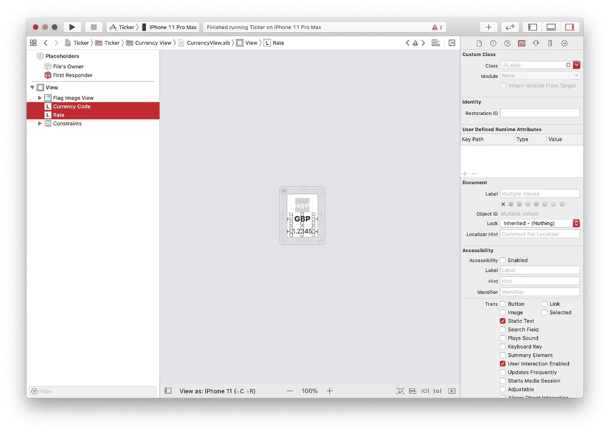
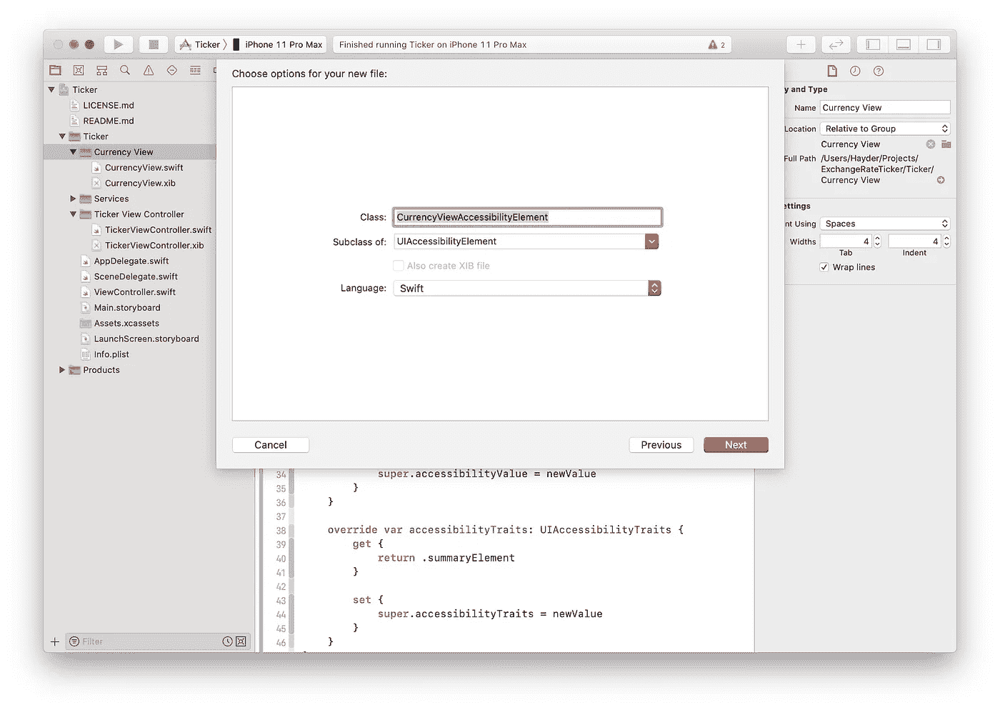

# 制作一个可访问的汇率报价机

> 原文：<https://blog.devgenius.io/making-an-accessible-exchange-rate-ticker-1645a9671ece?source=collection_archive---------10----------------------->

因为这是正确的选择。

[之前](https://medium.com/dev-genius/exchange-rate-ticker-for-ios-b7e279b35c8f)我们讨论了如何设计和开发一个股票交易所。在这里，我们将使用动态文本和画外音使我们的 ticker 易于访问。

# 动态文本

动态文本是操作系统的辅助功能，允许用户在整个操作系统中控制文本的大小。

> 更改操作系统字体的大小。转到*设置* app，然后转到
> *辅助功能*->-*显示&文字*->-*大图文字。*
> 底部的滑块允许您更改文本大小。向右滑动以查看文本变化。

首先让我们开始更新我们的字体来使用`UIFontMetrics`。转到 **CurrencyView.swift** ，在`commonInit()`中添加以下调用`configureAccessibility()`。该方法的定义是:

运行该项目将呈现以下内容:

利率已经消失了！旗帜看起来模糊不清，有些旗帜比其他的大。让我们首先处理旗帜图像。标志模糊是由于使用位图而不是矢量图形造成的。当`CurrencyView`扩展时，标志图像视图上的约束被设置为扩展。`CurrencyView`当比率或代码标签没有足够的空间显示其文本时展开。
为了修复模糊，正如前面提到的，我们应该使用 pdf 而不是 png 图像。我们没有旗帜的 pdf 文件。因此，我们将限制标志可以扩展的最大数量。

在 **CurrencyView.xib** 中，从**文档轮廓**中选择*标志图像视图*，向右打开**检查器**窗格中的**尺寸检查器**，将两个水平约束(尾随和前导)的优先级更改为 750。将**尾随空格的关系改为:**的值改为**≥**,**前导空格与**的关系改为 **≤** 。
打开对齐约束面板，在容器中水平勾选**，最后添加一个值为 50 的宽度约束，并使其关系 **≤** 。*标志图像视图*约束应该是这样的。**

关于*费率标签*，较大的文本改变了我们*当前视图的*高度。充当 ticker 的父视图控制器的主视图控制器正在裁剪标签。因此，我们需要让父视图控制器知道动态文本的大小已经改变。我们通过实现`traitCollectionDidChange(_:)`来实现这一点，只要操作系统的界面环境发生变化，视图控制器就会调用这个方法。
在我们调整滚动条的大小之前，父母需要知道如何与滚动条交流。

转至 **Main.storyboard** 。在**文档轮廓**中展开*视图控制器场景*并选择**嵌入 Segue 到“跑马灯视图控制器”**。打开右侧*检查器*面板中的**属性检查器**，将 segue 的标识符设置为 **ticker** 。

现在，让我们为容器视图的高度约束添加一个`IBOutlet`。在 **ViewController.swift** 中添加以下内容，并在*界面构建器*中连接出口。

在 **ViewController.swift** 中添加一个属性来存储`tickerViewController`的实例，该实例将通过实现`prepare(for:, sender:)`来检索。

有了对`tickerViewController`的引用，每当动态文本改变时，让我们继续更新它的高度。

我们还会给`viewDidLoad()`加上`updateTickerViewLayout()`。

`TickerViewController`中的属性`recommendedHeight`检查滚动视图的内容高度并返回它。

在动态文本设置为最大值的情况下运行项目将如下所示:

# 画外音

Voice Over 是 iOS 屏幕阅读器，你可以在这里阅读更多关于如何在你的应用中支持 VoiceOver 的信息[。
启用 VoiceOver 最快最简单的方法就是使用 Siri，说“VoiceOver on”显然要关闭，要求 Siri“关闭 VoiceOver”或者“VoiceOver off”。](https://developer.apple.com/documentation/uikit/accessibility_for_ios_and_tvos/supporting_voiceover_in_your_app)

启用 VoiceOver 并启动 ticker，没有任何反应！为什么？原因这么多，先从加载内容开始吧。
当我们的 ticker 启动时，它的视图是空的，ticker 正忙于从服务中获取价格。同时，VoiceOver 会查看我们的视图，并相应地设置其结构。因此，我们需要通知画外音我们的跑马灯已经改变，并重新评估布局。这是通过发布一个`UIAccessibility.post(notification: .layoutChanged, argument: nil)`实现的。

在`TickerViewController`中，我们将通过张贴通知来更新我们的`currencies`房产观察者。

跑马灯的动画也阻止了 VoiceOver 正确关注任何内容。因此，我们将在启用 VoiceOver 时禁用动画。

在`TickerViewController`中，我们将更新`startAnimationTimer()`来检查画外音是否激活。

当 VoiceOver 打开或关闭时，操作系统会发布通知。在`TickerViewController`中，通过添加通知观察者来更新`commonInit()`。

我们的观察者`voiceOverStatusChanged()`检查画外音的状态，并相应地启动/停止计时器。

在`CurrencyView`上，我们想让这个视图可访问。我们将通过将标签分组到一个可访问性元素中来简化信息。
转到 **CurrencyView.xib** ，选择货币代码标签 **shift** 选择汇率标签。打开右侧**检查器**窗格中的**身份检查器**。在**无障碍**部分，取消勾选**无障碍**的**启用**复选框。

转到项目导航器并选择**货币视图**组，添加一个新的 Cocoa Touch 类文件，将其命名为**CurrencyViewAccessibilityElement**，并使其成为`UIAccessibilityElement`的子类。

`CurrencyViewAccessibilityElement`看起来是这样的:

我们用一个可访问性容器初始化这个类，这里容器将是`CurrencyView`的实例，并传递`Currency`模型对象。遗憾的是，我们使用的服务不提供货币名称。因此，让我们在模型上创建一个新属性，它将返回货币名称。

我们使用此属性为 VoiceOver 提供一个辅助功能标签，向用户读出我们试图传达的信息。在`CurrencyViewAccessibilityElement`对`acccessibilityLabel`的实现中，我们简化了视图中包含的信息。

回到`CurrencyView`。当货币被设置在`CurrencyView`的属性上时，它的观察者调用`update()`方法。我们将在`update()`中添加一个新方法`configureAccessibilityElement()`。

我们需要设置这个元素的框架。我们在`TickerViewController`的`configureCurrenyViews()`中这样做。一旦我们完成了填充滚动视图，我们将强制它布局它的视图，然后我们将能够设置货币视图的元素框架。

有了以上所有内容，运行项目并使用 VoiceOver 导航货币，用户将获得他们需要的所有信息。

让你的观点变得容易理解并不困难，这也是正确的做法。我希望你喜欢这篇文章。

和往常一样，你可以从 [github](https://github.com/h4yder/ExchangeRateTicker) 下载代码。