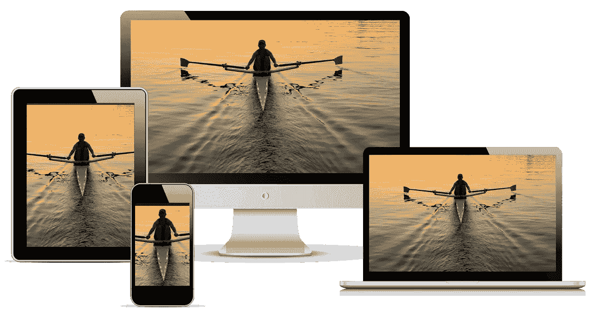

# 用 6 行代码制作图像响应

> 原文：<https://blog.devgenius.io/making-an-image-responsive-with-6-lines-of-code-27916b2a67bf?source=collection_archive---------0----------------------->

## 你所需要做的就是添加 6 行 CSS 代码来使图像具有响应性。

**照片由** [**塔努南达帕布**](https://unsplash.com/@tanuprabhu?utm_source=unsplash&utm_medium=referral&utm_content=creditCopyText) **上** [**下**](https://unsplash.com/@tanuprabhu?utm_source=unsplash&utm_medium=referral&utm_content=creditCopyText)

# 响应图像

响应式图像是那些非常适合屏幕的图像，与它们的纵横比无关。响应图像将根据屏幕调整而自然改变。当你最小化桌面屏幕或者甚至使用任何分辨率的智能手机时，一个完美的响应图像应该适合并且容易看到(这意味着你不需要上下或左右滚动来查看整个图像)。例如，为了更好地理解，请参考下面的示例。

**照片由** [**皮特·莱佩奇**](https://developers.google.com/web/resources/contributors/petelepage) **于** [**网页基础**](https://developers.google.com/web/fundamentals)

正如你所看到的，同一个图像(在 kayak 上的人)非常适合所有四种设备(台式机、笔记本电脑、智能手机、平板电脑),不管它们的显示器如何，如上图所示。

# 履行

对于实现，您需要做的只是一些基本的 HTML 和 CSS 编码。别担心，没那么难。我也解释了下面的代码。

## 超文本标记语言

每个人都知道 HTML 文件的创建，我指的是 HTML 文档。现在在`**.html**`文件里面，要渲染一个图像给图像的来源里面的`**src**` 属性的`**img**` 标签。

> *添加一个名为*`***center***`**的类，这样你就可以在 CSS 文件中提供属性使其具有响应性。**

*好了，废话少说，下面是 HTML 代码。*

## *半铸钢ˌ钢性铸铁(Cast Semi-Steel)*

*创建一个名为`**styles.css**`的新 CSS 文件。确保文件名以`**.css**`为扩展名。无论如何，现在为带有类`**center**` **的`**img**` 标签添加一个选择器。**选择器根据元素名称选择 HTML 元素。在选择器中，您需要添加 4 个 CSS 属性，它们的值如下所述。*

*   *`**display: block**`—`**display**`属性将元素显示为块元素。它占据了整个屏幕的宽度。 [**多读**](https://www.w3schools.com/cssref/pr_class_display.asp) 。*
*   *`**margin-left: auto**` —顾名思义，`margin-left`将元素设置在左边距。给定其值为`**auto**`，浏览器自动计算左边距并相应地放置元素。 [**阅读更多**](https://www.w3schools.com/cssref/pr_margin-left.asp) 。*
*   *`**margin-right: auto**`**——**现在你知道了，`margin-right`是做什么的。给定值为`auto`，浏览器自动计算右边距并相应地放置元素。 [**阅读更多**](https://www.w3schools.com/cssref/pr_margin-right.asp) 。*
*   *`**width:100%**` **—**`**width**`**属性设置一个元素的宽度，可以是图像、文本、视频等。在`**%**` 中给定值，例如`**100%**`定义包含块的宽度百分比。***

***下面是我在本教程开始时谈到的 **6 行 CSS 代码**(注释是例外)。***

# ***结果***

***最期待的部分来了。我将使用 Google Chrome 在移动设备上呈现输出。为此，你所要做的就是点击**检查** ( **Ctrl-Shift-I** )，然后点击**切换设备工具栏(Ctrl+Shift+M)** 。从下拉列表中，您可以选择任何智能手机或平板电脑设备。***

> ******活动*** *:不包含 CSS 文件，尝试只执行 HTML 文件，看结果再下结论。****

******

***像素 2XL 放大到 150%的结果***

> ****从上面的结果来看，你不必从左到右或从上到下滚动图像就能看到完整的图像。这就是添加 CSS 属性使图像具有响应性的美妙之处。****

# ***结论***

***恭喜你，你已经完成了这个名为“**用 6 行代码制作一个响应性图像**”的简短教程。嗯，有很多方法可以让图像有反应，但这是最简单的方法之一。如果你知道任何其他方法来创建响应图像，请通过评论部分让我知道。这样，你不仅帮助了我，也帮助了其他读者。我希望你们从这篇教程中学到了一些新的东西。敬请关注更多更新，祝大家 2021 年新年快乐。***