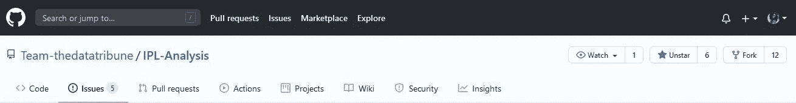
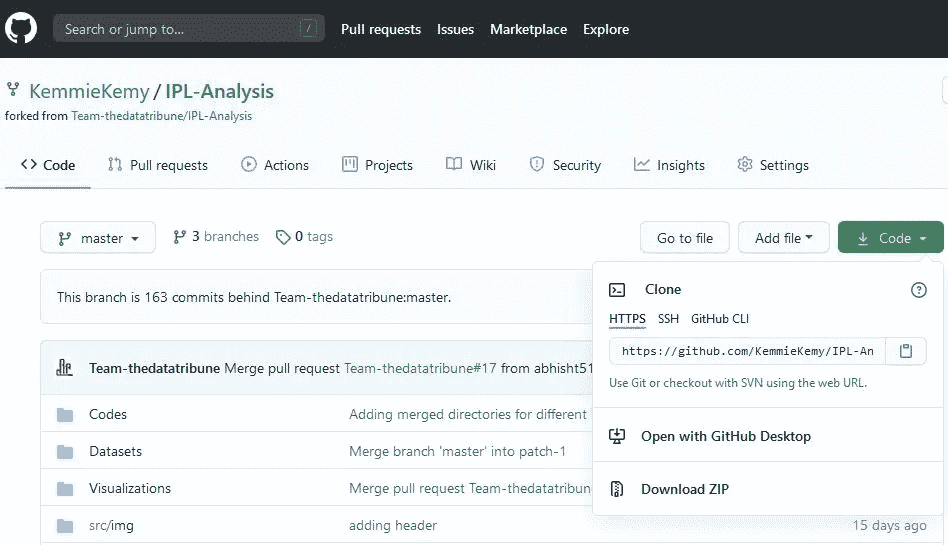
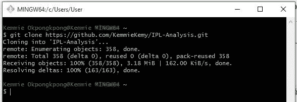
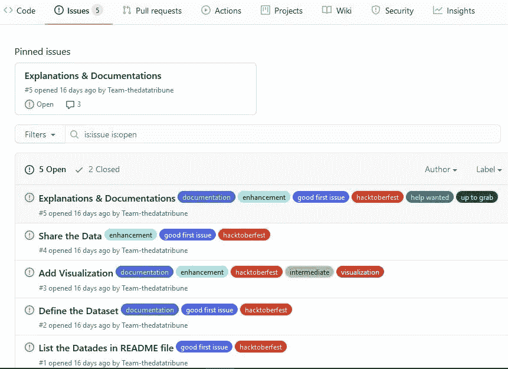
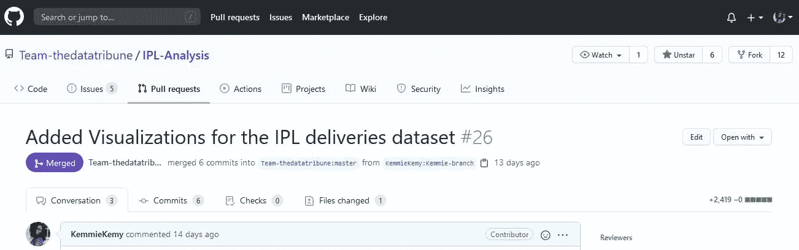

# 在 Github 上做开源贡献

> 原文：<https://blog.devgenius.io/making-an-open-source-contribution-on-github-15f02460e3ff?source=collection_archive---------5----------------------->

照片由 [Richy Great](https://unsplash.com/@richygreat?utm_source=medium&utm_medium=referral) 在 [Unsplash](https://unsplash.com?utm_source=medium&utm_medium=referral) 上拍摄

本文将指导您什么是开源，以及如何开始为开源项目做贡献。

# 什么是开源？

> 开源是指人们可以修改和分享的东西，因为它的设计是公开的— [*开源*](https://opensource.com/resources/what-open-source)

# 如何开始

**要求；**一台 PC，互联网连接，Git *(如果你没有安装，你可以阅读这篇* [*文章*](https://git-scm.com/book/en/v2/Getting-Started-Installing-Git) *关于如何这样做)，你想要贡献的**项目，以及一个 Github 账户。*

在本文中，该项目的 GitHub 统一资源定位器(URL)是[https://github.com/Team-thedatatribune/IPL-Analysis](https://github.com/Team-thedatatribune/IPL-Analysis)，分叉库的 URL 是[https://github.com/KemmieKemy/IPL-Analysis.git](https://github.com/KemmieKemy/IPL-Analysis.git)，所以您可以用自己的链接替换这些链接。

我将把我的经历作为一个案例研究，带我们走过为开源做贡献的步骤。在 [Hacktoberfest](https://hacktoberfest.digitalocean.com) *(将于 10 月 31 日结束)*期间，我决定打开我的开源游戏😉使用这些步骤；

## **1。搜索您要参与的存储库；**

如果你是初学者，确保存储库有初学者友好的问题*(也就是说，存储库有标签，如；仅限新手，好的第一期，诚招)*。对于本文，我们将致力于 [IPL—分析](https://github.com/Team-thedatatribune/IPL-Analysis)库。

## 2.派生存储库

> *GitHub fork 是位于您的帐户中的存储库(repo)的副本，而不是您从中获取 dat* a 的帐户— [地球数据科学](https://www.earthdatascience.org/workshops/intro-version-control-git/about-forks/)

转到存储库的页面，点击右上角的“fork”按钮。

## 3.克隆存储库

首先打开 **Git Bash** 或终端窗口，然后键入`git clone`命令以及指向您的存储库分支的 URL，这样，您需要制作一个您要贡献的存储库的本地副本👇

`git clone [https://github.com/KemmieKemy/IPL-Analysis.git](https://github.com/KemmieKemy/IPL-Analysis.git)`

您可以通过单击存储库副本中的“代码”按钮来获得此 URL👇

您应该得到如下输出:👇

## 4.设置上游

这一步是可选的，但是如果您想要跟踪原始存储库中的变更，您需要添加“上游”。

`git remote add [https://github.com/Team-thedatatribune/IPL-Analysis](https://github.com/KemmieKemy/IPL-Analysis.git)`

*   然后，您从上游的主服务器获取最新的变更，并将其与您的存储库的主分支合并。

`git pull upstream master`

## 5.更改

在你开始投稿之前，仔细阅读投稿指南*(通常在一个名为“Contributing.md”的文件中)*，这样你就不会在投稿时遇到冲突。

然后，找出你能解决的问题。我发现我可以添加数据可视化，所以我开始着手这个问题。

## 6.创建新分支

现在你的投稿已经准备好了，是时候上传了。

要从 Git Bash 创建您的分支，您需要将目录更改为存储库的目录*(您可以为您的分支取任何名称，但是在本文中，分支名称是“new-branch”)*。

`git branch *new-branch*`

现在您的新分支已经创建，您可以使用`git checkout`命令切换以确保您正在这个分支上工作:

`git checkout *new-branch*`

## 7.添加更改

要添加本地进行的更改，可以使用 git add 命令，然后是文件名或。添加所有更改。

`git add .`

## 8.提交更改

当您完成添加您的贡献或解决问题(在线或离线)时，您需要提交这些更改。

你的承诺信息必须以你试图解决的问题或你的贡献为中心。

`git commit -m "Added Visualizations for the IPL deliveries dataset"`

## 9.推动变革

您可以使用 git push 命令将更改推送到分叉存储库的当前分支:

`git push --set-upstream origin new-branch`

## 10.更新您的本地存储库

为了避免冲突，您需要让您的本地存储库保持最新。您首先需要为 fork 配置一个引用 GitHub 上的上游和原始存储库的远程，然后同步更改。您将使用 git remote add 命令和您派生的原始存储库来实现这一点:

`git remote add upstream [https://github.com/Team-thedatatribune/IPL-Analysis](https://github.com/KemmieKemy/IPL-Analysis.git).git`

*   同步分叉:

`git fetch upstream`

*   切换到我们存储库的本地主分支:

`git checkout master`

*   将原始存储库的主分支中所做的任何更改与本地主分支合并:

`git merge upstream/master`

## 11.打开拉取请求

您需要返回到您的存储库，然后单击“比较并提取请求”按钮。

如果分支没有冲突，您可以创建一个拉请求。

# 12.等待开源维护者的评论

如果一切顺利，并且维护者或存储库的所有者批准了您的贡献，您将会收到一个通知，说明该贡献已经被合并。💃 😃

我希望这篇文章对你有所帮助，如果你在这个过程中遇到任何挑战，请在 [Twitter](https://twitter.com/_Kemmie_) 上直接给我发消息，或者在下面的回复框中留言。