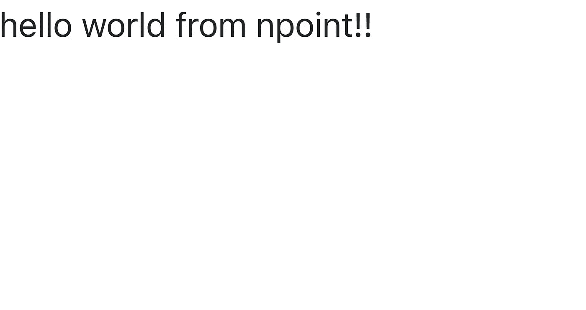

# 使用 Axios 在 React 中生成基本的 HTTP GET 请求

> 原文：<https://blog.devgenius.io/making-basic-http-get-requests-in-react-using-axios-53c73018213b?source=collection_archive---------6----------------------->


当我还在学习如何做这件事的时候，这实际上花了我比我预期更长的时间。因此，本文旨在成为我在学习如何在 React 中发出 HTTP 请求时所希望拥有的文档。让我们开始吧。

# 我们的 HTTP GET 请求端点

```
https://api.npoint.io/df2c42f9149aa832ea14
```

我使用 npoint . io——一个免费的 JSON 存储服务——创建了这个简单的端点。如果我们向这个 url 发出 GET 请求，我们将得到:

```
{"message": "hello world from npoint!!"}
```

如果您愿意，您可以将这个 url 粘贴到您的浏览器中，您也应该在浏览器中看到这个 JSON 字符串。我们今天的目标只是在 React 应用程序的主屏幕上显示这条消息。

# 我们的目标是建立什么



一个完全空白的页面，显示来自我们端点的`message`。(不允许对此消息进行硬编码)

# 安装 Axios

Axios 是我们用来发出 HTTP GET 请求的库。

```
npm install --save axios
```

是的，有其他可用的库可以做同样的事情，但这个足够简单，对我来说足够好。

# 测试是否安装了 Axios

要检查 axios 安装是否没有任何问题，只需导入它并检查是否出现错误信息。

## 在你开始的时候。jsx 文件

```
import axios from "axios"
```

当你运行你的应用程序，没有任何错误，axios 已经安装没有问题。

# 组件代码

```
import React from "react"
import axios from "axios"class HomePage extends React.Component {

    state = {
        message: "default message"
    } componentDidMount() {
        axios.get("[https://api.npoint.io/df2c42f9149aa832ea14](https://api.npoint.io/df2c42f9149aa832ea14)")
        .then((response) => {
            this.setState({
                message: response.data.message
            })
        })
    } render () {
        return <div>
            {this.state.message}
        </div>
    }
}export default HomePage
```

# 代码的一些解释

## 导入我们需要的库— React & axios

```
import React from "react"
import axios from "axios"
```

## 组件状态

```
class HomePage extends React.Component {

    state = {
        message: "default message"
    } // the other stuff
}
```

这里，每个组件都有一个`state`——本质上是创建组件类时存储的一些数据。为了简单起见，我们的状态有一个值为 T3 的变量 T2。

## 显示我们的消息

```
render() {
    return <div>
        {this.state.message}
    </div>
}
```

为了显示来自我们的`state`的`message`，我们可以在我们返回的 HTML 部分使用这个语法`this.state.message`。默认情况下，如果我们不做任何 GET 请求，我们的应用程序将只显示`"default message"`而不是`"hello world from npoint!!"`。

## componentDidMount()函数

```
componentDidMount() {
    //stuff
}
```

当我们的 app 组件被*挂载*(完成加载)时，该函数运行。我们在这个函数中写的东西会在组件中的东西加载完成后立即执行。我们将把我们的 axios 代码放在`componentDidMount`函数中来发出 GET 请求。

## Axios 代码—发出 HTTP GET 请求

```
axios.get("[https://api.npoint.io/df2c42f9149aa832ea14](https://api.npoint.io/df2c42f9149aa832ea14)")
        .then((response) => {
            this.setState({
                message: response.data.message
            })
        })
```

为了发出 GET 请求，我们调用`axios.get(url)`。为了处理响应(我们在发出 get 请求后返回的 JSON 内容)，我们在后面使用了`.then`方法。

这里，`response`是我们在发出 get 请求后得到的全部内容，`response.data`是我们得到的 JSON 对象。在这种情况下，`response.data`就会是:

```
{"message": "hello world from npoint!!"}
```

`this.setState`方法改变了组件的状态，本质上是将`message`设置为`response.data.message`，而 T5 恰好是字符串`"hello world from npoint!!"`。在这个`setState`方法之后，我们的状态将是:

```
{message: "hello world from npoint!!"}
```

而不是:

```
{message: "default message"}
```

# 数据流的摘要

1.  我们的组件状态被设置为`{message: "default message"}`
2.  我们使用`componentDidMount`函数中的`axios`库发出 HTTP GET 请求，这在组件加载时运行
3.  我们拿回一个`response`
4.  `response.data`是`{"message": "hello world from npoint!!"}`
5.  我们使用`this.setState`方法将`state.message`设置为字符串`"hello world from npoint!!"`
6.  `state.message`现在是`"hello world from npoint!!"`而不是`"default message"`
7.  当我们渲染`this.state.message`时，我们的字符串`"hello world from npoint!!"`现在显示在我们的组件中

# Github 回购供参考

[](https://github.com/zlliu246/react_examples/tree/http-get-request-axios) [## http-get-request-axios 上的 GitHub - zlliu246/react_examples

### 这个项目是用 Create React App 引导的。在项目目录中，您可以运行:在…中运行应用程序

github.com](https://github.com/zlliu246/react_examples/tree/http-get-request-axios) 

# 一些最后的话

这是我们如何在 React 中创建基本 HTTP GET 请求的基本形式。

# 结论

如果这篇文章有价值，并且你希望支持我成为一名作家，请考虑注册一个 Medium 会员——每月 5 美元，你可以无限制地访问 Medium 上的故事。如果你注册使用我的链接，我会赚一小笔佣金。

[***点击此处无限制访问媒体***](https://zl-liu.medium.com/membership)

如果你希望在我发布时得到通知，请考虑加入我的电子邮件列表。

[](https://zl-liu.medium.com/subscribe) [## 每当 Zlliu 发布时收到一封电子邮件。

### 每当 Zlliu 发布时收到一封电子邮件。注册后，如果您还没有中型帐户，您将创建一个…

zl-liu.medium.com](https://zl-liu.medium.com/subscribe)