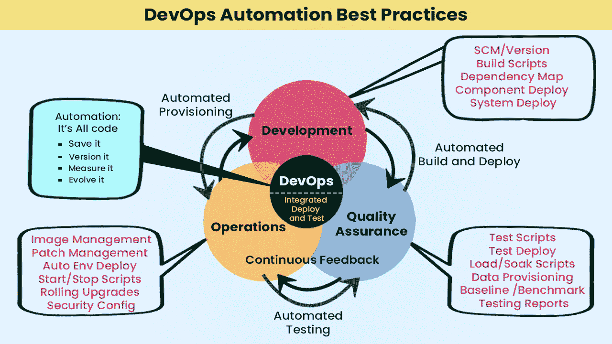

# 通过自动化使开发更容易

> 原文：<https://blog.devgenius.io/making-devsecops-easier-with-automation-58e8f110957e?source=collection_archive---------7----------------------->

克里斯托夫·高尔在 [Unsplash](https://unsplash.com/s/photos/coding?utm_source=unsplash&utm_medium=referral&utm_content=creditCopyText) 上拍摄的照片

DevOps 方法的采用在整个公司内越来越受欢迎。DevOps 是“开发操作”的缩写，指的是优化软件开发过程的最佳实践的集合。因此，持续集成、持续交付和持续部署(CI/CD)都得到了更好的支持。

在过去，软件开发的主要焦点是特性的开发，而其他团队负责确定如何测试和维护那些特性。在 DevOps 的环境中，跨职能的产品团队需要根据开发人员和 IT 运营人员的意见，从概念到产品管理特性。

由于消除了软件开发团队和 IT 运营团队之间的知识孤岛，这导致了更少的停机时间、更快的发布和更少的问题。

# 通过自动化简化开发运维的两种方法

[来源](https://www.veritis.com/solutions/devops/automation-services/)

自动化是每个公司的基本要求，包括那些遵循 DevOps 实践的公司。自动化的基本过程始于开发人员在他们的机器上开发代码，并在代码投入生产后持续很长时间。

在代码被推送之后，除了构建、部署、秘密扫描和验证代码中的任何安全漏洞之外，自动化将涉及许多用于监控的 [devsecops 工具](https://www.mend.io/resources/blog/devsecops-tools/)。让我们讨论几个自动化类别。

## 自动化基础设施安全

基础设施自动化涉及各种元素，例如资产部署监控和安全性。AWS 有许多工具可以用于正确的自动化，例如 [CloudWatch](https://aws.amazon.com/cloudwatch/) ，这是一个 AWS 监控塔，可以对资产进行行为分析，寻找任何违规行为，以及需要遵守法规的项目。

因此，不需要进行任何测试或验证，因为该工具将在单个仪表板上显示问题，您可以在其中管理或修补它们。它甚至分析系统的已知漏洞。

然而，自动化允许完成大量的额外任务，其中一些包括确定是否有任何资产运行异常，使用大量的 RAM 或资源，或者大量的其他任务。

## 自动化监控和日志管理

一个组织的基础设施在很大程度上依赖于日志和监控来正常运行。除了帮助解决任何性能问题之外，日常监控还可以帮助识别网络中可能发生的任何入侵。监控绝不能手动完成。因此，我们需要一个能够在集中位置监控和存储日志的解决方案。

可以通过许多工具进行监测，包括 AWS 已经提供的工具和第三方解决方案，如太阳风。当我们谈论日志监控时，我们指的是使用 Sumologic 毫不费力地实现自动化，sumo logic 归档日志并提供更有效的方法来检索它们。当 DevOps 团队使用 [Sumologic](https://www.sumologic.com/) 时，他们将更容易确定任何问题的潜在来源，并且他们还将能够检测到任何入侵。

因此，自动化不仅是日志管理，而且监控也起着重要的作用，可以简化生活，因为他们可以从一个集中的系统访问每个日志。

# 结论

开发业务现在是每个组织不可或缺的组成部分。在开发和运营领域，许多任务很容易实现自动化，并有可能发挥重要作用。例如，创建代码、在其上运行单元测试，以及在一个集中的区域维护和收集日志以便管理和收集。此外，Jenkins 和太阳风可以自动化许多任务，例如部署，还有许多其他事情可以自动化。因此，他们不仅可以加快开发人员调试问题的过程，还可以保护公司免受任何不受欢迎的攻击或环境。