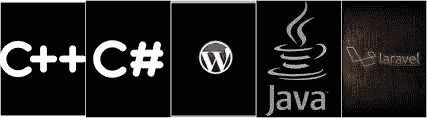

# 通过构建应用程序制作编程项目

> 原文：<https://blog.devgenius.io/making-programming-projects-by-building-apps-78ed3c184f5d?source=collection_archive---------10----------------------->

***这取决于你使用的编程语言。***

尽管大多数人不会将编程项目添加到他们的投资组合中，但是了解一门特定的编程语言还是很有帮助的。在这里，我们将讨论如何通过构建应用程序来做编程项目。

## 1-选择一个特定的应用程序开始

根据编程语言的不同，你可以创建不同种类的应用程序。它们包括自动化、游戏、移动应用，以及更多可以用来学习特定编程语言的应用。做 app，先确定自己的职业领域在哪里，然后自己创建一个 app。

## 2-使用各种来源

在构建应用程序时，可以使用各种资源来帮助您构建自己的应用程序。这些包括 YouTube 视频、开源代码、面向项目的在线课程，以及更多可以帮助你磨练自己技能的东西。然后，建立更多的 app，这样你就可以学习各种 app 场景，进一步丰富自己的知识。

## 3-利用你以前经验中的知识

在你开发了应用程序来实践你所学到的东西之后，你必须保存你以前的信息来帮助其他需要帮助的人。它可能包括语法错误、缩进错误或者他们可能忘记在软件中添加一些东西。因此，如果你的朋友问你他们的代码有什么问题，你应该意识到他们做错了什么，以及他们如何用他们的程序解决他们的问题。如果没有，你可能需要更多的练习，直到你完全理解软件中的错误。

## 4-不断构建更多的应用程序来实践

为了增强你对编程语言的了解，应该开发更多的应用程序，让你为潜在的问题做好准备。如果不仅仅是潜在的问题，可能需要使用特定的编程语言来解决各种场景。通过用编程语言构建应用程序，你只要具备编程语言的知识，就可以直接解决你一眼看到的问题。

## 5-通过制作教学视频分享您的知识

在你对编程语言的具体应用有了足够的了解之后，你就可以在各种平台上上一门课来赚钱了。但在这种情况下，你必须小心保持你的高评分，这样你就可以在不工作的时候获得收入。而且，如果你有很高的评分可以推荐，你可以在流行的平台上创建课程。结果，你的编程知识可能成为你自己的小生意，你可能不必为此纳税。你的网上业务可以让你成千上万的美元，让你的梦想成真。

*你对编程项目有什么看法？你会把它们加入你的投资组合吗？在下面的评论区分享你的想法和经历。*