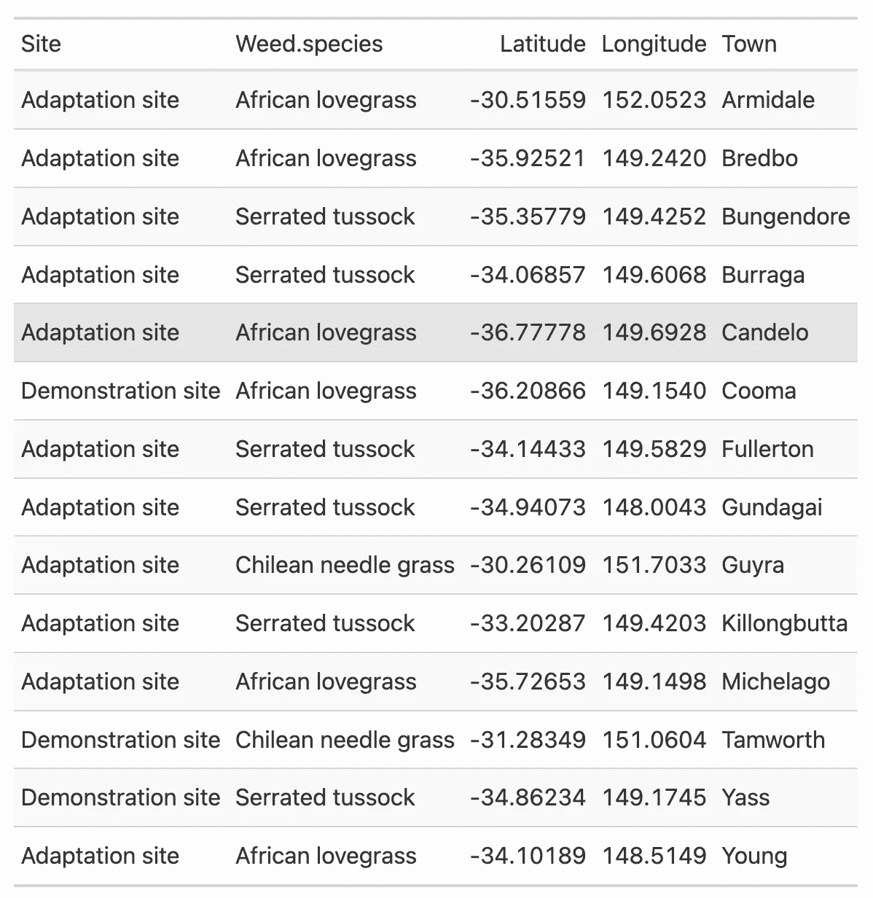

# 使用 ggplot2 在 R 中制作出版物质量的插图

> 原文：<https://blog.devgenius.io/making-publication-quality-inset-maps-in-r-using-ggplot2-85359c492ac8?source=collection_archive---------4----------------------->

在这篇博文中，我将展示我们如何使用`ggplot2`包在 R 中制作出版物质量的插图。

当在期刊上发表科学研究或在会议上介绍研究工作时，显示数据收集地点或实验地点的地图是关键的可视化之一。研究地点/位置的地图可以帮助观众和读者更好地理解数据。

制图听起来很奇特，但它需要大量的培训和技能来制作高质量的地图，这些地图对读者友好且具有视觉美感。有时，研究地点更加分散，易于在大的地理区域中可视化。然而，在某些情况下，研究站点是聚集的，这使得很难在更大的范围内显示它们。在这种情况下，插图有助于我们参照熟悉的地理区域来显示位置。

插图是与主地图显示在同一页面上的较小地图。传统上，插图以比主地图更大的比例(更小的区域)显示。通常，插图用作定位器地图，在更广泛、更熟悉的地理参照系中显示主地图的区域。

# 加载库

```
**library**(tidyverse)
**library**(readxl)
**library**(ozmaps) 
**library**(grid)
**library**(gt)
```

# 加载数据

在这篇博文中，我将使用澳大利亚新南威尔士不同实验地点的地理坐标数据。这些地点包括对不同杂草的适应和示范试验。

# 实验坐标

```
*# coordinates*
data <- read.csv("https://raw.githubusercontent.com/MohsinRamay/sampledata/main/GPS_coordinates_for_map.csv") %>% 
  select(-3)head(data)
```


# 澳大利亚地图

*   我将使用`ozmap`函数从`ozmaps`包中提取澳洲地图。

```
*# Australia map*
sf_aus <- ozmap("states")
```


# 最近的城市名称

我将通过过滤每个分组城镇数据的第一行，从原始数据集中提取最近的城市名称及其坐标。

```
*# cities* 
town <- data %>% 
  arrange(Town) %>% 
  group_by(Town) %>% 
  filter(row_number()==1) %>% 
  ungroup()gt(town)
```



**地图**

首先，我将创建一个简单的带有实验地点的澳大利亚全国地图。我会用不同的符号来表示网站类型，用不同的颜色来表示杂草。

# 原始地图

```
data %>% 
  ggplot() + 
  geom_sf(data = sf_aus) +
  geom_point(aes(x = Longitude, y = Latitude, color = Weed.species, shape = Site)) +
  xlim(112, 155) +
  labs() +
  theme_bw()
```


如您所见，在全国比例地图上绘制时，研究地点是聚类的(在新南威尔士州)。但是，为了更好地了解研究地点与附近城市/城镇的关系，我们需要以集中的比例绘制它们。为此，我们首先需要确定研究地点的范围。

# 程度

我将使用简单的水平线和垂直线来显示研究地点的范围。

```
data %>% 
  ggplot() + 
  geom_sf(data = sf_aus) +
  geom_point(aes(x = Longitude, y = Latitude, color = Weed.species, shape = Site)) +
  xlim(112, 155) +
  geom_hline(yintercept = -38, lty = 2, colour = "red") +
  geom_hline(yintercept = -29, lty = 2, colour = "red") +
  geom_vline(xintercept = 147, lty = 2, colour = "red") +
  geom_vline(xintercept = 153, lty = 2, colour = "red") +
  labs() +
  theme_bw()
```


使用之前地图中的`min`和`max`坐标值，我们可以在研究地点上绘制一个多边形，并查看此范围是否能最好地显示数据。

```
data %>% 
  ggplot() + 
  geom_sf(data = sf_aus) +
  geom_point(aes(x = Longitude, y = Latitude, color = Weed.species, shape = Site)) +
  xlim(112, 155) +
  geom_rect(aes(xmin = 147, xmax = 153, ymin = -38, ymax = -29), color = "red", fill = NA) +
  labs() +
  theme_bw()
```


# 焦点图

现在，我将使用在之前步骤中确定的范围坐标绘制研究地点的聚焦版本。

```
data %>% 
  mutate(point_size = ifelse(Site == "Demonstration", 1, 0)) %>% 
  ggplot() + 
  geom_sf(data = sf_aus) +
  geom_point(aes(x = Longitude, y = Latitude, color = Weed.species, shape = Site, size = point_size > 0), alpha = 0.75) +
  scale_size_manual(values=c(2,3.5)) +
  xlim(147, 153) +
  ylim(-38, -30) +
  theme_test() +
  guides(size = "none")
```


与前一个版本相比，这个版本看起来更好。但是，我们需要补充一些信息，给它一个参考。此外，我们需要删除新南威尔士州南部的边界线。为此，我将使用库`sf`的`st_union`函数来溶解边界线。然后，我们将在后续的地图中使用溶解的多边形。

```
*# Now the dissolve*
**library**(sf)AN = sf_aus %>% 
  filter(NAME %**in**% c("New South Wales", "Australian Capital Territory"))NM <- st_union(AN)plot(NM)
```


# 添加地图元素

专业地图也包括一些元素，如`North Arrow`和`scale`等。我们也将这些组件添加到我们的地图中。除此之外，我还会添加最近的城镇名称，并用`lightblue`颜色填充非陆地区域，分别作为参考和区分。

```
ss <- data %>% 
  mutate(point_size = ifelse(Site == "Demonstration", 1, 0)) %>% 
  ggplot() + 
  geom_sf(data = NM) +
  geom_point(aes(x = Longitude, y = Latitude, color = Weed.species, shape = Site, size = point_size > 0), alpha = 0.75) +
  scale_size_manual(values=c(2,3.5)) +
  xlim(147, 153) +
  ylim(-38, -30) +
  ggrepel::geom_text_repel(aes(x = Longitude, y = Latitude, label = Town), data = town, nudge_y = 0.06, nudge_x = 0.06, size = 2) +
  labs(color = "Weed species") +
  theme_test() +
  theme(panel.background = element_rect(fill = "lightblue")) +
  guides(size = "none") +
  ggsn::north(location = "topleft", scale = 0.8, symbol = 12,
               x.min = 151.5, x.max = 152.5, y.min = -36, y.max = -38) +
  ggsn::scalebar(location = "bottomleft", dist = 100,
           dist_unit = "km", transform = TRUE, 
           x.min=150.5, x.max=152, y.min=-38, y.max=-30,
           st.bottom = FALSE, height = 0.025,
           st.dist = 0.05, st.size = 3)ss
```


# 插页地图

现在，我将创建一个全比例的澳大利亚地图，用红色多边形显示研究地点的范围和重点地图。

```
*# Map of Australia*
inset <- sf_aus %>% 
  ggplot() + 
  geom_sf() +
  *#geom_sf(data = NM) +*
  geom_rect(aes(xmin = 147, xmax = 153, ymin = -38, ymax = -30), color = "red", fill = NA) +
  xlim(112, 155) +
  labs(x = NULL, y = NULL) +
  theme_test() + 
  theme(axis.text = element_blank(),
        axis.ticks = element_blank(),
        axis.ticks.length = unit(0, "pt"),
        axis.title=element_blank(),
        plot.margin = margin(0, 0, 0, 0, "cm"),
        panel.background = element_rect(fill = "lightblue"))inset
```


# 最终地图

现在，我将合并两张地图，在左上角插入澳大利亚地图。

```
ss*# Combining both maps*
print(inset, vp = viewport(0.322, 0.859, width = 0.25, height = 0.25))
```


这张插图更好地显示了研究地点相对于国家和省份的位置，并且更加专业。

**就是这样！**

如果你有任何问题，请随时联系我。