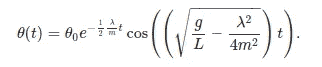
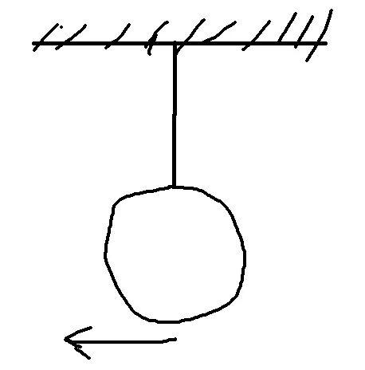
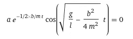
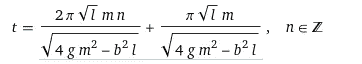
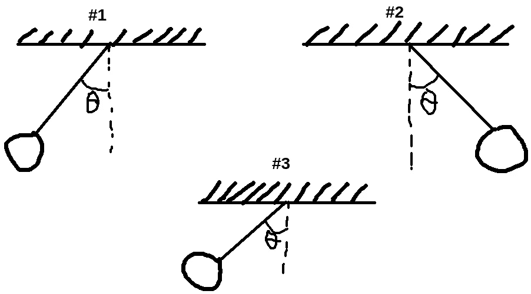

# 在 React 中制作逼真的圣诞球动画

> 原文：<https://blog.devgenius.io/making-realistic-christmas-ball-animation-in-react-6f28ee54cbf4?source=collection_archive---------10----------------------->

很快就要过圣诞节和除夕了。所以是时候做一些能让你保持好心情的可爱效果了。为此，我将制作一个圣诞球摆动的动画。

## **什么是“写实”？**

动画要对应一些物理规律，好像球要在我们的世界里摆动。在现实世界中，球不会无休止地摆动，它会因为轴和绳子之间的摩擦而停止摆动。我对这个课题做了一些研究，找到了有摩擦力的摆的数学公式:



(此公式来源于带摩擦的摆运动微分方程，可在此处找到:[https://physics . stack exchange . com/questions/243143/how-friction-affect-of-a-motion of-a-pendulum](https://physics.stackexchange.com/questions/243143/how-does-friction-affect-the-motion-of-a-pendulum))

在代码中应用该公式会产生这个小函数:

```
const GRAVITY = 9.80665;
const pendWithFricAngle = (
  time: number,
  initAngle: number,
  fricCoeff: number,
  mass: number,
  length: number
) => {
  const expCoeff = Math.exp((((-1 / 2) * fricCoeff) / mass) * time);
  const sqrtCoeff = Math.sqrt(
    GRAVITY / length - Math.pow(fricCoeff, 2) / (4 * Math.pow(mass, 2))
  );
  return initAngle * expCoeff * Math.cos(sqrtCoeff * time);
};
```

如果钟摆在没有初速度的情况下，从指定的角度开始摆动，这个公式就成立。但是我们的钟摆应该从底部开始，初始踢水/速度:



然后我们还需要从一开始就计算这一刻经过的时间，并将其作为“时间填充”应用于前面的公式。假设`angle = 0`(如上图所示)我们得到:



(参见[https://www.wolframalpha.com/input/?I =+a * e % 5E % 28-1% 2 F2 * b % 2Fm * t % 29 * cos % 28 sqrt % 28g % 2Fl-b % 5E 2% 2F % 284 * m % 5E 2% 29% 29 * t % 29% 3d 0](https://www.wolframalpha.com/input/?i=+a*e%5E%28-1%2F2*b%2Fm*t%29*cos%28sqrt%28g%2Fl-b%5E2%2F%284*m%5E2%29%29*t%29%3D0)

`n`是当前摆的周期数，看起来像这样:



我们假设只有第一个时期所以`n = 0`。我们只留下了正确的总结部分。它是这样写在代码里的:

```
const timePaddingForZeroAngle = (
  fricCoeff: number,
  mass: number,
  length: number
) => {
  const a = Math.PI * Math.sqrt(length) * mass;
  const b = Math.sqrt(
    4 * GRAVITY * Math.pow(mass, 2) - Math.pow(fricCoeff, 2) * length
  );

  return a / b;
};
```

## 以及如何将这些公式应用到圣诞球的动画中？

首先，我们需要一种方法来测量从开始到当前时刻的时间。第二，我们需要在人眼无法捕捉到运动中的微小差异时停止动画。为了结束动画，我们需要做最后一件事:因为现在我们可以再次触发动画。在我们的代码中，它反映如下动画循环:

```
const animationFrame = (timestamp: number) => {
    if (!boxRef.current) return;
    const isBegin = !stateRef.current.initTimestamp;
    if (isBegin) {
      stateRef.current.initTimestamp = performance.now();
    }

    const time = timestamp - stateRef.current.initTimestamp;
    const timePadding = timePaddingForZeroAngle(fricCoeff, mass, length);

    let angle = pendWithFricAngle(
      time / 1000 + timePadding,
      initAngle,
      fricCoeff,
      mass,
      length
    );
    const prevAngle = stateRef.current.angle;
    if (Math.abs(angle - prevAngle) <= EPSILON) {
      frameRef.current = null;
      stateRef.current.initTimestamp = 0;
      angle = 0;
    } else {
      frameRef.current = requestAnimationFrame(animationFrame);
    }

    stateRef.current.angle = angle;
    boxRef.current.style.transform = `rotate(${angle}rad)`;
  };
```

“math . ABS(angle—pre angle)< = EPSILON”作为动画的停止条件；

为什么我要在 React refs 中存储初始时间戳和角度？因为我不需要那个状态在 React 组件生命周期方面是被动的:我的动画应该用最小的计算开销来更新。所以状态需要直接控制。这就是利用回调的 React 组件的样子:

```
const ChristmasBall = ({
  className,
  fricCoeff,
  mass,
  length,
  initAngle
}: Props) => {
  const boxRef = useRef<HTMLElement>(null);
  const frameRef = useRef<null | number>(null);
  const stateRef = useRef({
    initTimestamp: 0,
    angle: 0
  });

  const animationFrame = (timestamp: number) => {
    if (!boxRef.current) return;
    const isBegin = !stateRef.current.initTimestamp;
    if (isBegin) {
      stateRef.current.initTimestamp = performance.now();
    }

    const time = timestamp - stateRef.current.initTimestamp;
    const timePadding = timePaddingForZeroAngle(fricCoeff, mass, length);

    let angle = pendWithFricAngle(
      time / 1000 + timePadding,
      initAngle,
      fricCoeff,
      mass,
      length
    );
    const prevAngle = stateRef.current.angle;
    if (Math.abs(angle - prevAngle) <= EPSILON) {
      frameRef.current = null;
      stateRef.current.initTimestamp = 0;
      angle = 0;
    } else {
      frameRef.current = requestAnimationFrame(animationFrame);
    }

    stateRef.current.angle = angle;
    boxRef.current.style.transform = `rotate(${angle}rad)`;
  };

  const handleHover = () => {
    if (!frameRef.current) {
      frameRef.current = requestAnimationFrame(animationFrame);
    }
  };

  useEffect(() => {
    return () => {
      const taskDesc = frameRef.current;
      if (taskDesc) {
        cancelAnimationFrame(taskDesc);
      }
    };
  }, []);

  return (
    <Wrapper ref={boxRef} className={className} onMouseEnter={handleHover}>
      
    </Wrapper>
  );
};
```

所有这些看起来就像这个简洁的动作:

所有的源代码都在这里:[https://codesandbox.io/s/pendulum-christmas-ball-xnsd8](https://codesandbox.io/s/pendulum-christmas-ball-xnsd8?file=/src/ChristmasBall.tsx:1526-3083)

*请随意留下你的经验等任何建议。我感谢任何有益的反馈；)*

【我的 git lab:[*https://gitlab.com/jbyte*](https://gitlab.com/john-byte)*777*