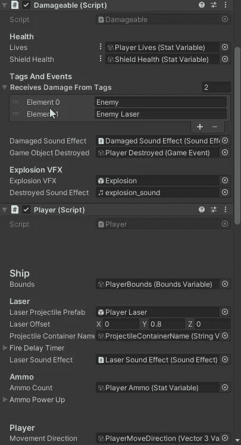
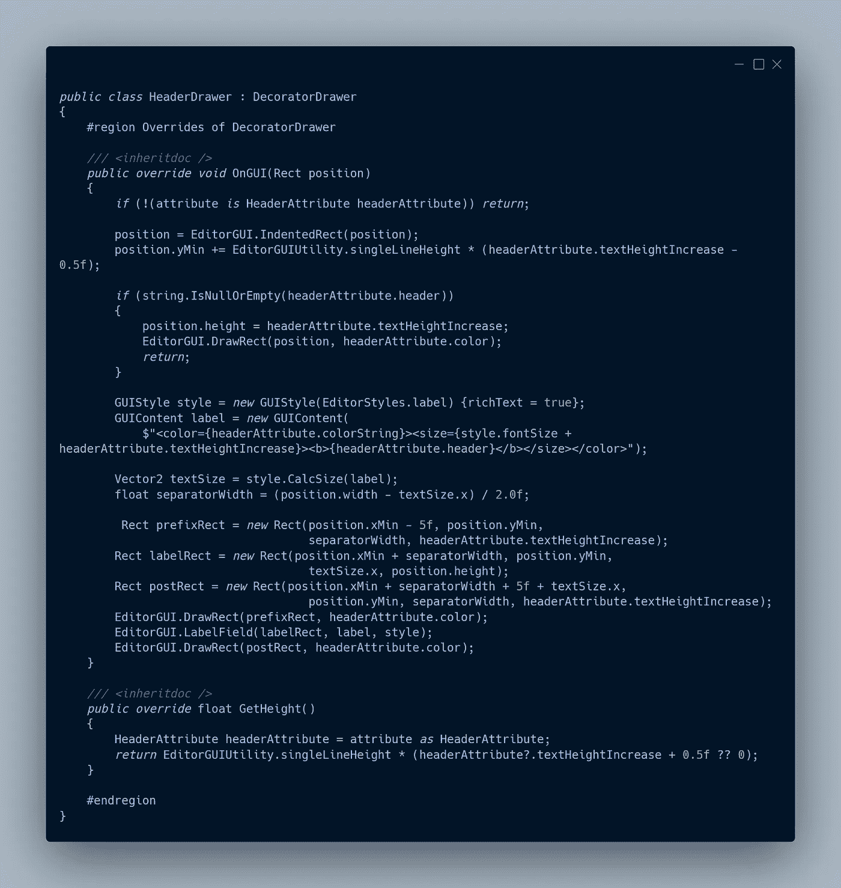
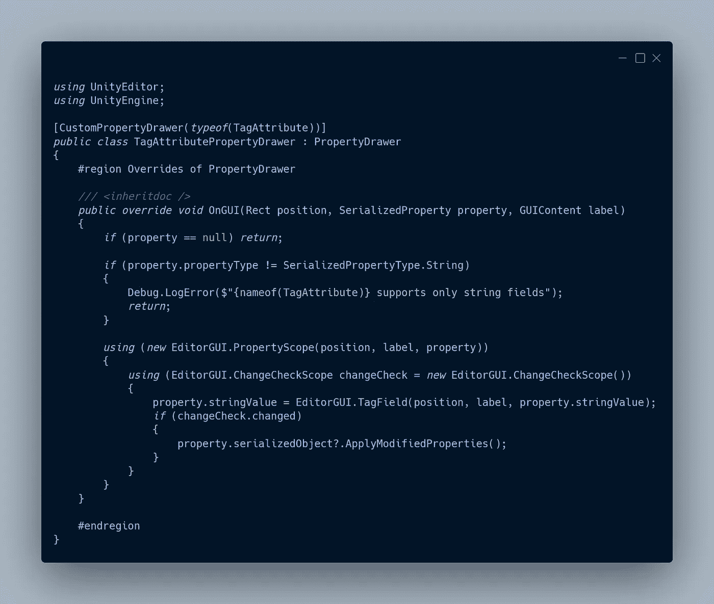
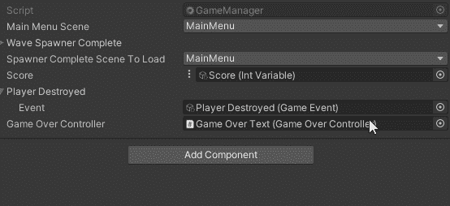

# 让检查员看起来更好

> 原文：<https://blog.devgenius.io/making-the-inspector-look-better-175baf39ada0?source=collection_archive---------0----------------------->

## 自定义属性特性


我已经使用了 Unity 的内置属性来让检查器看起来更有条理。

[](https://ktmarine1999.medium.com/unity-attributes-58a0f0a40ebd) [## 统一属性

### 更改事物在检查器中的显示方式。

ktmarine1999.medium.com](https://ktmarine1999.medium.com/unity-attributes-58a0f0a40ebd) 

要查看 Unity 属性的代码

[](https://github.com/Unity-Technologies/UnityCsReference/blob/master/Runtime/Export/PropertyDrawer/PropertyAttribute.cs) [## unity-技术 Unity 参考

### Unity C#参考源代码。为 Unity-Technologies/UnityCsReference 开发贡献一份力量

github.com](https://github.com/Unity-Technologies/UnityCsReference/blob/master/Runtime/Export/PropertyDrawer/PropertyAttribute.cs) 

我还有一个自定义属性抽屉，用于我的 ScriptableObject 引用类型。

[](https://ktmarine1999.medium.com/script-communication-in-unity-using-scriptable-objects-ad2ef0d99c59) [## 使用可编写脚本的对象编写 Unity 中的通信脚本

### 可脚本化的对象使得在游戏对象之间传递数据变得容易，这对于全局变量尤其有用…

ktmarine1999.medium.com](https://ktmarine1999.medium.com/script-communication-in-unity-using-scriptable-objects-ad2ef0d99c59) 

Unity 最近出售了一些资产，其中之一是奥丁督察。我非常喜欢使用已有的资产来帮助我的工作流程，而不是重新发明轮子。其中之一是它有 80 多个属性，你可以在你的代码中使用，使你的检查器看起来很棒，而不需要为你的所有类创建自定义属性抽屉或检查器编辑器。

[](https://assetstore.unity.com/packages/tools/utilities/odin-inspector-and-serializer-89041) [## Odin -检查器和串行器|实用工具| Unity 资产存储

### 在你的下一个项目中使用 Sirenix 的 Odin - Inspector 和 Serializer。找到这个实用工具&更多关于 Unity…

assetstore.unity.com](https://assetstore.unity.com/packages/tools/utilities/odin-inspector-and-serializer-89041) 

不幸的是，我没有在出售时得到它，即使我得到了，我也不能在这个项目中使用它，因为我把这个项目放在 Git Hub 上，这将违反使用该资产的条款。我猜他们是通过使用[定制属性属性](https://docs.unity3d.com/ScriptReference/PropertyAttribute.html)和[定制属性抽屉](https://docs.unity3d.com/ScriptReference/PropertyDrawer.html)来完成这个任务的。可能还会使用自定义编辑器来实现分组功能。在银河射击游戏中，我想使用的属性真的很少，实现我需要的东西会很容易。

```
 ● Header with Separator, Color
    ● Scene Selection Attribute
    ● Tag Selection Attribute
    ● Input Selection Attribute "For the Player"
    ● Info Box Attribute
```

# 标题属性

Unity 的标题代码。属性 usage 被设置为允许多个，因为标题是一个装饰抽屉。

> [虽然 DecoratorDrawer 在概念上并不意味着与特定的字段相关联，但是它的属性仍然需要放在脚本中的字段之上。但是，与 PropertyDrawer 属性不同，在同一个字段上可以有多个 DecoratorDrawers 属性。与 PropertyDrawers 不同的是，如果 DecoratorDrawer 属性被放置在一个列表或数组的字段之上，装饰器将只在数组之前出现一次；不是对每个数组元素。](https://docs.unity3d.com/ScriptReference/DecoratorDrawer.html)


## 添加颜色

为了给标题添加颜色，你需要使用富文本。

 [## 多信息文本

### UI 元素和文本网格的文本可以包含多种字体样式和大小。以下两者都支持富文本…

docs.unity3d.com](https://docs.unity3d.com/Packages/com.unity.ugui@1.0/manual/StyledText.html) 

我为颜色添加了一个字符串参数，默认值为浅蓝色。我还添加了一个浮动来增加文本高度。


在抽屉中，我使用编辑器标签的默认样式创建了一个样式。我确保将富文本设置为 true。然后，我使用富文本创建一个字符串来设置颜色，其大小要大于标准标签的大小，并将其加粗。在获取高度方法中增加 0.5f 只是为了确保有足够的空间，这样东西就不会被切掉。0.5f 的减法只是稍微向上移动了一下。


因为我已经使用了 Header 属性，所以我不需要修改任何代码就可以让它出现在检查器中，我可以只保留原来的 Header 属性，我确实修改了一些 Header 属性，增加了不同的大小



## 添加分隔符

我在 Header 属性中添加了一个条件，这样如果传入的字符串为 null 或空，我就可以只使用一个行分隔符


在标题抽屉中，我添加了行分隔符的条件。我用样式来计算文本的大小。我创建了矩形，用一些填充在文本的两边画了一个分隔线。我计算了要在中间绘制的文本的矩形位置。



我玩矩形的 Y 位置，直到我得到我喜欢的东西。


# 标签属性

目前，在我的可破坏行为中，我有一个标签字符串数组，它会破坏它所附着的游戏对象。


我添加到项目中的标签是敌人、玩家激光和敌人激光。


Unity 有一些预定义的标签，比如重生、完成、玩家等等..


最好能够从下拉列表中选择这些标签，而不是必须键入这些标签。为此，我将创建一个带有标签属性抽屉的标签属性。

## 标签属性

Tag 属性只需要继承 Property 属性，目标是字段。我不需要指定 Inherited，因为它默认为 true。我也不需要指定 Allow Multiple，因为它默认为 false，这些是我想要的设置。


## 标签属性抽屉

为了绘制该属性，我检查以确保该属性是一个字符串，如果不是，则记录一条错误消息并返回。在属性范围中，我使用了一个变更检查范围，并将该属性绘制为一个 [**标记字段**](https://docs.unity3d.com/ScriptReference/EditorGUI.TagField.html?_ga=2.183674918.1809783043.1619635833-1702441098.1612996063) 。我本可以使用 [**UnityEditorInternal 创建自己的自定义下拉菜单。internaleditorutility . tags**](https://answers.unity.com/questions/57952/getting-the-tag-array.html?_ga=2.178971940.1809783043.1619635833-1702441098.1612996063)



使用作用域与 EditorGUI 相同。开始并编辑 GUI。结束，你只是不需要记得叫结束。

上述代码与以下代码相同:

```
EditorGUI.BeginProperty(position, label, property);
EditorGUI.BeginChangeCheck();

property.stringValue = EditorGUI.TagField(position, label, property.stringValue);

if (EditorGUI.EndChangeCheck())
{
    property.serializedObject?.ApplyModifiedProperties();
}

EditorGUI.EndProperty();
```

## 使用标签属性

现在，只要我有一个标记字符串的属性，我就可以使用 tag 属性，这确保了我要使用的标记是正确的。


# 场景属性

我希望能够选择一个在构建设置中列出的可以使用的场景，而不是必须知道场景索引或场景名称(字符串很容易输入错误)。使用选择方法可以消除用户在选择场景时的任何错误。


## 场景属性

属性的实现方式与标记属性相同。


## GUI 上的场景属性抽屉

我覆盖了 GUI 上的方法。获取构建设置中场景的字符串数组。我检查一下，看看电影中是否有场景。我得到了在枚举弹出菜单中显示的选项，这是路径的条纹场景。I 执行典型的使用属性并更改检查范围。然后我打开属性类型，因为加载场景的唯一方式是使用字符串或整数。


## 场景属性属性抽屉获取场景

为了以数组的形式获取场景，我使用 Linq expression 来获取 [**编辑器构建设置**](https://docs.unity3d.com/ScriptReference/EditorBuildSettings.html) 中启用的所有场景。为了获得场景的名称，我使用 Linq expersion 来选择 Regex Match 返回的所有值(过滤掉路径和扩展名)到一个数组。


## 绘制字符串属性的场景属性抽屉

为了绘制字符串，我获取了场景路径的索引，然后使用一个弹出字段。我将属性的字符串设置为场景数组中选定索引处的字符串。


## 绘制 int 属性的场景属性抽屉

绘制 int 属性与绘制不带字符串选择的 string 属性是一样的。


## 使用场景属性

当 spawner 完成时，我已经在使用索引来加载一个新场景了。我为主菜单添加了一个字符串，只是为了显示正在使用的属性。



# 输入轴属性

为了输入，我用了和选择场景一样的方法。我必须做一点研究来弄清楚如何从输入管理器中获得轴的列表。

[](https://answers.unity.com/questions/566736/get-list-of-axes.html) [## 获取坐标轴列表？

### 有没有办法获得 InputManager 中定义的轴列表，或者以某种方式枚举它们？我知道我能得到它们…

answers.unity.com](https://answers.unity.com/questions/566736/get-list-of-axes.html) 

# 信息框属性

我用与 Header 属性相同的方式来做这件事。

