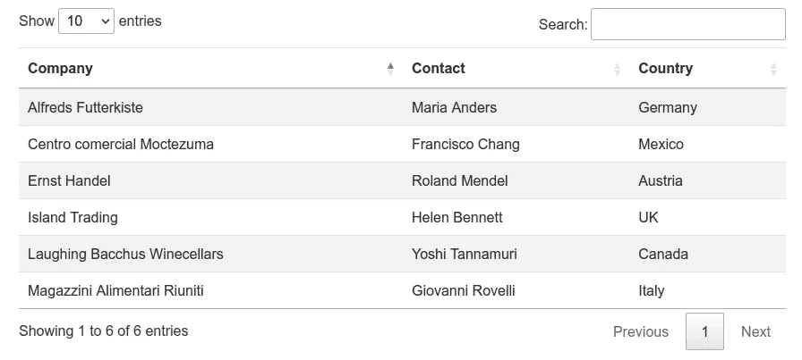
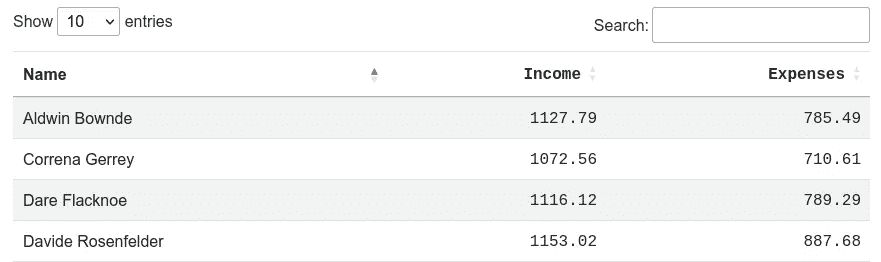
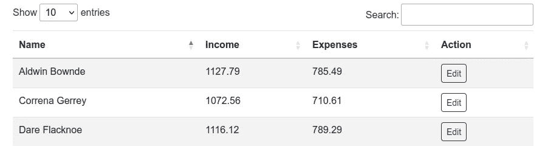

# 在数据表中使用 columnDefs 选项

> 原文：<https://blog.devgenius.io/making-use-of-columndefs-option-in-datatables-bc0fcc23f793?source=collection_archive---------2----------------------->


照片由[阿诺德·弗朗西斯卡](https://unsplash.com/@clark_fransa?utm_source=medium&utm_medium=referral)在 [Unsplash](https://unsplash.com?utm_source=medium&utm_medium=referral) 拍摄

HTML 表格是 web 应用程序和网站中的常见元素。它们是以行和列表示数据的一种方便有效的方式。

虽然表是强大的工具，但用户只能遍历和梳理这么多行，否则会非常不方便。因此，需要对表格进行搜索、排序、排序和分页。HTML 表格插件旨在填补这一空白，而[数据表](http://datatables.net/)是众多 javascript 表格插件/库之一。

数据表是作为 jQuery javascript 库的一个插件设计的，它带来了上面提到的所有高级表格特性。它是[开源的](https://github.com/DataTables/DataTables)，Github 上有很多跨不同语言和不同框架的数据表的服务器端库。因此，它被相当多的开发人员使用。

关于数据表的介绍已经够长了。这篇文章将关注数据表实例配置中的一个特殊选项，以我的经验来看，这是一个非常强大的选项,`columnDefs`选项。

这篇文章将简要介绍如何实例化 DataTables 实例，然后我们将直接进入`columnDefs`选项的各种用例，以及如何在上述用例中利用它。

## 如何实例化数据表

在 jQuery 库之上，您需要两个文件来使用数据表、样式表和 javascript 文件，这两个文件都可以通过 cdn 获得。

```
// jQuery file
[https://code.jquery.com/jquery-3.6.0.min.js](https://code.jquery.com/jquery-3.6.0.min.js)// DataTables files
https://cdn.datatables.net/1.12.1/css/jquery.dataTables.min.css
https://cdn.datatables.net/1.12.1/js/jquery.dataTables.min.js
```

有两种方法可以将表转换成 datatable 实例。第一种方法是用数据填充表，然后如下所示实例化它。

当利用来自外部源的数据时，使用第二个选项，例如来自在呈现时间期间从服务器获得的 JSON 对象、来自 API 调用、来自具有服务器端数据表的 AJAX 调用或者来自外部 JSON 文件。对于第二个选项，在实例化数据表之前，表的`tbody`应该是空的。

对同一数据集使用这两种方法将产生以下结果。



## columnDefs 选项的用例

columnDefs 选项基本上允许开发人员从一个中心点对特定列的单元格(td)进行修改。这些修改包括将自定义元素而不是数据源呈现为文本，以及向单元格添加自定义 css 类等。对于这种情况,`columnDefs`选项是理想的。

## 如何使用 columnDefs 选项

columnDefs 在表的实例化中被定义为 DataTable 对象。在其基本形式中，需要在目标列的索引数组中指定修改的目标，列的索引为零。一旦定义了目标，就会添加其余的属性。

DataTables 满足负索引的要求，以便从末尾开始创建目标列，最后一列为-1。

## 使用 columnDefs 向特定列添加 css 类

您可能会希望对列应用特定的样式。例如，在包含人名的列中，您可能希望文本以大写形式显示。另一个常见的用例是呈现数字数据。常见的做法是将数字右对齐，并使用单倍行距字体以方便比较。

这会产生以下结果:



虽然 datatables 允许您在 columns 选项中定义这一点，但使用 columnDefs，您可以从一个点配置多个列。这可以使用列配置中的`className`选项来完成。

## 使用 columnDefs 编辑列属性

可编辑的属性包括可见性、可搜索性以及列是否可排序。当列可能包含开发人员认为是私有的属性(如资源的 id)时，可见性非常重要。对于包含删除和编辑按钮等操作的列，使列不可排序非常重要。

## 使用 columnDefs 呈现不同的内容

我们在上面关于动作列的小节中已经提到；您可能需要按钮来编辑或删除资源。在这种情况下，columnDefs 使开发人员能够呈现与列中的数据源不同的内容。例如，如果列将资源的`id`作为列数据源，那么您可以使用 id 来呈现一些内容。



需要注意的是，`render`选项中的匿名函数有三个参数。第一个参数`data`提供了对该特定列的数据源的访问。在上面的例子中，目标列的数据源是`id`。因此，`data`参数将提供对`id`属性的访问。第二个参数`type`将提供对类型调用数据的访问，该数据用于[数据表的正交数据支持](https://datatables.net/manual/data/orthogonal-data)。第三个参数`row`是该行的完整数据源。

## 应用 columnDefs 以使用不同的数据源作为排序参数

这个副标题有点混乱，但是让我们用一个例子来澄清一下。作为属性的`createdAt`显示为文本，将其作为文本排序通常不会产生正确的结果。更好的方法是将它显示为文本，但是使用它的 unix 时间戳等价物对它进行排序。

DataTables 使开发人员能够使用不同列(通常是隐藏的列)中的数据对列进行排序。

该选项可用于`columnDefs`和`columns`选项。

## 结论

对于数据表的高级用法来说，`columnDefs`选项的知识可能非常有用。它将使你轻松地通过一些障碍。`columnDefs`的完整文档及其可用选项可在[这里](https://datatables.net/reference/option/columnDefs)找到。

这个帖子只使用了大部分 gists 的部分完整代码，完整的演示代码可以在这里找到。