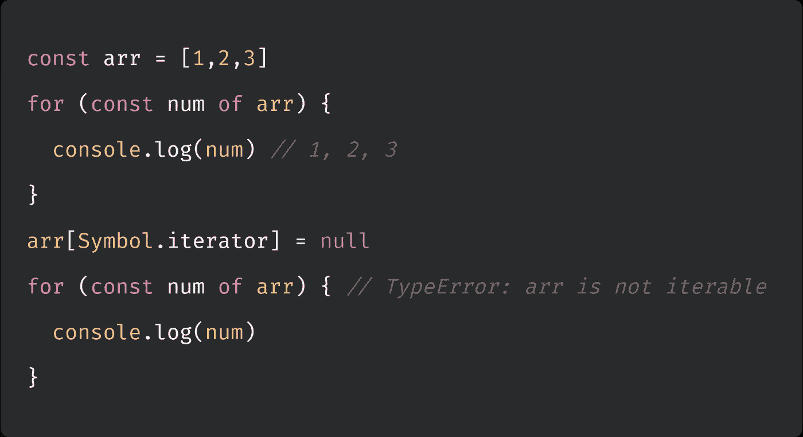
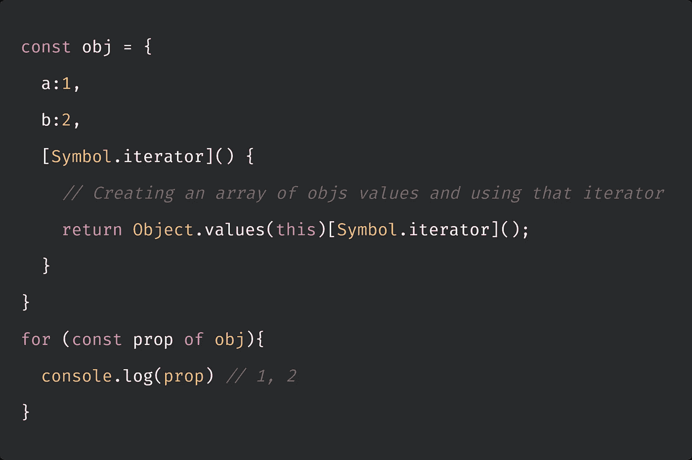
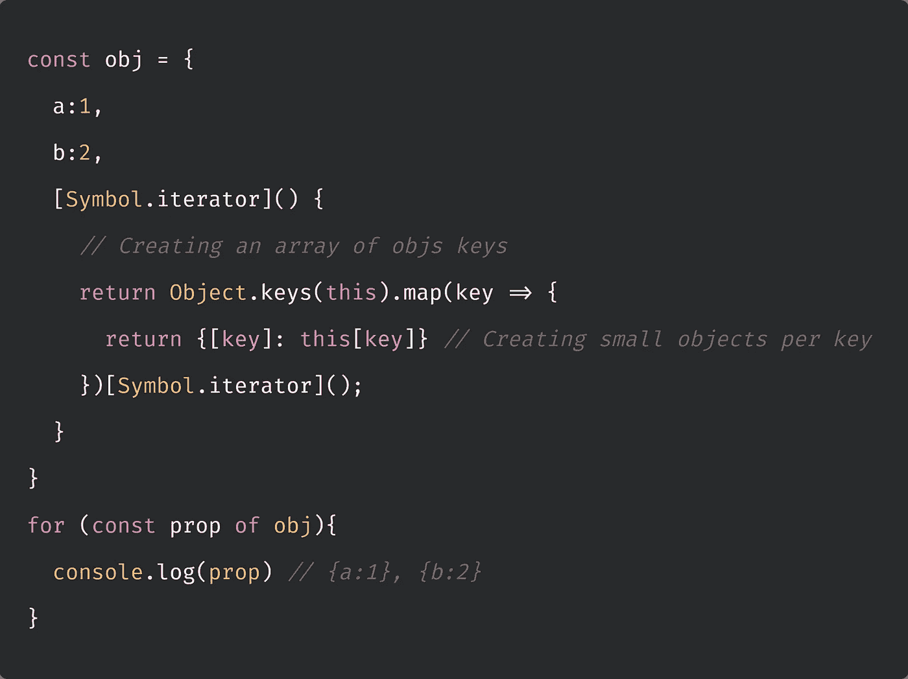
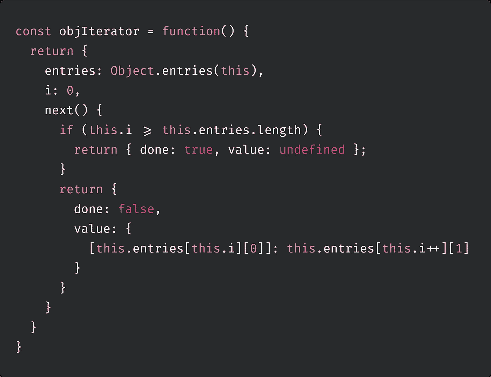
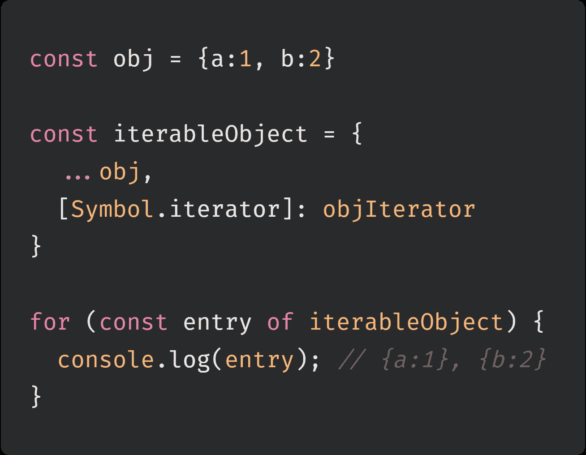

# 制作自己的 Javascript 迭代器

> 原文：<https://blog.devgenius.io/making-your-own-javascript-iterator-88178c2e5bef?source=collection_archive---------6----------------------->

费尔南多·埃尔南德斯在 [Unsplash](https://unsplash.com?utm_source=medium&utm_medium=referral) 上的照片

可能许多 Javascript 开发人员在研究 for…of 循环时第一次偶然发现迭代器。for…of 语句创建了一个循环，为此需要一个 iterable 对象。

那么 Javascript 中的可迭代对象是什么呢？

是的，你猜对了。数组就是其中之一。我们还有一些类似数组的对象，比如参数和节点列表。映射、集合和类型数组也是可迭代对象。最后一个荣誉奖是弦乐。

当我们迭代这些对象时，会为对象的每个不同属性的值执行一个带有语句的迭代钩子。

有了这些知识，我们是否可以为默认情况下不可迭代的普通 Javascript 对象添加一个定制的迭代钩子？当然是一个反问。

在 Symbol.iterator.
中有一个默认的迭代器，让我们先看看如果我们把它从一个普通数组中移除会发生什么。

现在让我们试着将它添加到一个普通的对象中。

好的，这里有一些东西需要打开。我们在对象上创建一个迭代器，它是一个函数，创建一个对象值的数组并调用该数组的迭代器。如果我们想以不同的方式格式化输出，我们可以。

现在，我们改为使用键为每个属性创建迷你对象。

但这还不够好，对吗？

题目讲的是自己做迭代器。开始了…

迭代器需要实现一个 next()函数，该函数返回一个具有属性 done 和值的对象。

下一个函数有两个结果。要么 done 为 false 且值为当前对象条目，要么 done 为 true 且值未定义。

让我们把这个功能放在一个简单的物体上，然后试一试。

很酷的东西。

我希望您觉得这篇文章很有趣，并且学到了一些关于 Javascript 的新知识。

我很乐意在推特“@barelydaniel”上看到你，或者在我的 Youtube 频道上看到你的评论:[https://www.youtube.com/c/BarelyCoding](https://www.youtube.com/c/BarelyCoding)