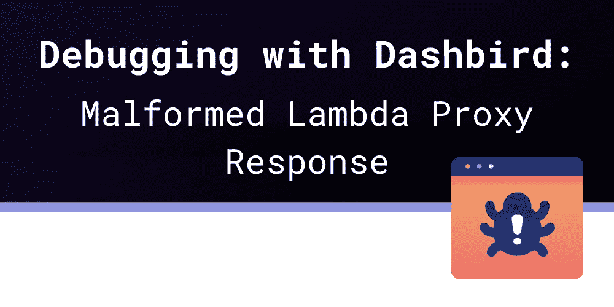

# Lambda 代理响应格式错误——是什么原因导致的，如何修复？

> 原文：<https://blog.devgenius.io/malformed-lambda-proxy-response-what-causes-it-and-how-to-fix-b0e5dfcf5d42?source=collection_archive---------0----------------------->



当人们试图用 [AWS API Gateway](https://dashbird.io/knowledge-base/api-gateway/what-is-aws-api-gateway/) 和 [AWS Lambda](https://dashbird.io/knowledge-base/aws-lambda/introduction-to-aws-lambda/) 构建无服务器应用时，经常出现的一个问题是*由于配置错误而执行失败:畸形的 Lambda 代理响应。*

没有什么比一般的错误消息更糟糕的了，它没有告诉你任何需要修复的问题，对吗？AWS 并不以它的错误信息设计而闻名，如果你可以称之为错误信息设计的话，更不用说为你提供解决问题的方法了。那么如何修复这个 Lambda 错误，是什么原因造成的呢？

# 修复格式错误的 Lambda 代理响应

为了解决这个问题，你需要**改变你的** [**Lambda 函数**](https://dashbird.io/knowledge-base/aws-lambda/anatomy-of-a-lambda-function/) **返回的**。为此，您需要返回一个具有两个属性的对象:

*   `statusCode`–这是您希望为您的客户端提供的 HTTP 状态代码，带有类型编号。
*   `body` –这是您的 HTTP 响应的内容，类型为 string。

如果您使用了异步函数，它应该是这样的:

```
exports.handler = async function(event, context) {
  return {statusCode: 200, body: "OK"};
};
```

如果你是一个更有前途的开发人员，它应该是这样的:

```
exports.handler = function(event, context) {
  return new Promise(function(resolove, reject) {
    resolve({statusCode: 200, body: "OK"});
  });
};
```

最后，如果你参加了复试，这将解决你的问题:

```
exports.handler = function(event, context, callback) {
  callback({statusCode: 200, body: "OK"});
};
```

# 了解格式错误的 Lambda 代理错误响应

如果您有时间，为什么不在这个过程中了解一下错误的“原因”呢？

首先，*格式错误的 Lambda 代理响应*并不是真正的配置错误，因为**问题在于您的 Lambda 代码**。但是，检查返回值的例程也可能检查其他可以从外部配置的东西，比如从 AWS CloudFormation。

但是错误消息中的代理部分呢？

如果您在 AWS 控制台的 AWS API Gateway 中为您的 API 配置了一个路由，那么您需要**为该路由选择一个集成**，在我们的例子中，是一个 Lambda 集成。这种集成是 AWS Lambda 和 AWS API 网关之间的粘合剂。毕竟，Lambda 不仅仅可以用于处理 API 网关请求。

如果你通过 CloudFormation 配置路线，事情会变得更清楚一些。

```
ExampleApi:
  ...
DefaultStage:
  ...
ExampleRoute:
  Type: AWS::ApiGatewayV2::Route
  Properties:
    ApiId:
      Ref: ExampleApi
    RouteKey: ANY /
    Target:
      Fn::Join:
        - integrations/
        - Ref: ProxyIntegration
ProxyIntegration:
  Type: AWS::ApiGatewayV2::Integration
  Properties:
    ApiId:
      Ref: ExampleApi
    IntegrationType: AWS_PROXY
    IntegrationUri:
      Fn::GetAtt:
        - ExampleFunction
        - Arn
    PayloadFormatVersion: "2.0"
ExampleRole:
  ...
ExampleFunction:
  Type: AWS::Lambda::Function
  Properties:
    Code:
      ZipFile:
        'exports.handler = async () => ({ statusCode: 200, body: "Example" });'
    Handler: index.handler
    Role:
      Fn::GetAtt:
        - ExampleRole
        - Arn
    Runtime: nodejs12.x
  DependsOn:
    - ExampleRole
```

我想你已经发现了这里的重点。我们在 AWS 控制台中创建的集成实际上是一种**特定类型的集成，称为** `**AWS_PROXY**`。它用于与许多 AWS 服务集成，AWS 控制台有一个很好的 UI，使与 Lambda 的集成更简单。

实际上有五种类型的 API 网关集成。三个用于 WebSockets 端点，两个用于 HTTP 端点。

# HTTP 集成类型

当您构建一个常规的 HTTP API 时。

1.  `**AWS_PROXY**`与 Lambda 或其他 AWS 服务集成，如 Step 函数。
2.  `**HTTP_PROXY**`将请求传递给另一个 HTTP 端点。

# WebSocket 集成类型

当您构建基于 WebSocket 的 HTTP API 时。

1.  `**AWS**`与 Lambda 整合。
2.  `**HTTP**`与其他(即第三方)HTTP APIs 集成。
3.  `**MOCK**`让一个 WebSocket 端点像环回一样工作，不涉及任何其他服务。

# 摘要

对于开发人员来说，错误消息是一个常见的痛点，但通常修复起来非常简单。但是，如果您了解一些错误起源的背景，这将有助于在将来更快地修复它。

要了解更多关于特定的常见无服务器错误以及如何修复它们，请务必访问我们的[事件库](https://dashbird.io/event-library/)。